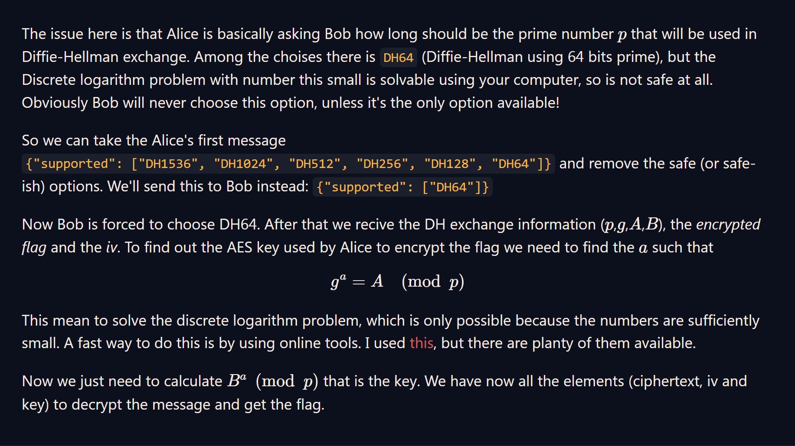

## RSA Starter 1
>All operations in RSA involve [modular exponentiation](https://en.wikipedia.org/wiki/Modular_exponentiation).
>
>Modular exponentiation is an operation that is used extensively in cryptography and is normally written like: `2^10 mod 17`
>
>You can think of this as raising some number to a certain power (`2^10 = 1024`), and then taking the remainder of the division by some other number (`1024 mod 17 = 4`). In Python there's a built-in operator for performing this operation: `pow(base, exponent, modulus)`
>
>In RSA, modular exponentiation, together with the problem of prime factorization, helps us to build a "[trapdoor function](https://en.wikipedia.org/wiki/Trapdoor_function)". This is a function that is easy to compute in one direction, but hard to do in reverse unless you have the right information. It allows us to encrypt a message, and only the person with the key can perform the inverse operation to decrypt it.
>
>Find the solution to `101^17 mod 22663`

### Solution
```python
> pow(101, 17, 22663)
19906
```

**flag:** `19906` 

## RSA Starter 2
>RSA encryption is modular exponentiation of a message with an exponent `e` and a modulus `N` which is normally a product of two primes: `N = p * q`.
>
>Together the exponent and modulus form an RSA "public key" `(N, e)`. The most common value for `e` is `0x10001` or `65537`.
>
>"Encrypt" the number `12` using the exponent `e = 65537` and the primes `p = 17` and `q = 23`. What number do you get as the ciphertext?

### Solution
```python
> pow(12,65537,17*23)
301
```

**flag:** `301`

## RSA Starter 3
>RSA relies on the difficulty of the factorization of the modulus `N`. If the primes can be found then we can calculate the [Euler totient](https://leimao.github.io/article/RSA-Algorithm/) of `N` and thus decrypt the ciphertext.
>
>Given `N = p*q` and two primes:
>
>`p = 857504083339712752489993810777`
>
>`q = 1029224947942998075080348647219`
>
>What is the totient of `N`?

### Solution
```python
> p = 857504083339712752489993810777
> q = 1029224947942998075080348647219
> phi = (p-1)*(q-1)
> print(phi)
882564595536224140639625987657529300394956519977044270821168
```

**flag:** `882564595536224140639625987657529300394956519977044270821168`

## RSA Starter 4
> The private key `d` is used to decrypt ciphertexts created with the corresponding public key (it's also used to "sign" a message but we'll get to that later).
> 
> The private key is the secret piece of information or "trapdoor" which allows us to quickly invert the encryption function. If RSA is implemented well, if you do not have the private key the fastest way to decrypt the ciphertext is to first factorize the modulus.
> 
> In RSA the private key is the [modular multiplicative inverse](https://en.wikipedia.org/wiki/Modular_multiplicative_inverse) of the exponent `e` modulo the totient of `N`.
>
> Given the two primes:
> 
> `p = 857504083339712752489993810777`
> 
> `q = 1029224947942998075080348647219`
> 
> and the exponent:
> 
> `e = 65537`
> 
> What is the private key `d`?

### Solution
```python
> from Crypto.Util.number import inverse

  p = 857504083339712752489993810777
  q = 1029224947942998075080348647219
  e = 65537

  phi = (p-1)*(q-1)
  d = inverse(e, phi)
> print(d)
121832886702415731577073962957377780195510499965398469843281
```

Alternate solution(s):
```python
# source: CryptoHack user @Scalpel
p = 857504083339712752489993810777
q = 1029224947942998075080348647219
e = 65537
phi = (p-1)*(q-1)
d = pow(e, -1, phi)
print(d)
```

**flag:** `121832886702415731577073962957377780195510499965398469843281`

## RSA Starter 5
> I've encrypted a secret number for your eyes only using your public key parameters:
> 
> `N = 882564595536224140639625987659416029426239230804614613279163`
> 
> `e = 65537`
> 
> Use the private key that you found for these parameters in the previous challenge to decrypt this ciphertext:
> 
> `c = 77578995801157823671636298847186723593814843845525223303932`

### Solution
```python {linenos=true}
from Crypto.Util.number import inverse, long_to_bytes
N = 882564595536224140639625987659416029426239230804614613279163
# http://factordb.com/index.php?query=882564595536224140639625987659416029426239230804614613279163
p = 857504083339712752489993810777
q = 1029224947942998075080348647219
assert p*q == N

e = 65537
c = 77578995801157823671636298847186723593814843845525223303932

phi = (p-1)*(q-1)
d = inverse(e, phi)
m = pow(c, d, N)
print(m)
```
```python
13371337
```

**flag:** `13371337`

## RSA Starter 6
> How can you ensure that the person receiving your message knows that you wrote it?
> 
> You've been asked out on a date, and you want to send a message telling them that you'd love to go, however a jealous lover isn't so happy about this.
> 
> When you send your message saying yes, your jealous lover intercepts the message and corrupts it so it now says no!
> 
> We can protect against these attacks by signing the message.
>
> Imagine you write a message `M`. You encrypt this message with your friend's public key: `C = M^e0 mod N0`.
> 
> To sign this message, you calculate the hash of the message: `H(M)` and "encrypt" this with your private key: `S = H(M)^d1 mod N1`.
> Your friend can decrypt the message using their private key: `m = C^d0 mod N0`. Using your public key they calculate `s = S^e1 mod N1`.
>
> Now by computing `H(m)` and comparing it to `s`: `assert H(m) == s`, they can ensure that the message you sent them, is the message that they received!
>
> Sign the flag `crypto{Immut4ble_m3ssag1ng}` using your private key and the SHA256 hash function.
>
> Challenge files:
>  - private.key

*file: private.key*
```txt {linenos=true}
N = 15216583654836731327639981224133918855895948374072384050848479908982286890731769486609085918857664046075375253168955058743185664390273058074450390236774324903305663479046566232967297765731625328029814055635316002591227570271271445226094919864475407884459980489638001092788574811554149774028950310695112688723853763743238753349782508121985338746755237819373178699343135091783992299561827389745132880022259873387524273298850340648779897909381979714026837172003953221052431217940632552930880000919436507245150726543040714721553361063311954285289857582079880295199632757829525723874753306371990452491305564061051059885803
d = 11175901210643014262548222473449533091378848269490518850474399681690547281665059317155831692300453197335735728459259392366823302405685389586883670043744683993709123180805154631088513521456979317628012721881537154107239389466063136007337120599915456659758559300673444689263854921332185562706707573660658164991098457874495054854491474065039621922972671588299315846306069845169959451250821044417886630346229021305410340100401530146135418806544340908355106582089082980533651095594192031411679866134256418292249592135441145384466261279428795408721990564658703903787956958168449841491667690491585550160457893350536334242689
```

### Solution
```python {linenos=true}
from hashlib import sha256
from Crypto.Util.number import bytes_to_long

N = 15216583654836731327639981224133918855895948374072384050848479908982286890731769486609085918857664046075375253168955058743185664390273058074450390236774324903305663479046566232967297765731625328029814055635316002591227570271271445226094919864475407884459980489638001092788574811554149774028950310695112688723853763743238753349782508121985338746755237819373178699343135091783992299561827389745132880022259873387524273298850340648779897909381979714026837172003953221052431217940632552930880000919436507245150726543040714721553361063311954285289857582079880295199632757829525723874753306371990452491305564061051059885803
d = 11175901210643014262548222473449533091378848269490518850474399681690547281665059317155831692300453197335735728459259392366823302405685389586883670043744683993709123180805154631088513521456979317628012721881537154107239389466063136007337120599915456659758559300673444689263854921332185562706707573660658164991098457874495054854491474065039621922972671588299315846306069845169959451250821044417886630346229021305410340100401530146135418806544340908355106582089082980533651095594192031411679866134256418292249592135441145384466261279428795408721990564658703903787956958168449841491667690491585550160457893350536334242689

m = b'crypto{Immut4ble_m3ssag1ng}'
h_m = bytes_to_long(sha256(m).digest())
s = pow(h_m, d, N)
print(hex(s)[2:])
```
```txt
6ac9bb8f110b318a40ad8d7e57defdcce2652f5928b5f9b97c1504d7096d7af1d34e477b30f1a08014e8d525b14458b709a77a5fa67d4711bd19da1446f9fb0ffd9fdedc4101bdc9a4b26dd036f11d02f6b56f4926170c643f302d59c4fe8ea678b3ca91b4bb9b2024f2a839bec1514c0242b57e1f5e77999ee67c450982730252bc2c3c35acb4ac06a6ce8b9dbf84e29df0baa7369e0fd26f6dfcfb22a464e05c5b72baba8f78dc742e96542169710918ee2947749477869cb3567180ccbdfe6fdbe85bcaca4bf6da77c8f382bb4c8cd56dee43d1290ca856318c97f1756b789e3cac0c9738f5e9f797314d39a2ededb92583d97124ec6b313c4ea3464037d3
```

**flag:** `6ac9bb8f110b318a40ad8d7e57defdcce2652f5928b5f9b97c1504d7096d7af1d34e477b30f1a08014e8d525b14458b709a77a5fa67d4711bd19da1446f9fb0ffd9fdedc4101bdc9a4b26dd036f11d02f6b56f4926170c643f302d59c4fe8ea678b3ca91b4bb9b2024f2a839bec1514c0242b57e1f5e77999ee67c450982730252bc2c3c35acb4ac06a6ce8b9dbf84e29df0baa7369e0fd26f6dfcfb22a464e05c5b72baba8f78dc742e96542169710918ee2947749477869cb3567180ccbdfe6fdbe85bcaca4bf6da77c8f382bb4c8cd56dee43d1290ca856318c97f1756b789e3cac0c9738f5e9f797314d39a2ededb92583d97124ec6b313c4ea3464037d3`

## Factoring
> So far we've been using the product of small primes for the modulus, but small primes aren't much good for RSA as they can be factorized using [modern methods](https://en.wikipedia.org/wiki/General_number_field_sieve).
> 
> What is a "small prime"? There was an [RSA Factoring Challenge](https://en.wikipedia.org/wiki/RSA_Factoring_Challenge) with cash prizes given to teams who could factorize RSA moduli. This gave insight to the public into how long various key sizes would remain safe. Computers get faster, algorithms get better, so in cryptography it's always prudent to err on the side of caution.
> 
> These days, using primes that are at least 1024 bits long is recommended–multiplying two such 1024 primes gives you a modulus that is 2048 bits large. RSA with a 2048-bit modulus is called RSA-2048.
> 
> Some say that to really remain future-proof you should use RSA-4096 or even RSA-8192. However, there is a tradeoff here; it takes longer to generate large prime numbers, plus modular exponentiations are predictably slower with a large modulus.
> 
> Factorize the 150-bit number `510143758735509025530880200653196460532653147` into its two constituent primes. Give the smaller one as your answer.
> 
> Resources:
>   - [How big an RSA key is considered secure today?](https://crypto.stackexchange.com/questions/1978/how-big-an-rsa-key-is-considered-secure-today/1982#1982)
>   - [primefac-fork](https://github.com/elliptic-shiho/primefac-fork)

### Solution
[factorDB](http://factordb.com/index.php?query=510143758735509025530880200653196460532653147) gives us the factors:
```txt
p = 19704762736204164635843
q = 25889363174021185185929
```

## Monoprime
>Why is everyone so obsessed with multiplying two primes for RSA. Why not just use one?
>
>Challenge files:
>  - output.txt
>
>Resources:
>  - [Why do we need in RSA the modulus to be product of 2 primes?](https://crypto.stackexchange.com/questions/5170/why-do-we-need-in-rsa-the-modulus-to-be-product-of-2-primes)

*file: output.txt*
```txt {linenos=true}
n = 171731371218065444125482536302245915415603318380280392385291836472299752747934607246477508507827284075763910264995326010251268493630501989810855418416643352631102434317900028697993224868629935657273062472544675693365930943308086634291936846505861203914449338007760990051788980485462592823446469606824421932591                                                                  
e = 65537
ct = 161367550346730604451454756189028938964941280347662098798775466019463375610700074840105776873791605070092554650190486030367121011578171525759600774739890458414593857709994072516290998135846956596662071379067305011746842247628316996977338024343628757374524136260758515864509435302781735938531030576289086798942  
```

### Solution
```python {linenos=true}
from Crypto.Util.number import inverse, long_to_bytes
n = 171731371218065444125482536302245915415603318380280392385291836472299752747934607246477508507827284075763910264995326010251268493630501989810855418416643352631102434317900028697993224868629935657273062472544675693365930943308086634291936846505861203914449338007760990051788980485462592823446469606824421932591
e = 65537
ct = 161367550346730604451454756189028938964941280347662098798775466019463375610700074840105776873791605070092554650190486030367121011578171525759600774739890458414593857709994072516290998135846956596662071379067305011746842247628316996977338024343628757374524136260758515864509435302781735938531030576289086798942
phi = n-1

d = inverse(e, phi)
m = pow(ct, d, n)
print(long_to_bytes(m))
```

```python
b'crypto{0n3_pr1m3_41n7_pr1m3_l0l}'
```

**flag:** `crypto{0n3_pr1m3_41n7_pr1m3_l0l}`

## Manyprime
>Using one prime factor was definitely a bad idea so I'll try using over 30 instead.
>
>Challenge files:
>  - output.txt
>
>Resources:
>  - [The Elliptic Curve Factorization Method](https://doc.sagemath.org/html/en/reference/interfaces/sage/interfaces/ecm.html)

*file: output.txt*
```txt {linenos=true}
n = 580642391898843192929563856870897799650883152718761762932292482252152591279871421569162037190419036435041797739880389529593674485555792234900969402019055601781662044515999210032698275981631376651117318677368742867687180140048715627160641771118040372573575479330830092989800730105573700557717146251860588802509310534792310748898504394966263819959963273509119791037525504422606634640173277598774814099540555569257179715908642917355365791447508751401889724095964924513196281345665480688029639999472649549163147599540142367575413885729653166517595719991872223011969856259344396899748662101941230745601719730556631637
e = 65537
ct = 320721490534624434149993723527322977960556510750628354856260732098109692581338409999983376131354918370047625150454728718467998870322344980985635149656977787964380651868131740312053755501594999166365821315043312308622388016666802478485476059625888033017198083472976011719998333985531756978678758897472845358167730221506573817798467100023754709109274265835201757369829744113233607359526441007577850111228850004361838028842815813724076511058179239339760639518034583306154826603816927757236549096339501503316601078891287408682099750164720032975016814187899399273719181407940397071512493967454225665490162619270814464
```

### Solution
```python {linenos=true}
from sage.all import ecm
from Crypto.Util.number import inverse, long_to_bytes

n = 580642391898843192929563856870897799650883152718761762932292482252152591279871421569162037190419036435041797739880389529593674485555792234900969402019055601781662044515999210032698275981631376651117318677368742867687180140048715627160641771118040372573575479330830092989800730105573700557717146251860588802509310534792310748898504394966263819959963273509119791037525504422606634640173277598774814099540555569257179715908642917355365791447508751401889724095964924513196281345665480688029639999472649549163147599540142367575413885729653166517595719991872223011969856259344396899748662101941230745601719730556631637
e = 65537
ct = 320721490534624434149993723527322977960556510750628354856260732098109692581338409999983376131354918370047625150454728718467998870322344980985635149656977787964380651868131740312053755501594999166365821315043312308622388016666802478485476059625888033017198083472976011719998333985531756978678758897472845358167730221506573817798467100023754709109274265835201757369829744113233607359526441007577850111228850004361838028842815813724076511058179239339760639518034583306154826603816927757236549096339501503316601078891287408682099750164720032975016814187899399273719181407940397071512493967454225665490162619270814464

factors = ecm.factor(n)
phi = 1
for f in factors:
    phi *= f-1
d = inverse(e, phi)
m = pow(ct, d, n)
print(long_to_bytes(int(m)))
```

```python
b'crypto{700_m4ny_5m4ll_f4c70r5}'
```

**flag:** `crypto{700_m4ny_5m4ll_f4c70r5}`

## Salty
>Smallest exponent should be fastest, right?
>
>Challenge files:
>  - salty.py
>  - output.txt

*file: salty.py*
```python {linenos=true}
#!/usr/bin/env python3

from Crypto.Util.number import getPrime, inverse, bytes_to_long, long_to_bytes

e = 1
d = -1

while d == -1:
    p = getPrime(512)
    q = getPrime(512)
    phi = (p - 1) * (q - 1)
    d = inverse(e, phi)

n = p * q

flag = b"XXXXXXXXXXXXXXXXXXXXXXX"
pt = bytes_to_long(flag)
ct = pow(pt, e, n)

print(f"n = {n}")
print(f"e = {e}")
print(f"ct = {ct}")

pt = pow(ct, d, n)
decrypted = long_to_bytes(pt)
assert decrypted == flag
```

*file: output.txt*
```txt {linenos=true}
n = 110581795715958566206600392161360212579669637391437097703685154237017351570464767725324182051199901920318211290404777259728923614917211291562555864753005179326101890427669819834642007924406862482343614488768256951616086287044725034412802176312273081322195866046098595306261781788276570920467840172004530873767                                                                  
e = 1
ct = 44981230718212183604274785925793145442655465025264554046028251311164494127485
```

### Solution
```python {linenos=true}
from Crypto.Util.number import long_to_bytes

n = 110581795715958566206600392161360212579669637391437097703685154237017351570464767725324182051199901920318211290404777259728923614917211291562555864753005179326101890427669819834642007924406862482343614488768256951616086287044725034412802176312273081322195866046098595306261781788276570920467840172004530873767
e = 1
ct = 44981230718212183604274785925793145442655465025264554046028251311164494127485

m = pow(ct, 1, n)
print(long_to_bytes(m))
```
```python
b'crypto{saltstack_fell_for_this!}'
```

**flag:** `crypto{saltstack_fell_for_this!}`

## Modulus Inutilis
>My primes should be more than large enough now!
>
>Challenge files:
>  - modulus_inutilis.py
>  - output.txt

*file: modulus_inutilis.py*
```python {linenos=true}
#!/usr/bin/env python3

from Crypto.Util.number import getPrime, inverse, bytes_to_long, long_to_bytes

e = 3
d = -1

while d == -1:
    p = getPrime(1024)
    q = getPrime(1024)
    phi = (p - 1) * (q - 1)
    d = inverse(e, phi)

n = p * q

flag = b"XXXXXXXXXXXXXXXXXXXXXXX"
pt = bytes_to_long(flag)
ct = pow(pt, e, n)

print(f"n = {n}")
print(f"e = {e}")
print(f"ct = {ct}")

pt = pow(ct, d, n)
decrypted = long_to_bytes(pt)
assert decrypted == flag
```

*file: output.txt*
```txt {linenos=true}
n = 17258212916191948536348548470938004244269544560039009244721959293554822498047075403658429865201816363311805874117705688359853941515579440852166618074161313773416434156467811969628473425365608002907061241714688204565170146117869742910273064909154666642642308154422770994836108669814632309362483307560217924183202838588431342622551598499747369771295105890359290073146330677383341121242366368309126850094371525078749496850520075015636716490087482193603562501577348571256210991732071282478547626856068209192987351212490642903450263288650415552403935705444809043563866466823492258216747445926536608548665086042098252335883
e = 3
ct = 243251053617903760309941844835411292373350655973075480264001352919865180151222189820473358411037759381328642957324889519192337152355302808400638052620580409813222660643570085177957
```

### Solution
```python {linenos=true}
from Crypto.Util.number import long_to_bytes
from gmpy2 import iroot
n = 17258212916191948536348548470938004244269544560039009244721959293554822498047075403658429865201816363311805874117705688359853941515579440852166618074161313773416434156467811969628473425365608002907061241714688204565170146117869742910273064909154666642642308154422770994836108669814632309362483307560217924183202838588431342622551598499747369771295105890359290073146330677383341121242366368309126850094371525078749496850520075015636716490087482193603562501577348571256210991732071282478547626856068209192987351212490642903450263288650415552403935705444809043563866466823492258216747445926536608548665086042098252335883
e = 3
ct = 243251053617903760309941844835411292373350655973075480264001352919865180151222189820473358411037759381328642957324889519192337152355302808400638052620580409813222660643570085177957

print(long_to_bytes(iroot(ct,3)[0]))
```

```python
b'crypto{N33d_m04R_p4dd1ng}'
```
**flag:** `crypto{N33d_m04R_p4dd1ng}`

## Diffie-Hellman Starter 1
>The set of integers modulo `n`, together with the operations of both addition and multiplication is a ring. This means that adding or multiplying any two elements in the set returns another element in the set.
>
>When the modulus is prime: `n = p`, we are guaranteed an inverse of every element in the set, and so the ring is promoted to a field. We refer to this field as a finite field `Fp`.
>
>The Diffie-Hellman protocol works with elements of some finite field `Fp`, where the prime modulus is typically a large prime.
>
>Given the prime `p = 991`, and the element `g = 209`, find the inverse element `d` such that `g * d mod 991 = 1`.

### Solution
```python
> from Crypto.Util.number import inverse
> inverse(209, 991)
549
```

**flag:** `549`

## Diffie-Hellman Starter 2
>Every element of a finite field `Fp` can be used to make a subgroup `H` under repeated action of multiplication. In other words, for an element `g`: `H = {g, g^2, g^3, ...}`
>
>A primitive element of `Fp` is an element whose subgroup `H = Fp`, i.e., every element of `Fp`, can be written as `g^n mod p` for some integer `n`. Because of this, primitive elements are sometimes called generators of the finite field.
>
>For the finite field with `p = 28151` find the smallest element `g` which is a primitive element of `Fp`.

### Solution
```python
> from sage.all import GF
> GF(28151).primitive_element()
7
```

**flag:** `7`

## Diffie-Hellman Starter 3
>The Diffie-Hellman protocol is used because the discrete logarithm is assumed to be a "hard" computation for carefully chosen groups.
>
>The first step of the protocol is to establish a prime `p` and some generator of the finite field `g`. These must be carefully chosen to avoid special cases where the discrete log can be solved with efficient algorithms. For example, a safe prime `p = 2*q +1` is usually picked such that the only factors of `p - 1` are `{2,q}` where `q` is some other large prime. This protects DH from the [Pohlig–Hellman algorithm](https://en.wikipedia.org/wiki/Pohlig%E2%80%93Hellman_algorithm).
>
>The user then picks a secret integer `a < p` and calculates `g^a mod p`. This can be transmitted over an insecure network and due to the assumed difficulty of the discrete logarithm, if the protocol has been implemented correctly the secret integer should be infeasible to compute.
>
>Given the NIST parameters:
>
>```txt
>g: 2
>p: 2410312426921032588552076022197566074856950548502459942654116941958108831682612228890093858261341614673227141477904012196503648957050582631942730706805009223062734745341073406696246014589361659774041027169249453200378729434170325843778659198143763193776859869524088940195577346119843545301547043747207749969763750084308926339295559968882457872412993810129130294592999947926365264059284647209730384947211681434464714438488520940127459844288859336526896320919633919
>```
>Calculate the value of `g^a mod p` for
>```txt
>a: 972107443837033796245864316200458246846904598488981605856765890478853088246897345487328491037710219222038930943365848626194109830309179393018216763327572120124760140018038673999837643377590434413866611132403979547150659053897355593394492586978400044375465657296027592948349589216415363722668361328689588996541370097559090335137676411595949335857341797148926151694299575970292809805314431447043469447485957669949989090202320234337890323293401862304986599884732815`
>```

### Solution
```python
> p = 2410312426921032588552076022197566074856950548502459942654116941958108831682612228890093858261341614673227141477904012196503648957050582631942730706805009223062734745341073406696246014589361659774041027169249453200378729434170325843778659198143763193776859869524088940195577346119843545301547043747207749969763750084308926339295559968882457872412993810129130294592999947926365264059284647209730384947211681434464714438488520940127459844288859336526896320919633919
> a = 972107443837033796245864316200458246846904598488981605856765890478853088246897345487328491037710219222038930943365848626194109830309179393018216763327572120124760140018038673999837643377590434413866611132403979547150659053897355593394492586978400044375465657296027592948349589216415363722668361328689588996541370097559090335137676411595949335857341797148926151694299575970292809805314431447043469447485957669949989090202320234337890323293401862304986599884732815
> g = 2
> pow(g, a, p)
1806857697840726523322586721820911358489420128129248078673933653533930681676181753849411715714173604352323556558783759252661061186320274214883104886050164368129191719707402291577330485499513522368289395359523901406138025022522412429238971591272160519144672389532393673832265070057319485399793101182682177465364396277424717543434017666343807276970864475830391776403957550678362368319776566025118492062196941451265638054400177248572271342548616103967411990437357924
```
**flag:**
```txt
1806857697840726523322586721820911358489420128129248078673933653533930681676181753849411715714173604352323556558783759252661061186320274214883104886050164368129191719707402291577330485499513522368289395359523901406138025022522412429238971591272160519144672389532393673832265070057319485399793101182682177465364396277424717543434017666343807276970864475830391776403957550678362368319776566025118492062196941451265638054400177248572271342548616103967411990437357924
```
## Diffie-Hellman Starter 4
>Now it's time to calculate a shared secret using data received from your friend Alice. Like before, we will be using the NIST parameters:
>```txt
>g: 2
>p: 2410312426921032588552076022197566074856950548502459942654116941958108831682612228890093858261341614673227141477904012196503648957050582631942730706805009223062734745341073406696246014589361659774041027169249453200378729434170325843778659198143763193776859869524088940195577346119843545301547043747207749969763750084308926339295559968882457872412993810129130294592999947926365264059284647209730384947211681434464714438488520940127459844288859336526896320919633919
>```
>You have received the following integer from Alice:
>```txt
>A: 70249943217595468278554541264975482909289174351516133994495821400710625291840101960595720462672604202133493023241393916394629829526272643847352371534839862030410331485087487331809285533195024369287293217083414424096866925845838641840923193480821332056735592483730921055532222505605661664236182285229504265881752580410194731633895345823963910901731715743835775619780738974844840425579683385344491015955892106904647602049559477279345982530488299847663103078045601
>```
>You generate your secret integer b and calculate your public one B, which you send to Alice.
>```txt
>b: 12019233252903990344598522535774963020395770409445296724034378433497976840167805970589960962221948290951873387728102115996831454482299243226839490999713763440412177965861508773420532266484619126710566414914227560103715336696193210379850575047730388378348266180934946139100479831339835896583443691529372703954589071507717917136906770122077739814262298488662138085608736103418601750861698417340264213867753834679359191427098195887112064503104510489610448294420720`
>B: 518386956790041579928056815914221837599234551655144585133414727838977145777213383018096662516814302583841858901021822273505120728451788412967971809038854090670743265187138208169355155411883063541881209288967735684152473260687799664130956969450297407027926009182761627800181901721840557870828019840218548188487260441829333603432714023447029942863076979487889569452186257333512355724725941390498966546682790608125613166744820307691068563387354936732643569654017172
>```
>You and Alice are now able to calculate a shared secret, which would be infeasible to calculate knowing only `{g,p,A,B}`.
>
>What is your shared secret?

### Solution
```python
> A = 70249943217595468278554541264975482909289174351516133994495821400710625291840101960595720462672604202133493023241393916394629829526272643847352371534839862030410331485087487331809285533195024369287293217083414424096866925845838641840923193480821332056735592483730921055532222505605661664236182285229504265881752580410194731633895345823963910901731715743835775619780738974844840425579683385344491015955892106904647602049559477279345982530488299847663103078045601
> b = 12019233252903990344598522535774963020395770409445296724034378433497976840167805970589960962221948290951873387728102115996831454482299243226839490999713763440412177965861508773420532266484619126710566414914227560103715336696193210379850575047730388378348266180934946139100479831339835896583443691529372703954589071507717917136906770122077739814262298488662138085608736103418601750861698417340264213867753834679359191427098195887112064503104510489610448294420720
> p = 2410312426921032588552076022197566074856950548502459942654116941958108831682612228890093858261341614673227141477904012196503648957050582631942730706805009223062734745341073406696246014589361659774041027169249453200378729434170325843778659198143763193776859869524088940195577346119843545301547043747207749969763750084308926339295559968882457872412993810129130294592999947926365264059284647209730384947211681434464714438488520940127459844288859336526896320919633919
> pow(A,b,p)
1174130740413820656533832746034841985877302086316388380165984436672307692443711310285014138545204369495478725102882673427892104539120952393788961051992901649694063179853598311473820341215879965343136351436410522850717408445802043003164658348006577408558693502220285700893404674592567626297571222027902631157072143330043118418467094237965591198440803970726604537807146703763571606861448354607502654664700390453794493176794678917352634029713320615865940720837909466
```

**flag:** 
```txt
1174130740413820656533832746034841985877302086316388380165984436672307692443711310285014138545204369495478725102882673427892104539120952393788961051992901649694063179853598311473820341215879965343136351436410522850717408445802043003164658348006577408558693502220285700893404674592567626297571222027902631157072143330043118418467094237965591198440803970726604537807146703763571606861448354607502654664700390453794493176794678917352634029713320615865940720837909466
```

## Diffie-Hellman Starter 5
>Alice wants to send you her secret flag and asks you to generate a shared secret with her. She also tells you she will be using the NIST standard:
>```txt
>g: 2
>p: 2410312426921032588552076022197566074856950548502459942654116941958108831682612228890093858261341614673227141477904012196503648957050582631942730706805009223062734745341073406696246014589361659774041027169249453200378729434170325843778659198143763193776859869524088940195577346119843545301547043747207749969763750084308926339295559968882457872412993810129130294592999947926365264059284647209730384947211681434464714438488520940127459844288859336526896320919633919
>```
>You receive the following integer from Alice:
>```txt
>A: 112218739139542908880564359534373424013016249772931962692237907571990334483528877513809272625610512061159061737608547288558662879685086684299624481742865016924065000555267977830144740364467977206555914781236397216033805882207640219686011643468275165718132888489024688846101943642459655423609111976363316080620471928236879737944217503462265615774774318986375878440978819238346077908864116156831874695817477772477121232820827728424890845769152726027520772901423784
>```
>You then generate your secret integer and calculate your public one, which you send to Alice.
>```txt
>b: 197395083814907028991785772714920885908249341925650951555219049411298436217190605190824934787336279228785809783531814507661385111220639329358048196339626065676869119737979175531770768861808581110311903548567424039264485661330995221907803300824165469977099494284722831845653985392791480264712091293580274947132480402319812110462641143884577706335859190668240694680261160210609506891842793868297672619625924001403035676872189455767944077542198064499486164431451944
>B: 1241972460522075344783337556660700537760331108332735677863862813666578639518899293226399921252049655031563612905395145236854443334774555982204857895716383215705498970395379526698761468932147200650513626028263449605755661189525521343142979265044068409405667549241125597387173006460145379759986272191990675988873894208956851773331039747840312455221354589910726982819203421992729738296452820365553759182547255998984882158393688119629609067647494762616719047466973581`
>```
>Individually you each use the shared secret to derive an AES private key. This allows you to encrypt large amounts of data over your channel without needing to exchange keys again.
>
>Alice sends you the following IV and ciphertext:
>```txt
>{'iv': '737561146ff8194f45290f5766ed6aba', 'encrypted_flag': '39c99bf2f0c14678d6a5416faef954b5893c316fc3c48622ba1fd6a9fe85f3dc72a29c394cf4bc8aff6a7b21cae8e12c'}
>```
>Decrypt this to obtain your flag!
>
>Challenge files:
>  - source.py
>  - decrypt.py

*file: source.py*
```python {linenos=true}
from Crypto.Cipher import AES
from Crypto.Util.Padding import pad, unpad
import hashlib
import os
from secret import shared_secret

FLAG = b'crypto{????????????????????????????}'

def encrypt_flag(shared_secret: int):
    # Derive AES key from shared secret
    sha1 = hashlib.sha1()
    sha1.update(str(shared_secret).encode('ascii'))
    key = sha1.digest()[:16]
    # Encrypt flag
    iv = os.urandom(16)
    cipher = AES.new(key, AES.MODE_CBC, iv)
    ciphertext = cipher.encrypt(pad(FLAG, 16))
    # Prepare data to send
    data = {}
    data['iv'] = iv.hex()
    data['encrypted_flag'] = ciphertext.hex()
    return data

print(encrypt_flag(shared_secret))
```

*file: decrypt.py*
```python {linenos=true}
from Crypto.Cipher import AES
from Crypto.Util.Padding import pad, unpad
import hashlib

def is_pkcs7_padded(message):
    padding = message[-message[-1]:]
    return all(padding[i] == len(padding) for i in range(0, len(padding)))

def decrypt_flag(shared_secret: int, iv: str, ciphertext: str):
    # Derive AES key from shared secret
    sha1 = hashlib.sha1()
    sha1.update(str(shared_secret).encode('ascii'))
    key = sha1.digest()[:16]
    # Decrypt flag
    ciphertext = bytes.fromhex(ciphertext)
    iv = bytes.fromhex(iv)
    cipher = AES.new(key, AES.MODE_CBC, iv)
    plaintext = cipher.decrypt(ciphertext)

    if is_pkcs7_padded(plaintext):
        return unpad(plaintext, 16).decode('ascii')
    else:
        return plaintext.decode('ascii')

shared_secret = ?
iv = ?
ciphertext = ?

print(decrypt_flag(shared_secret, iv, ciphertext))
```

### Solution
```python {linenos=true}
from Crypto.Cipher import AES
from Crypto.Util.Padding import pad, unpad
import hashlib

def is_pkcs7_padded(message):
    padding = message[-message[-1]:]
    return all(padding[i] == len(padding) for i in range(0, len(padding)))

def decrypt_flag(shared_secret: int, iv: str, ciphertext: str):
    # Derive AES key from shared secret
    sha1 = hashlib.sha1()
    sha1.update(str(shared_secret).encode('ascii'))
    key = sha1.digest()[:16]
    # Decrypt flag
    ciphertext = bytes.fromhex(ciphertext)
    iv = bytes.fromhex(iv)
    cipher = AES.new(key, AES.MODE_CBC, iv)
    plaintext = cipher.decrypt(ciphertext)

    if is_pkcs7_padded(plaintext):
        return unpad(plaintext, 16).decode('ascii')
    else:
        return plaintext.decode('ascii')

A = 112218739139542908880564359534373424013016249772931962692237907571990334483528877513809272625610512061159061737608547288558662879685086684299624481742865016924065000555267977830144740364467977206555914781236397216033805882207640219686011643468275165718132888489024688846101943642459655423609111976363316080620471928236879737944217503462265615774774318986375878440978819238346077908864116156831874695817477772477121232820827728424890845769152726027520772901423784
b = 197395083814907028991785772714920885908249341925650951555219049411298436217190605190824934787336279228785809783531814507661385111220639329358048196339626065676869119737979175531770768861808581110311903548567424039264485661330995221907803300824165469977099494284722831845653985392791480264712091293580274947132480402319812110462641143884577706335859190668240694680261160210609506891842793868297672619625924001403035676872189455767944077542198064499486164431451944
p = 2410312426921032588552076022197566074856950548502459942654116941958108831682612228890093858261341614673227141477904012196503648957050582631942730706805009223062734745341073406696246014589361659774041027169249453200378729434170325843778659198143763193776859869524088940195577346119843545301547043747207749969763750084308926339295559968882457872412993810129130294592999947926365264059284647209730384947211681434464714438488520940127459844288859336526896320919633919
shared_secret = pow(A, b, p)
iv = '737561146ff8194f45290f5766ed6aba'
ciphertext = '39c99bf2f0c14678d6a5416faef954b5893c316fc3c48622ba1fd6a9fe85f3dc72a29c394cf4bc8aff6a7b21cae8e12c'

print(decrypt_flag(shared_secret, iv, ciphertext))
```

**flag:** `crypto{sh4r1ng_s3cret5_w1th_fr13nd5}`

## Parameter Injection
>You're in a position to not only intercept Alice and Bob's DH key exchange, but also rewrite their messages. Think about how you can play with the DH equation that they calculate, and therefore sidestep the need to crack any discrete logarithm problem.
>
>Use the script from "Diffie-Hellman Starter 5" to decrypt the flag once you've recovered the shared secret.
>
>Connect at `nc socket.cryptohack.org 13371`

### Solution
```python {linenos=true}
from Crypto.Cipher import AES
from Crypto.Util.Padding import pad, unpad
import hashlib
from pwn import *
from json import loads, dumps

def is_pkcs7_padded(message):
    padding = message[-message[-1]:]
    return all(padding[i] == len(padding) for i in range(0, len(padding)))

def decrypt_flag(shared_secret: int, iv: str, ciphertext: str):
    # Derive AES key from shared secret
    sha1 = hashlib.sha1()
    sha1.update(str(shared_secret).encode('ascii'))
    key = sha1.digest()[:16]
    # Decrypt flag
    ciphertext = bytes.fromhex(ciphertext)
    iv = bytes.fromhex(iv)
    cipher = AES.new(key, AES.MODE_CBC, iv)
    plaintext = cipher.decrypt(ciphertext)

    if is_pkcs7_padded(plaintext):
        return unpad(plaintext, 16).decode('ascii')
    else:
        return plaintext.decode('ascii')

r = remote('socket.cryptohack.org', 13371)

# Alice -> Us
r.readuntilS(b': ')
json = loads(r.readlineS())
p = int(json['p'], 16)
A = int(json['A'], 16)
g = int(json['g'], 16)

# Us -> Bob
payload = dumps({"p":hex(p),"g":hex(g),"A":hex(p)}).encode('latin')
r.sendlineafter(b"Bob: ", payload)

# Us -> Alice (fake Bob's response)
payload = dumps({"B":"0x1"}).encode('latin')
r.sendlineafter(b"Alice: ", payload)

# Alice -> Us
r.readuntilS(b': ')
json = loads(r.readlineS())
iv = json['iv']
ct = json['encrypted_flag']

# Decrypt (shared key = 1 since we sent B=0x1)
flag = decrypt_flag(1, iv, ct)
print(flag)
```

**flag:** `crypto{n1c3_0n3_m4ll0ry!!!!!!!!}`

## Export-grade
>Alice and Bob are using legacy codebases and need to negotiate parameters they both support. You've man-in-the-middled this negotiation step, and can passively observe thereafter. How are you going to ruin their day this time?
>
>Connect at `nc socket.cryptohack.org 13379`

### Solution
```python {linenos=true}
from Crypto.Cipher import AES
from Crypto.Util.Padding import pad, unpad
import hashlib
from pwn import *
from sage.all import *
from json import loads, dumps

def is_pkcs7_padded(message):
    padding = message[-message[-1]:]
    return all(padding[i] == len(padding) for i in range(0, len(padding)))

def decrypt_flag(shared_secret: int, iv: str, ciphertext: str):
    # Derive AES key from shared secret
    sha1 = hashlib.sha1()
    sha1.update(str(shared_secret).encode('ascii'))
    key = sha1.digest()[:16]
    # Decrypt flag
    ciphertext = bytes.fromhex(ciphertext)
    iv = bytes.fromhex(iv)
    cipher = AES.new(key, AES.MODE_CBC, iv)
    plaintext = cipher.decrypt(ciphertext)

    if is_pkcs7_padded(plaintext):
        return unpad(plaintext, 16).decode('ascii')
    else:
        return plaintext.decode('ascii')

r = remote('socket.cryptohack.org', 13379)

# Alice -> Us
r.readuntilS(b'Alice: ')

# Us -> Bob
payload = dumps({"supported": ["DH64"]}).encode('latin')
r.sendlineafter(b"Bob: ", payload)

# Bob -> Us
r.readuntilS(b'Bob: ')

# Us -> Alice
payload = r.readline()
r.sendlineafter(b"Alice: ", payload)

# Alice -> Us
r.readuntilS(b'Alice: ')
json = loads(r.readlineS())
p = GF(json['p'])
g = p(json['g'])
A = p(json['A'])

# Bob -> Us
r.readuntilS(b'Bob: ')
json = loads(r.readlineS())
B = p(json['B'])

# Alice -> Us
r.readuntilS(b'Alice: ')
json = loads(r.readlineS())
iv = json['iv']
ct = json['encrypted_flag']

# Decrypt
n = discrete_log(A, g)
shared_key = B**n
flag = decrypt_flag(shared_key, iv, ct)
print(flag)
```

Alternate solution(s):


**flag:** `crypto{d0wn6r4d35_4r3_d4n63r0u5}`