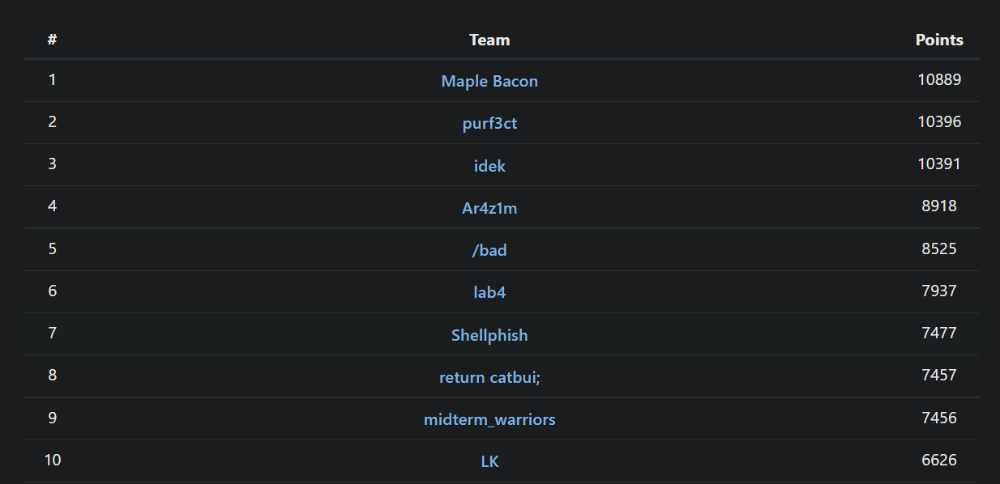
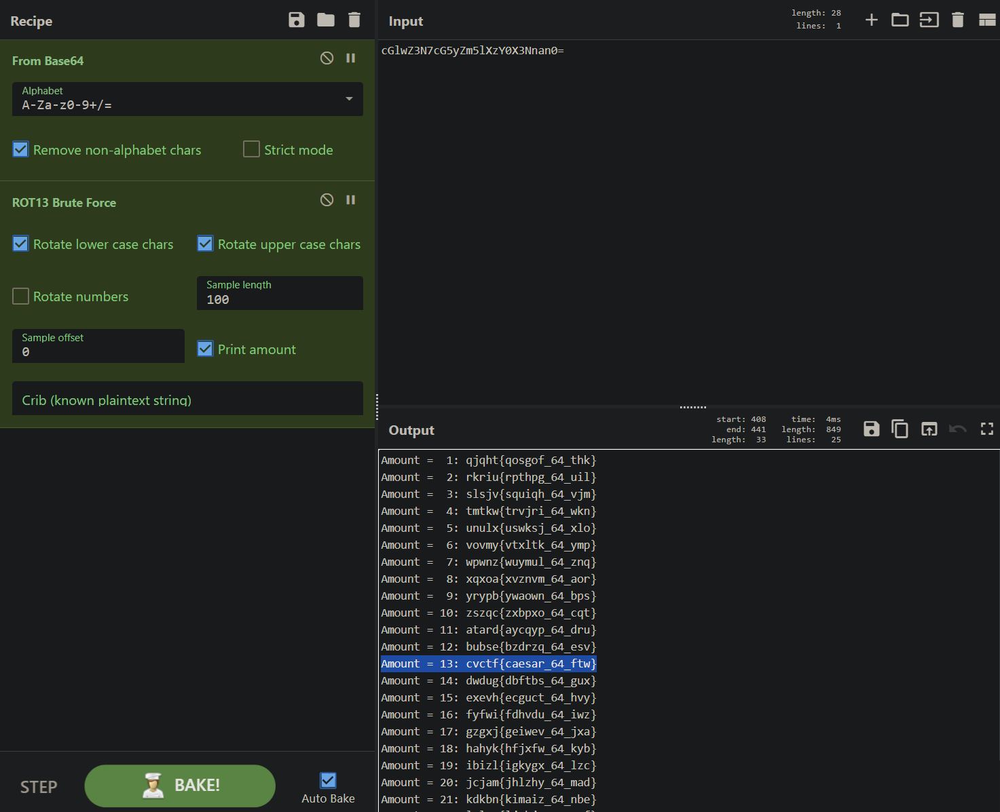
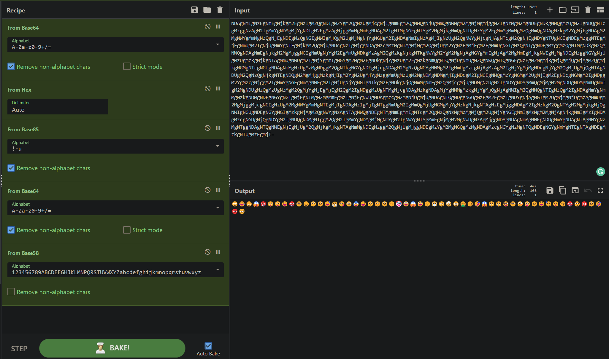
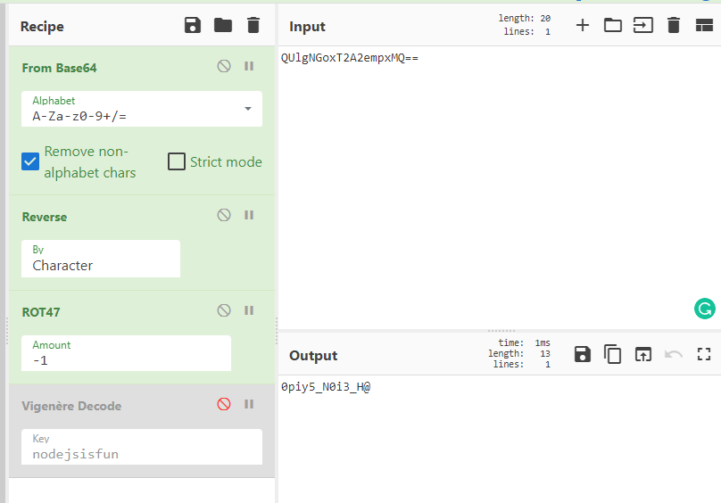
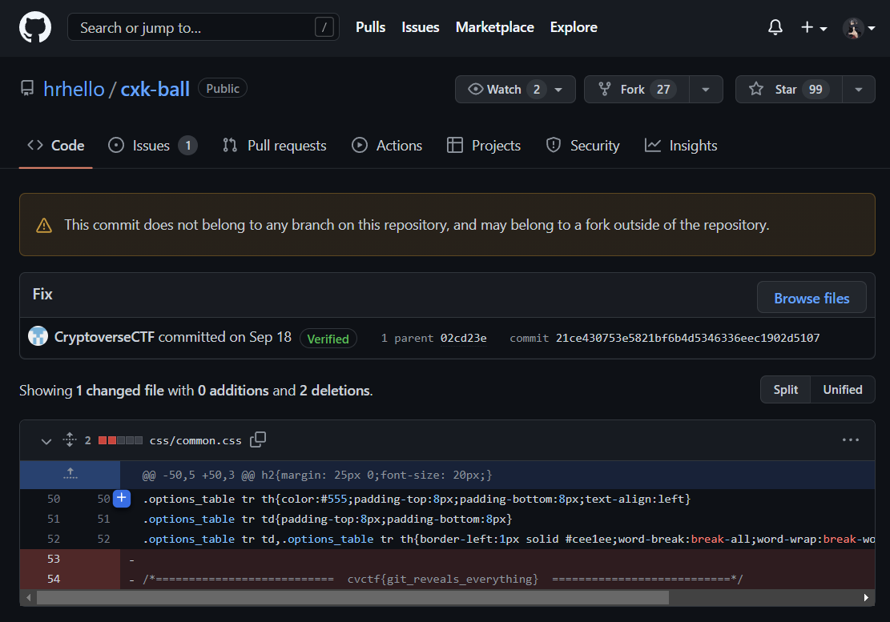

This past weekend, I joined [Shellphish](https://shellphish.net/) for a last minute CTF called Cryptoverse 

<!--more--> 

While I'm still a crypto n00b, I spent a few hours gathering some flags for the team.



## Crypto
### Warmup 1
#### 293 solves / 107 points
> Decode the following ciphertext: cGlwZ3N7cG5yZm5lXzY0X3Nnan0=.
>
>Remember: CyberChef is your friend.

The ciphertext for this challenge had the distinct appearance of `base64`. The output format was correct, perhaps a simple rotation cipher such as `ROT13` will help. This gets us our flag.



**flag:**
`cvctf{caesar_64_ftw}`

---

### Warmup 2
#### 274 solves / 113 points
>First described by Giovan Battista Bellaso in 1553, this cipher is easy to understand and implement, but it resisted all attempts to break it until 1863, three centuries 
>later.
>
>Remember: The Key to success is determination.
>
>fzvxw{hqtegmfr_lw_msf_scrslg_kvwlhyk_fpr_kxg?}

If the given key and flag didn't give it away, a quick search could tell you this is likely a `Vigenère cipher`.

Throw that in [CyberChef](https://gchq.github.io/CyberChef/) and get the flag.

**flag:** `cvctf{vigenere_is_too_guessy_without_the_key?}`

---

### Warmup 3
#### 313 solves / 102 points
>You should recognize this instantly.
>
>-.-. ...- -.-. - ..-. -- ----- .-. ..... ...-- .. ... -. ----- - ..... ----- ..-. ..- -.
>
>Note: Add { and } around the flag. Flag is all lower case.

Dots and dashes scream `Morse code`. [dcode.fr](https://www.dcode.fr/morse-code) is a great tool for all things decoding, including morse code.

**flag:** `cvctf{m0r53isn0tfun}`

---

### Warmup 4
#### 73 solves / 387 points
>Last warmup. You should get it fast if you use any social media.
>
>Ｉn sｃｉencｅ fіctіοｎ ｍetａνerse ｉs ｉtｅrａtiｏｎоf the Iｎternｅｔ as a sⅰｎgｌe, universal and immersive virtual world that is facilitated by the use of virtual reality and augmented reality headsets.
>
>Note: Wrap the message you decoded in cvctf{}.
>
>Note 2: This challenge involves some steganography tool related to a social media.

For this challenge, I tried several things before ultimately being successful. I thought maybe it would have to do with `zero-width characters` and tried tools like Stegsnow with no luck. 

Eventually I found a [Twitter Secret Message](https://holloway.nz/steg/) tool that gave the flag.

**flag:** `cvctf{secretsaretobeh1dd3n}`

--- 

### Substitution
#### 240 solves / 129 points
> Substitution is a cryptographic technique where a plaintext is replaced by a ciphertext. The ciphertext is a substitution of the plaintext.
>
> Here is a very simple CTF-related substitution cipher. Find out the flag.
>
> Hxpkdiz kcz Osxe ja x apzhjxs ljvr go jvogimxkjgv azhdijkf hgmpzkjkjgva. Kcziz xiz kcizz hgmmgv kfpza, Uzgpxirf, Xkkxhl Rzozvhz xvr mjyzr.
Jo fgd cxwz ojedizr gdk kcz xqgwz mzaaxez, cziz ja fgdi osxe, pszxaz xrr hdisf qixhlzka qzogiz adqmjaajgv: hwhkoxwzifajmpszadqakjkdkjgv

For this challenge, I realized `hwhkoxwzifajmpszadqakjkdkjgv` likely was the flag, hence the first `hwhko` should map to `cvctf`. After a little trial and error targeting 1 or 2 letter words, I decrypted with the following:

```txt
Plaintext: abcdefghijklmnopqrstuvwxyzABCDEFGHIJKLMNOPQRSTUVWXYZ
Ciphertext: sxhugyocritkmxfpbdlxxnvaxeXXXXXXXCXITXXXFXXDXXJXXAXX
```

Later, I found out [quipquip](https://www.quipqiup.com/) can solve this for us. 

**flag:** `cvctf{averysimplesubstitution}`

---

### CyberMania
#### 42 solves / 443 points
>I got this piece of ciphertext from my friend who is a Cyber Mania. It must have hidden something...
>
>*file: secret.txt*

`secret.txt` contains:
```txt {linenos=true}
NDAgNmIgNzEgNmEgNjkgM2EgMzIgM2QgNDIgM2YgM2QgNzUgMjcgNjIgNmEgM2QgNWQgNjUgMmQgNWMgM2MgNjMgMjggM2IgNzMgM2MgNDEgNDkgNWQgMzUgM2IgNDQgNTcgMzggNzAgM2IgMmYgNDMgMjYgNDIgM2EgMzAgMjggMmMgMmEgNDAgM2IgNTMgNGEgNTYgM2MgMjkgNmQgNTUgMzYgM2EgMmMgMmMgMzQgMmQgNDAgMzkgM2YgMjEgNDAgM2MgNWYgMmMgNzQgNjEgNDEgMzQgNGIgNWIgMjQgM2UgMjMgNjYgNGUgM2IgNDAgNmIgNzAgMjIgNzUgM2QgNWYgNjcgNjAgNTcgM2QgNjEgNDYgNTUgNGIgNDEgMzggNTEgMjEgNmUgM2IgNjUgNmYgNTEgMjkgM2QgMjUgNDcgNzIgMjggNDAgMzcgMzMgNTMgMjMgM2QgMjUgM2YgNzEgMjEgM2EgMmUgNGIgMzQgNTggNDEgMzggMzQgNTMgNDkgM2QgNWQgNDAgNmEgNjkgM2MgMjggNGIgNmUgNjYgM2EgMmUgNDkgMzAgM2QgMzkgNjkgNTkgNWYgM2YgM2MgNjAgNGYgMmEgNjAgM2MgMmEgMjkgNWIgNjMgNDEgMzggNGYgNjUgMzUgMzkgNjkgNTAgMmUgNWUgM2IgNjYgMmIgNGYgM2MgM2EgNDkgNjYgMzUgM2EgMzkgNmQgNTQgNjUgNmUgM2QgNWQgNTQgNGEgNzEgM2MgMjkgNjQgMjQgNjYgM2QgMjkgNGMgNTcgNGUgNDAgNmYgNzUgMzMgNDggM2QgNTkgNGYgNDEgNjcgNDAgM2MgNzQgNGYgNWMgM2EgMmUgMzcgNjAgMzAgM2IgNjYgMjMgNDcgNjYgM2QgMjUgMjQgNTAgNDUgM2QgNzQgNjkgNTEgNDQgM2MgMjggMzkgNjIgM2YgM2UgMjYgMzggMmUgMzUgM2MgNDMgNDMgMjIgNDcgM2IgNGEgNWQgMzYgNGMgM2UgMjIgM2EgNDcgNGMgM2IgNDggM2YgMzcgNjggM2IgMmYgNGEgNmMgNWEgM2IgNjUgNjYgNGIgNTkgM2EgNDkgNjQgNmMgNmEgM2QgMjcgMjUgNDMgNzUgM2IgNDYgNDYgMmQgMjMgM2MgNDUgNDMgNmUgNmIgM2MgNDUgMzQgMzUgNzMgM2QgMjYgNjEgMjEgM2QgM2IgNDggMzUgNTMgNjcgNDAgMzkgNDAgMjYgNWMgMzkgNjYgMjQgNjAgNWIgM2QgNWQgNTIgNzQgM2IgNDAgNmYgNmMgMzkgNDMgNDEgNGYgNGIgMjEgNTMgM2MgMmEgMzIgNjEgNWUgNDAgMzcgM2MgNjUgMjUgNDAgNTQgNDggNGUgMzEgM2EgMzIgNDYgNjAgNGIgM2UgMjMgNjUgMzAgNmUgM2MgMjggMjcgNGEgNzUgM2MgNWYgMmMgNTEgMjIgNDAgNzIgMjIgNTggNmUgM2IgMmQgMjUgNGMgMjYgMzkgNjkgNTAgNzEgMjggNDAgM2IgMzkgM2QgNTYgM2MgMjkgNjQgNWIgNGUgNDEgNGYgNGIgMzkgNjAgM2QgNWYgNzAgNTAgNWQgNDEgNTMgNmEgMmIgNTcgM2QgNzQgNzMgMzMgMjQgM2UgMjYgNGEgMmIgMzMgM2MgNjAgNjkgMmIgMzIgNDAgMzcgNGUgNjQgNDYgM2IgNDQgNDMgNTggM2QgM2IgMmYgNDMgMjMgNmYgM2IgNWYgNTYgMmEgNjMgM2MgNWUgNzAgMjggNDYgNDAgNmYgNWEgNDUgMmYgNDAgNTAgNWYgNzMgNTggNDAgNTQgNWEgNjIgNjUgM2QgMjkgMjkgNTAgNmMgNDEgMzggM2QgNjUgMjggNDEgMzYgM2MgNGQgMzMgNDAgMzcgNGYgNzMgNTQgNDEgNGYgNmYgNTEgNTAgNDEgMzkgNTUgMzEgMjI=
```

After a bit of CyberChef magic...


These emoji's seemed suspicious, so I found [cryptoji](https://cryptoji.com/) and it popped out the flag.

**flag:** `cvctf{3m0j1_c4n_L34K_7h1ng5}`

---

### RSA 1
#### 183 solves / 182 points
> The n is so large that it's not possible to factor it. Or is it?
> 
>n = 0x7c05a45d02649367ebf6f472663119777ce5f9b3f2283c7b03471e9feb1714a3ce9fa31460eebd9cd5aca7620ecdb52693a736e2fcc83d7909130c6038813fd16ef50c5ca6f491b4a8571289e6ef710536c4615604f8e7aeea606d4b5f59d7adbec935df23dc2bbc2adebbee07c05beb7fa68065805d8c8f0e86b5c3f654e651
>
> e = 0x10001
>
>ct = 0x35b63f7513dbb828800a6bcd708d87a6c9f33af634b8006d7a94b7e3ba62e6b9a1732a58dc35a8df9f7554e1168bfe3de1cb64792332fc8e5c9d5db1e49e86deb650ee0313aae53b227c75e40779a150ddb521f3c80f139e26b2a8880f0869f755965346cd28b7ddb132cf8d8dcc31c6b1befc83e21d8c452bcce8b9207ab76e

[factordb](http://factordb.com/index.php?query=87091237697162291639240583354604891692983254592515285069145264228005784316828788710720195005876559753888622175782860806483073689964589952445188764321260407467326663845493390767542356531075786653796785363128508537513297816062340386803804514798615928649520538766198525719602573720821402202554497908382601897553) allows us to "factorize" `n` to find `p` and `q`. The rest is plug and chug.

```python {linenos=true}
#!/usr/bin/env python3
from Crypto.Util.number import inverse, long_to_bytes

# Given:
n = 0x7c05a45d02649367ebf6f472663119777ce5f9b3f2283c7b03471e9feb1714a3ce9fa31460eebd9cd5aca7620ecdb52693a736e2fcc83d7909130c6038813fd16ef50c5ca6f491b4a8571289e6ef710536c4615604f8e7aeea606d4b5f59d7adbec935df23dc2bbc2adebbee07c05beb7fa68065805d8c8f0e86b5c3f654e651
e = 0x10001
ct = 0x35b63f7513dbb828800a6bcd708d87a6c9f33af634b8006d7a94b7e3ba62e6b9a1732a58dc35a8df9f7554e1168bfe3de1cb64792332fc8e5c9d5db1e49e86deb650ee0313aae53b227c75e40779a150ddb521f3c80f139e26b2a8880f0869f755965346cd28b7ddb132cf8d8dcc31c6b1befc83e21d8c452bcce8b9207ab76e

# FactorDB the given 'n'
p = 8156072525389912369788197863285751656042515380911795404436333529629416084362735262281722179416240983448945672233749861517470671156357917601583268804973543
q = 10678085245814899631026086851678635624044610674331494223434578587048178556659016077336866548714220013612176819608742965144962254942844889066032236627832071
assert n == p*q

phi = (p-1)*(q-1)
d = inverse(e, phi)
m = pow(ct, d, n)
print(long_to_bytes(m))
```

**flag:** `cvctf{f4c70rDB_15_p0w3rfu1}`

---


## Reverse
### Baby Reverse
#### 239 solves / 130 points
>Baby warmup.
>
>*files: chall*

After running the program, it gave the output:

```sh
$ ./chall
You do not really need to run the program...
The flag is: cvctf{7h15_15_4_f4k3_fl4g}
```

So, I ran:
```sh
strings chall | grep cvctf
```
This gave the flag.

**flag:** `cvctf{r3v3r53_15_4w350m3}`

---

### Basic Transforms
#### 97 solves / 337 points
>Basic JS for you to tackle.
>
>*file: app.js*

`app.js` contains:
```js {linenos=true}
var readline = require('readline');
var Crypto = require('vigenere');

var rl = readline.createInterface({
    input: process.stdin,
    output: process.stdout,
    terminal: true
});

rl.on('line', function(line){
    if (line.length == 20 && line.startsWith("cvctf{") && line.endsWith("}")) {
        var cat = Crypto.encode(line.substring(6, line.length - 1), "nodejsisfun").split('').map(function(c) {
            return String.fromCharCode(c.charCodeAt(0) + 1);
        }).join('');
        if (Buffer.from(cat.split("").reverse().join("")).toString('base64') == "QUlgNGoxT2A2empxMQ==") {
            console.log("Correct!");
        }
    }
});
```
For this challenge, I simply used CyberChef again and reversed the cipher.



However, I wasn't getting the full flag upon decoding the `Vigenère cipher`. So, I reverted back to js using the [runkit](https://npm.runkit.com/vigenere) environment.


**flag:** `cvctf{0bfu5_N0d3_H@}`

---

## Misc
### iKUN1

>https://www.youtube.com/watch?v=w8bidbK0PI
>
>Find the flag for iKUN 1, already wrapped in flag format.
>
>Hint: Please find me (CryptoverseCTF) on THE platform for code repositories hosting.
>
>Note: The YouTube link is unrelated to solving the challenge.

THE platform seemed likely to be Github. I was quickly able to find the account, then found a repo with a `cvctf{fake_flag_but_correct_repo}` bio. I checked the commit history and found the flag:



**flag:** `cvctf{git_reveals_everything}`

### Not Georainbolt
#### 37 solves / 451 points
> Georainbolt is able to guess the location on Google Map in 0.1 seconds. Can you do it in a second?
>
>Given an IP address or a coordinate, tell me which city it is in. All answers are case-insensitive. You will need a space between words, such as "new york city".
>
>For simplicity, I will make it easy. There are 50 questions and you only need to
>achieve an accuracy of more than 50% to get the flag!
>
>`nc 137.184.215.151 22606`

After connecting, the challenge will prompt the user to guess the city based on IP or Coordinate (as shown below). If you answer in more than 1 second, it's automatically "Wrong."

```sh
$ nc 137.184.215.151 22606
...
IP: 2.145.91.238
City:

Coordinate (lat, lon): 45.3747, -75.5647
City:
```

We can script this to solve!

```python {linenos=true}
#!/usr/bin/env python3
import time
import ipinfo
from pwn import *
from geopy.geocoders import Nominatim

# init ipinfo
at = '<REDACTED>'
h = ipinfo.getHandler(at)

# init geo locator
geolocator = Nominatim(user_agent="geoapiExercises")

r = remote('137.184.215.151', 22606)
r.recvuntil(b'wrong.\n')
log.info('Solving...')
for i in range(50):
    time.sleep(0.2)
    q = r.recvuntil(b'City:')
    if b'IP' in q:
        ip = q.split(b'IP: ')[-1].split(b'\n')[0].decode()
        d = h.getDetails(ip)
        r.sendline(d.city.encode())
    else:
        coor = q.split(b'lon): ')[-1].split(b'\n')[0].decode()
        location = geolocator.reverse(coor)
        try:
            city = location.raw['address']['city']
        except:
            city = 'failed'
        r.sendline(city.encode())
r.interactive()
```

**flag:** `cvctf{4r3_y0u_4_R34L_Ge@r41nB0L7?}`