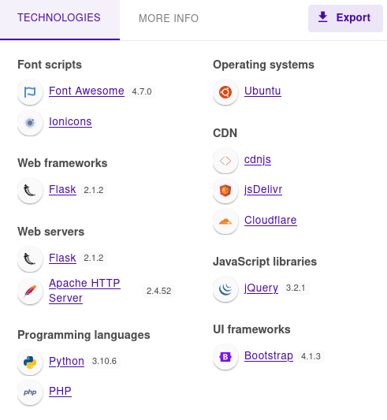

### nmap
```sh {linenos=true}
# Nmap 7.92 scan initiated Mon Apr 10 19:35:20 2023 as: nmap -sC -sV -oA nmap/busqueda -T4 10.10.11.208
Nmap scan report for 10.10.11.208
Host is up (0.054s latency).
Not shown: 998 closed tcp ports (reset)
PORT   STATE SERVICE VERSION
22/tcp open  ssh     OpenSSH 8.9p1 Ubuntu 3ubuntu0.1 (Ubuntu Linux; protocol 2.0)
| ssh-hostkey:
|   256 4f:e3:a6:67:a2:27:f9:11:8d:c3:0e:d7:73:a0:2c:28 (ECDSA)
|_  256 81:6e:78:76:6b:8a:ea:7d:1b:ab:d4:36:b7:f8:ec:c4 (ED25519)
80/tcp open  http    Apache httpd 2.4.52
|_http-title: Did not follow redirect to http://searcher.htb/
|_http-server-header: Apache/2.4.52 (Ubuntu)
Service Info: Host: searcher.htb; OS: Linux; CPE: cpe:/o:linux:linux_kernel

Service detection performed. Please report any incorrect results at https://nmap.org/submit/ .
# Nmap done at Mon Apr 10 19:35:28 2023 -- 1 IP address (1 host up) scanned in 8.67 seconds

```

### gobuster
```sh {linenos=true}
┌──(kali㉿kali)-[~/htb/busqueda]
└─$ sudo gobuster dir -u http://searcher.htb -w /usr/share/seclists/Discovery/Web-Content/raft-small-directories.txt -o gobuster/subdir.out -z
===============================================================
Gobuster v3.2.0-dev
by OJ Reeves (@TheColonial) & Christian Mehlmauer (@firefart)
===============================================================
[+] Url:                     http://searcher.htb
[+] Method:                  GET
[+] Threads:                 10
[+] Wordlist:                /usr/share/seclists/Discovery/Web-Content/raft-small-directories.txt
[+] Negative Status codes:   404
[+] User Agent:              gobuster/3.2.0-dev
[+] Timeout:                 10s
===============================================================
2023/04/10 19:37:01 Starting gobuster in directory enumeration mode
===============================================================
/search               (Status: 405) [Size: 153]
/server-status        (Status: 403) [Size: 277]
===============================================================
2023/04/10 19:38:17 Finished
===============================================================
```

### http
First I checked `Wappalyzer`.


I looked online briefly and `searchsploit`, but found nothing promising. 

Pretty immediately my eyes noticed [Searchor 2.4.0](https://security.snyk.io/vuln/SNYK-PYTHON-SEARCHOR-3166303) at the bottom and quickly found [this link](https://security.snyk.io/vuln/SNYK-PYTHON-SEARCHOR-3166303) mentioning a code injection was possible. I looked around a while for a POC but couldn't find anything. 

### privesc

### Flag
**user.txt:** ``

**root.txt:** ``