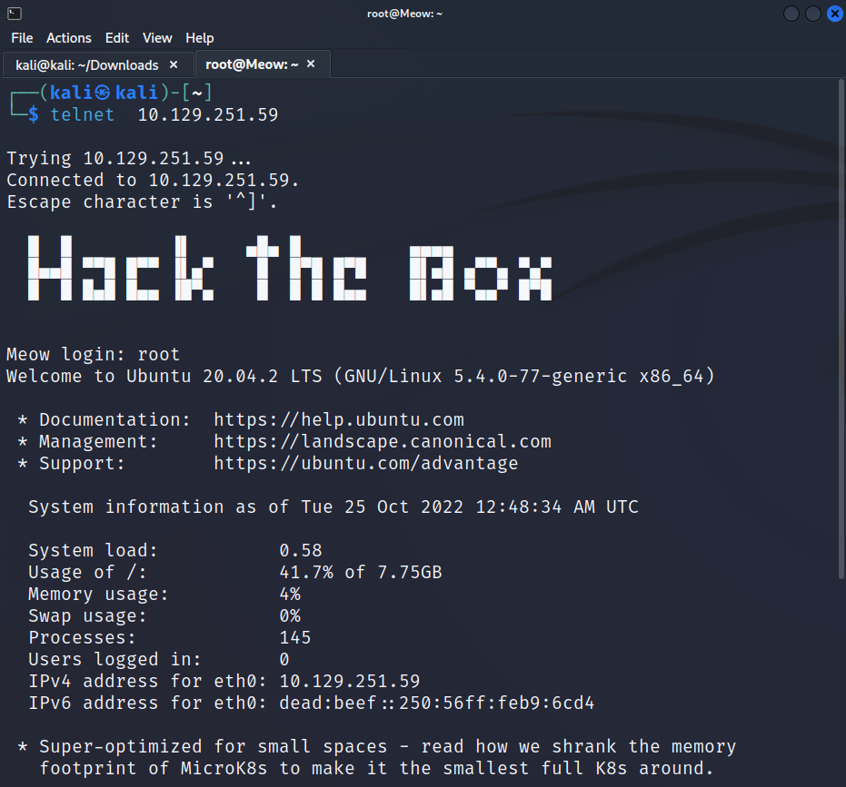
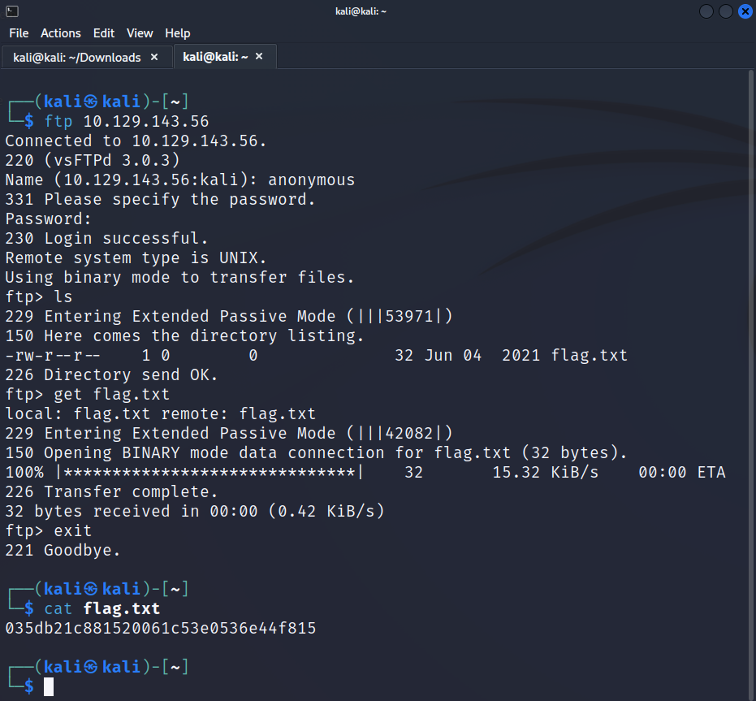
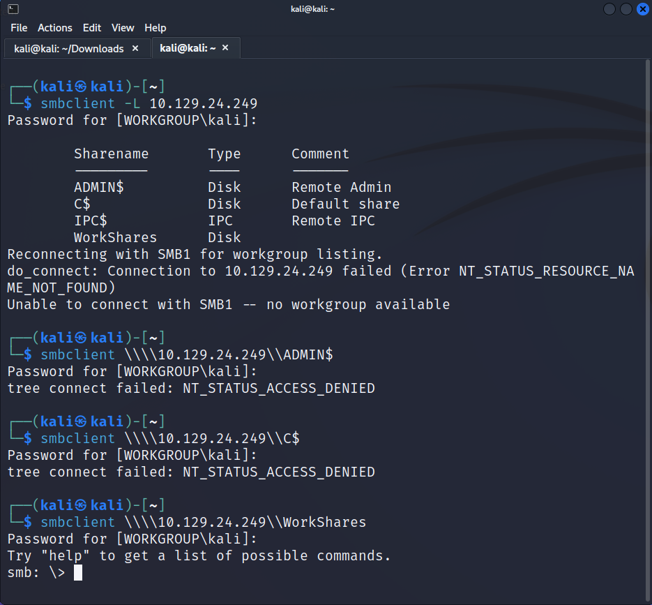
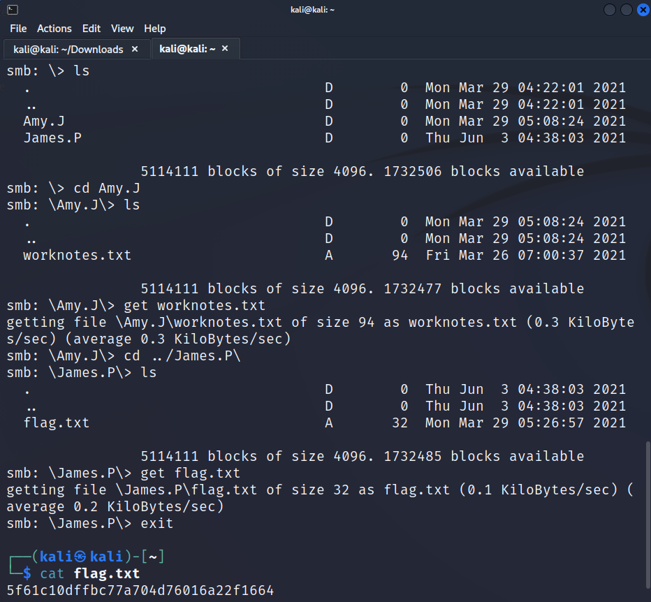
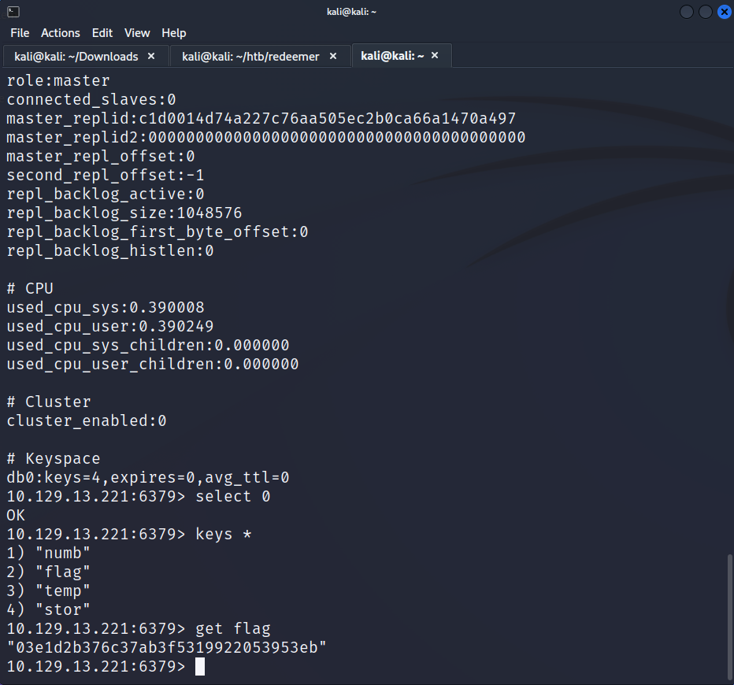

## Meow
### nmap

Starting the chall with an `nmap` scan to see which ports are open.
```sh {linenos=true}
# Nmap 7.92 scan initiated Fri Apr 29 15:39:25 2022 as: nmap -sV -sC -oA ./meow/meow 10.129.251.259
Nmap scan report for 10.129.251.259
Host is up (0.17s latency).
Not shown: 999 closed tcp ports (reset)
PORT   STATE SERVICE VERSION
23/tcp open  telnet?

Service detection performed. Please report any incorrect results at https://nmap.org/submit/ .
# Nmap done at Fri Apr 29 15:40:00 2022 -- 1 IP address (1 host up) scanned in 35.35 seconds
```
### telnet
`telnet` is an older and less secure network protocol that allows access to another device or server remotely. it happens to have an open port. Let's try to connect.



`root` worked first try! `ls; cat flag.txt` to get the flag.

### Questions
- What does the acronym VM stand for? `Virtual Machine`
- What tool do we use to interact with the operating system in order to issue commands via the command line, such as the one to start our VPN connection? It's also known as a console or shell. `terminal`
- What service do we use to form our VPN connection into HTB labs? `openvpn`
- What is the abbreviated name for a 'tunnel interface' in the output of your VPN boot-up sequence output? `tun`
- What tool do we use to test our connection to the target with an ICMP echo request? `ping`
- What is the name of the most common tool for finding open ports on a target? `nmap`
- What service do we identify on port 23/tcp during our scans? `telnet`
- What username is able to log into the target over telnet with a blank password? `root`

**flag:** `b40abdfe23665f766f9c61ecba8a4c19`

---

## Fawn

### nmap
Run `nmap` on the box.

```sh {linenos=true}
# Nmap 7.92 scan initiated Fri Apr 29 15:48:32 2022 as: nmap -sV -sC -oA nmap/fawn 10.129.143.56
Nmap scan report for 10.129.143.56
Host is up (0.088s latency).
Not shown: 999 closed tcp ports (reset)
PORT   STATE SERVICE VERSION
21/tcp open  ftp     vsftpd 3.0.3
| ftp-anon: Anonymous FTP login allowed (FTP code 230)
|_-rw-r--r--    1 0        0              32 Jun 04  2021 flag.txt
| ftp-syst: 
|   STAT: 
| FTP server status:
|      Connected to ::ffff:10.10.16.162
|      Logged in as ftp
|      TYPE: ASCII
|      No session bandwidth limit
|      Session timeout in seconds is 300
|      Control connection is plain text
|      Data connections will be plain text
|      At session startup, client count was 4
|      vsFTPd 3.0.3 - secure, fast, stable
|_End of status
Service Info: OS: Unix

Service detection performed. Please report any incorrect results at https://nmap.org/submit/ .
# Nmap done at Fri Apr 29 15:48:37 2022 -- 1 IP address (1 host up) scanned in 4.99 seconds
```

### FTP
`ftp` (File Transfer Protocol) allows devices to upload, download and transfer files through the internet. However, this can be taken advantage of if configured poorly.

Let's connect via: 
```sh 
ftp 10.129.143.56
```
and sign in as an `anonymous` user. Bingo, now just find the flag.




### Questions 
- What does the 3-letter acronym FTP stand for? `File Transfer Protocol`
- Which port does the FTP service listen on usually? `21`
- What acronym is used for the secure version of FTP? `SFTP`
- What is the command we can use to send an ICMP echo request to test our connection to the target? `ping`
- From your scans, what version is FTP running on the target? `vsftpd 3.0.3`
- From your scans, what OS type is running on the target? `Unix`
- What is the command we need to run in order to display the 'ftp' client help menu?`ftp -h`
- What is username that is used over FTP when you want to log in without having an account? `anonymous`
- What is the response code we get for the FTP message 'Login successful'? `230`
- There are a couple of commands we can use to list the files and directories available on the FTP server. One is dir. What is the other that is a common way to list files on a Linux system. `ls`
- What is the command used to download the file we found on the FTP server? `get`

**flag:** `035db21c881520061c53e0536e44f815`

---

## Dancing

### nmap 
```sh {linenos=true}
# Nmap 7.92 scan initiated Fri Apr 29 15:57:22 2022 as: nmap -sV -sC -oA nmap/dancing 10.129.24.249
Nmap scan report for 10.129.24.249
Host is up (0.075s latency).
Not shown: 997 closed tcp ports (reset)
PORT    STATE SERVICE       VERSION
135/tcp open  msrpc         Microsoft Windows RPC
139/tcp open  netbios-ssn   Microsoft Windows netbios-ssn
445/tcp open  microsoft-ds?
Service Info: OS: Windows; CPE: cpe:/o:microsoft:windows

Host script results:
| smb2-time: 
|   date: 2022-04-30T00:00:27
|_  start_date: N/A
| smb2-security-mode: 
|   3.1.1: 
|_    Message signing enabled but not required
|_clock-skew: 3h59m59s

Service detection performed. Please report any incorrect results at https://nmap.org/submit/ .
# Nmap done at Fri Apr 29 16:00:33 2022 -- 1 IP address (1 host up) scanned in 191.84 seconds
```

### smb
`smb` (Server Message Block) is a network protocol that allows devices to share, open, and edit files on remote devices or servers. `smbclient` is a tool to harness this protocol. 

We can list all the smb sharenames by:
```sh
smbclient -L 10.129.24.249
```
Now let's try to connect to all of them via:
```sh
smbclient \\\\10.129.24.249\\<Sharename>
```



`WorkShares` ftw! Now let's look around and get the flag. 



### Questions
- What does the 3-letter acronym SMB stand for? `Server Message Block`
- What port does SMB use to operate at? `445`
- What is the service name for port 445 that came up in our Nmap scan? `microsoft-ds`
- What is the 'flag' or 'switch' we can use with the SMB tool to 'list' the contents of the share? `-L`
- How many shares are there on Dancing? `4`
- What is the name of the share we are able to access in the end with a blank password? `WorkShares`
- What is the command we can use within the SMB shell to download the files we find? `get`

**flag:** `5f61c10dffbc77a704d76016a22f1664`

---

## Redeemer

### nmap
```sh {linenos=true}
Starting Nmap 7.92 ( https://nmap.org ) at 2022-10-24 21:34 EDT
Nmap scan report for 10.129.13.221
Host is up (0.069s latency).
Not shown: 65534 closed tcp ports (conn-refused)
PORT     STATE SERVICE VERSION
6379/tcp open  redis   Redis key-value store 5.0.7

Service detection performed. Please report any incorrect results at https://nmap.org/submit/ .
Nmap done: 1 IP address (1 host up) scanned in 724.57 seconds
```

### redis
`redis` (Remote Dictionary Server) is an in-memory data structure that can be used as a database, cache, or message broker. We can use `redis-cli` (`sudo apt install redis-tools`) to interact with the server:

```sh
redis-cli -h 10.129.13.221
```
...followed by `info` will give us some insight into the stored data. `select 0` will allow us to select the database, and `keys *` will show all keys in the db. Profit!

```ps
> info
...
> select 0
...
> keys *
...
``` 



### Questions
- Which TCP port is open on the machine? `6379`
- Which service is running on the port that is open on the machine? `redis`
- What type of database is Redis? Choose from the following options: (i) In-memory Database, (ii) Traditional Database `In-memory Database`
- Which command-line utility is used to interact with the Redis server? Enter the program name you would enter into the terminal without any arguments. `redis-cli`
- Which flag is used with the Redis command-line utility to specify the hostname? `-h`
- Once connected to a Redis server, which command is used to obtain the information and statistics about the Redis server? `info`
- What is the version of the Redis server being used on the target machine? `5.0.7`
- Which command is used to select the desired database in Redis? `select`
- How many keys are present inside the database with index 0? `4`
- Which command is used to obtain all the keys in a database? `keys *`

**flag:** `03e1d2b376c37ab3f5319922053953eb`